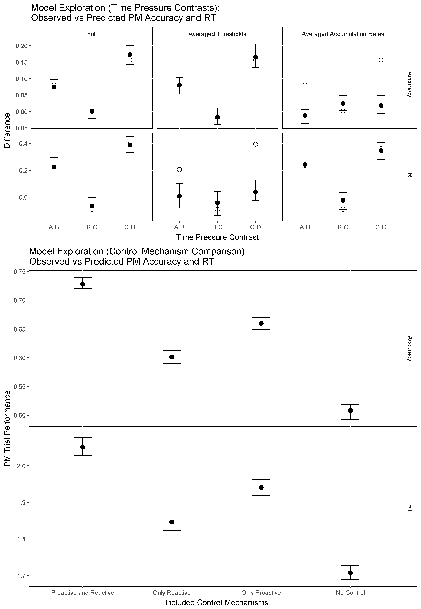

```{r setup, include=FALSE}
knitr::opts_chunk$set(echo = TRUE)
setwd("C:/Users/Russell Boag/Documents/GitHub/DMCATC")
```
## Model Selection
"analysis/DIC.TABLE.E1.csv"

## Model Fit Plots


## Parameter Plots


## Model Exploration



