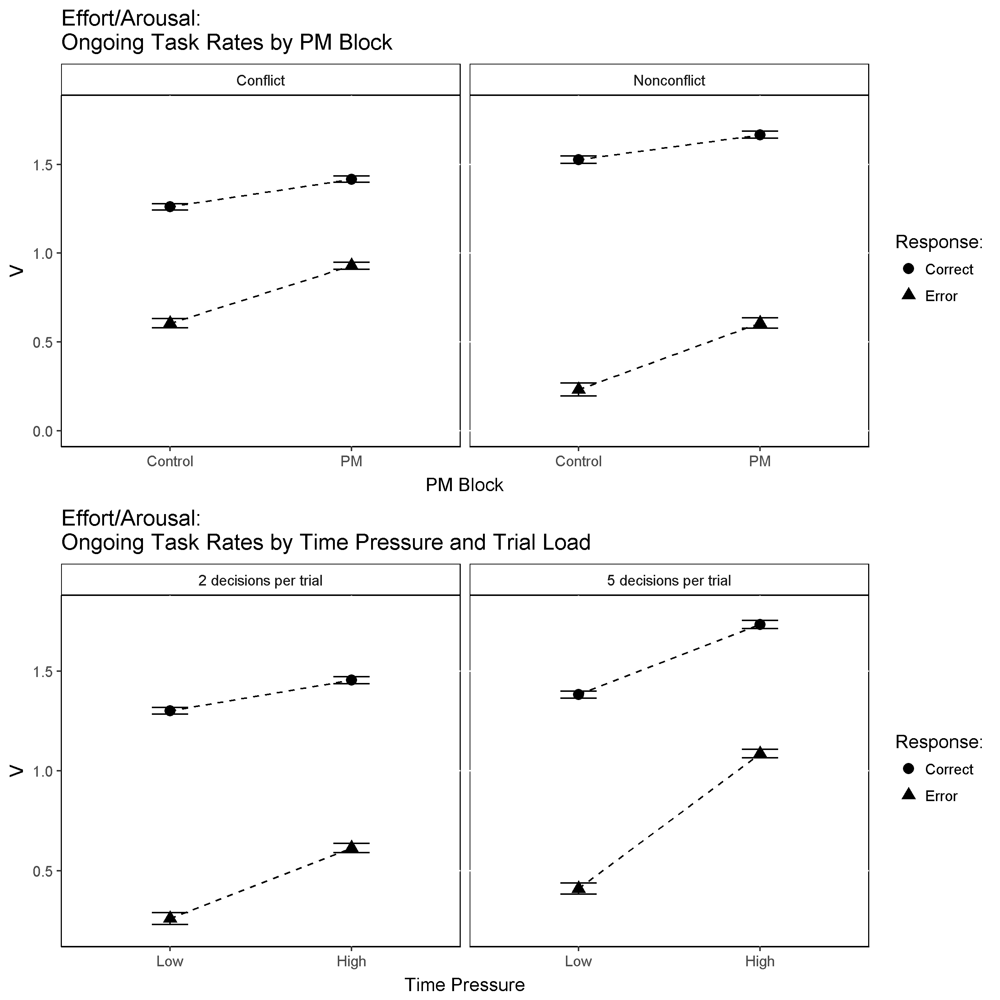

```{r setup, include=FALSE}
knitr::opts_chunk$set(echo = TRUE)
```

```{r load and prep data, echo=FALSE, include=FALSE}


rm(list=ls())
setwd("C:/Users/Russell Boag/Documents/GitHub/DMCATC")
source("dmc/dmc.R")
source("dmc/dmc_ATC.R")
load_model ("LBA","lbaN_B.R")
# source("LSAnova.R")
require("gridExtra")
require("lme4")
require("car")
pkgs <- c("plyr", "dplyr", "tidyr", "broom", "pander", "xtable")
sapply(pkgs, require, character.only = T) #load

# # # Load samples object # # #
#
load("data/samples/E1.block.B.V_cond.B.V.PMV.samples.RData")  # Samples object
samples.E1 <- E1.block.B.V_cond.B.V.PMV.samples
rm(E1.block.B.V_cond.B.V.PMV.samples)

samples.E1 <- samples.E1[names(samples.E1) != "p17"]  # Exclude p17 E1 due to no PM responses


# # # Load functions # # #
#
group.inference.dist <- function (hsamples, fun) {
  inference <- list()
  for (i in 1:length(hsamples)) {
   thetas <- hsamples[[i]]$theta
   inference [[i]] <- fun (thetas)
  }
   inf2 <- unlist(inference)
   dim3 <- c(dim(inference[[1]]), length(inf2)/prod(dim(inference[[1]])))
   dim(inf2) <- dim3
   apply(inf2, c(1,2,3), mean)
}

minp <- function (effect) min(ecdf(effect)(0), 1-ecdf(effect)(0))

zandp <- function(samples, fun){
    effect<- group.inference.dist(samples, fun)
    Z <- mean(effect)/sd(effect)
    p <- minp(effect)
    paste(round(Z,2), "(", round(p,3), ")", sep="")
}

mean.sd <- function(samples, fun){
    effect<- group.inference.dist(samples, fun)
    M <- mean(effect)
    SD <- sd(effect)
    data.frame(M, SD)
}

# # # Reactive Control # # #
#
Reactive.ccAC <- function (thetas) thetas[,"mean_v.ccA3C",, drop=F] - thetas[,"mean_v.pcA3C",, drop=F]
Reactive.ccBC <- function (thetas) thetas[,"mean_v.ccB3C",, drop=F] - thetas[,"mean_v.pcB3C",, drop=F]
Reactive.ccCC <- function (thetas) thetas[,"mean_v.ccC3C",, drop=F] - thetas[,"mean_v.pcC3C",, drop=F]
Reactive.ccDC <- function (thetas) thetas[,"mean_v.ccD3C",, drop=F] - thetas[,"mean_v.pcD3C",, drop=F]

Reactive.nnAN <- function (thetas) thetas[,"mean_v.nnA3N",, drop=F] - thetas[,"mean_v.pnA3N",, drop=F]
Reactive.nnBN <- function (thetas) thetas[,"mean_v.nnB3N",, drop=F] - thetas[,"mean_v.pnB3N",, drop=F]
Reactive.nnCN <- function (thetas) thetas[,"mean_v.nnC3N",, drop=F] - thetas[,"mean_v.pnC3N",, drop=F]
Reactive.nnDN <- function (thetas) thetas[,"mean_v.nnD3N",, drop=F] - thetas[,"mean_v.pnD3N",, drop=F]

Reactive.ccAN <- function (thetas) thetas[,"mean_v.ccA3N",, drop=F] - thetas[,"mean_v.pcA3N",, drop=F]
Reactive.ccBN <- function (thetas) thetas[,"mean_v.ccB3N",, drop=F] - thetas[,"mean_v.pcB3N",, drop=F]
Reactive.ccCN <- function (thetas) thetas[,"mean_v.ccC3N",, drop=F] - thetas[,"mean_v.pcC3N",, drop=F]
Reactive.ccDN <- function (thetas) thetas[,"mean_v.ccD3N",, drop=F] - thetas[,"mean_v.pcD3N",, drop=F]

Reactive.nnAC <- function (thetas) thetas[,"mean_v.nnA3C",, drop=F] - thetas[,"mean_v.pnA3C",, drop=F]
Reactive.nnBC <- function (thetas) thetas[,"mean_v.nnB3C",, drop=F] - thetas[,"mean_v.pnB3C",, drop=F]
Reactive.nnCC <- function (thetas) thetas[,"mean_v.nnC3C",, drop=F] - thetas[,"mean_v.pnC3C",, drop=F]
Reactive.nnDC <- function (thetas) thetas[,"mean_v.nnD3C",, drop=F] - thetas[,"mean_v.pnD3C",, drop=F]


# # # Proactive Control # # #
#
Proactive.AC <- function (thetas) thetas[,"B.A3C",, drop=F] - thetas[,"B.A2C",, drop=F]
Proactive.BC <- function (thetas) thetas[,"B.B3C",, drop=F] - thetas[,"B.B2C",, drop=F]
Proactive.CC <- function (thetas) thetas[,"B.C3C",, drop=F] - thetas[,"B.C2C",, drop=F]
Proactive.DC <- function (thetas) thetas[,"B.D3C",, drop=F] - thetas[,"B.D2C",, drop=F]

Proactive.AN <- function (thetas) thetas[,"B.A3N",, drop=F] - thetas[,"B.A2N",, drop=F]
Proactive.BN <- function (thetas) thetas[,"B.B3N",, drop=F] - thetas[,"B.B2N",, drop=F]
Proactive.CN <- function (thetas) thetas[,"B.C3N",, drop=F] - thetas[,"B.C2N",, drop=F]
Proactive.DN <- function (thetas) thetas[,"B.D3N",, drop=F] - thetas[,"B.D2N",, drop=F]


# # # Capacity (Difference in Drift between Control and PM blocks) # # #
#
Capacity.ccAC <- function (thetas) thetas[,"mean_v.ccA3C",, drop=F] - thetas[,"mean_v.ccA2C",, drop=F]
Capacity.ccBC <- function (thetas) thetas[,"mean_v.ccB3C",, drop=F] - thetas[,"mean_v.ccB2C",, drop=F]
Capacity.ccCC <- function (thetas) thetas[,"mean_v.ccC3C",, drop=F] - thetas[,"mean_v.ccC2C",, drop=F]
Capacity.ccDC <- function (thetas) thetas[,"mean_v.ccD3C",, drop=F] - thetas[,"mean_v.ccD2C",, drop=F]

Capacity.nnAN <- function (thetas) thetas[,"mean_v.nnA3N",, drop=F] - thetas[,"mean_v.nnA2N",, drop=F]
Capacity.nnBN <- function (thetas) thetas[,"mean_v.nnB3N",, drop=F] - thetas[,"mean_v.nnB2N",, drop=F]
Capacity.nnCN <- function (thetas) thetas[,"mean_v.nnC3N",, drop=F] - thetas[,"mean_v.nnC2N",, drop=F]
Capacity.nnDN <- function (thetas) thetas[,"mean_v.nnD3N",, drop=F] - thetas[,"mean_v.nnD2N",, drop=F]

Capacity.ccAN <- function (thetas) thetas[,"mean_v.ccA3N",, drop=F] - thetas[,"mean_v.ccA2N",, drop=F]
Capacity.ccBN <- function (thetas) thetas[,"mean_v.ccB3N",, drop=F] - thetas[,"mean_v.ccB2N",, drop=F]
Capacity.ccCN <- function (thetas) thetas[,"mean_v.ccC3N",, drop=F] - thetas[,"mean_v.ccC2N",, drop=F]
Capacity.ccDN <- function (thetas) thetas[,"mean_v.ccD3N",, drop=F] - thetas[,"mean_v.ccD2N",, drop=F]

Capacity.nnAC <- function (thetas) thetas[,"mean_v.nnA3C",, drop=F] - thetas[,"mean_v.nnA2C",, drop=F]
Capacity.nnBC <- function (thetas) thetas[,"mean_v.nnB3C",, drop=F] - thetas[,"mean_v.nnB2C",, drop=F]
Capacity.nnCC <- function (thetas) thetas[,"mean_v.nnC3C",, drop=F] - thetas[,"mean_v.nnC2C",, drop=F]
Capacity.nnDC <- function (thetas) thetas[,"mean_v.nnD3C",, drop=F] - thetas[,"mean_v.nnD2C",, drop=F]


# # # Proactive Control (PM Cost) by Time Pressure # # #
#
ProactiveTP.ABC <- function (thetas) (thetas[,"B.A3C",, drop=F] - thetas[,"B.A2C",, drop=F]) -
    (thetas[,"B.B3C",, drop=F] - thetas[,"B.B2C",, drop=F])
ProactiveTP.BCC <- function (thetas) (thetas[,"B.B3C",, drop=F] - thetas[,"B.B2C",, drop=F]) -
    (thetas[,"B.C3C",, drop=F] - thetas[,"B.C2C",, drop=F])
ProactiveTP.CDC <- function (thetas) (thetas[,"B.C3C",, drop=F] - thetas[,"B.C2C",, drop=F]) -
    (thetas[,"B.D3C",, drop=F] - thetas[,"B.D2C",, drop=F])

ProactiveTP.ABN <- function (thetas) (thetas[,"B.A3N",, drop=F] - thetas[,"B.A2N",, drop=F]) -
    (thetas[,"B.B3N",, drop=F] - thetas[,"B.B2N",, drop=F])
ProactiveTP.BCN <- function (thetas) (thetas[,"B.B3N",, drop=F] - thetas[,"B.B2N",, drop=F]) -
    (thetas[,"B.C3N",, drop=F] - thetas[,"B.C2N",, drop=F])
ProactiveTP.CDN <- function (thetas) (thetas[,"B.C3N",, drop=F] - thetas[,"B.C2N",, drop=F]) -
    (thetas[,"B.D3N",, drop=F] - thetas[,"B.D2N",, drop=F])


# # # Effort/Arousal by Time Pressure # # #
#
Effort.TPccCABC <- function (thetas) thetas[,"mean_v.ccA2C",, drop=F] - thetas[,"mean_v.ccB2C",, drop=F]
Effort.TPccCBCC <- function (thetas) thetas[,"mean_v.ccB2C",, drop=F] - thetas[,"mean_v.ccC2C",, drop=F]
Effort.TPccCCDC <- function (thetas) thetas[,"mean_v.ccC2C",, drop=F] - thetas[,"mean_v.ccD2C",, drop=F]

Effort.TPccPMABC <- function (thetas) thetas[,"mean_v.ccA3C",, drop=F] - thetas[,"mean_v.ccB3C",, drop=F]
Effort.TPccPMBCC <- function (thetas) thetas[,"mean_v.ccB3C",, drop=F] - thetas[,"mean_v.ccC3C",, drop=F]
Effort.TPccPMCDC <- function (thetas) thetas[,"mean_v.ccC3C",, drop=F] - thetas[,"mean_v.ccD3C",, drop=F]

Effort.TPnnCABN <- function (thetas) thetas[,"mean_v.nnA2N",, drop=F] - thetas[,"mean_v.nnB2N",, drop=F]
Effort.TPnnCBCN <- function (thetas) thetas[,"mean_v.nnB2N",, drop=F] - thetas[,"mean_v.nnC2N",, drop=F]
Effort.TPnnCCDN <- function (thetas) thetas[,"mean_v.nnC2N",, drop=F] - thetas[,"mean_v.nnD2N",, drop=F]

Effort.TPnnPMABN <- function (thetas) thetas[,"mean_v.nnA3N",, drop=F] - thetas[,"mean_v.nnB3N",, drop=F]
Effort.TPnnPMBCN <- function (thetas) thetas[,"mean_v.nnB3N",, drop=F] - thetas[,"mean_v.nnC3N",, drop=F]
Effort.TPnnPMCDN <- function (thetas) thetas[,"mean_v.nnC3N",, drop=F] - thetas[,"mean_v.nnD3N",, drop=F]


#
Effort.TPnnCABC <- function (thetas) thetas[,"mean_v.nnA2C",, drop=F] - thetas[,"mean_v.nnB2C",, drop=F]
Effort.TPnnCBCC <- function (thetas) thetas[,"mean_v.nnB2C",, drop=F] - thetas[,"mean_v.nnC2C",, drop=F]
Effort.TPnnCCDC <- function (thetas) thetas[,"mean_v.nnC2C",, drop=F] - thetas[,"mean_v.nnD2C",, drop=F]

Effort.TPnnPMABC <- function (thetas) thetas[,"mean_v.nnA3C",, drop=F] - thetas[,"mean_v.nnB3C",, drop=F]
Effort.TPnnPMBCC <- function (thetas) thetas[,"mean_v.nnB3C",, drop=F] - thetas[,"mean_v.nnC3C",, drop=F]
Effort.TPnnPMCDC <- function (thetas) thetas[,"mean_v.nnC3C",, drop=F] - thetas[,"mean_v.nnD3C",, drop=F]

Effort.TPccCABN <- function (thetas) thetas[,"mean_v.ccA2N",, drop=F] - thetas[,"mean_v.ccB2N",, drop=F]
Effort.TPccCBCN <- function (thetas) thetas[,"mean_v.ccB2N",, drop=F] - thetas[,"mean_v.ccC2N",, drop=F]
Effort.TPccCCDN <- function (thetas) thetas[,"mean_v.ccC2N",, drop=F] - thetas[,"mean_v.ccD2N",, drop=F]

Effort.TPccPMABN <- function (thetas) thetas[,"mean_v.ccA3N",, drop=F] - thetas[,"mean_v.ccB3N",, drop=F]
Effort.TPccPMBCN <- function (thetas) thetas[,"mean_v.ccB3N",, drop=F] - thetas[,"mean_v.ccC3N",, drop=F]
Effort.TPccPMCDN <- function (thetas) thetas[,"mean_v.ccC3N",, drop=F] - thetas[,"mean_v.ccD3N",, drop=F]

#
Effort.TPppPMABP <- function (thetas) thetas[,"mean_v.ppA3P",, drop=F] - thetas[,"mean_v.ppB3P",, drop=F]
Effort.TPppPMBCP <- function (thetas) thetas[,"mean_v.ppB3P",, drop=F] - thetas[,"mean_v.ppC3P",, drop=F]
Effort.TPppPMCDP <- function (thetas) thetas[,"mean_v.ppC3P",, drop=F] - thetas[,"mean_v.ppD3P",, drop=F]

Effort.TPpcPMABC <- function (thetas) thetas[,"mean_v.pcA3C",, drop=F] - thetas[,"mean_v.pcB3C",, drop=F]
Effort.TPpcPMBCC <- function (thetas) thetas[,"mean_v.pcB3C",, drop=F] - thetas[,"mean_v.pcC3C",, drop=F]
Effort.TPpcPMCDC <- function (thetas) thetas[,"mean_v.pcC3C",, drop=F] - thetas[,"mean_v.pcD3C",, drop=F]

Effort.TPpnPMABN <- function (thetas) thetas[,"mean_v.pnA3N",, drop=F] - thetas[,"mean_v.pnB3N",, drop=F]
Effort.TPpnPMBCN <- function (thetas) thetas[,"mean_v.pnB3N",, drop=F] - thetas[,"mean_v.pnC3N",, drop=F]
Effort.TPpnPMCDN <- function (thetas) thetas[,"mean_v.pnC3N",, drop=F] - thetas[,"mean_v.pnD3N",, drop=F]

Effort.TPpnPMABC <- function (thetas) thetas[,"mean_v.pnA3C",, drop=F] - thetas[,"mean_v.pnB3C",, drop=F]
Effort.TPpnPMBCC <- function (thetas) thetas[,"mean_v.pnB3C",, drop=F] - thetas[,"mean_v.pnC3C",, drop=F]
Effort.TPpnPMCDC <- function (thetas) thetas[,"mean_v.pnC3C",, drop=F] - thetas[,"mean_v.pnD3C",, drop=F]

Effort.TPpcPMABN <- function (thetas) thetas[,"mean_v.pcA3N",, drop=F] - thetas[,"mean_v.pcB3N",, drop=F]
Effort.TPpcPMBCN <- function (thetas) thetas[,"mean_v.pcB3N",, drop=F] - thetas[,"mean_v.pcC3N",, drop=F]
Effort.TPpcPMCDN <- function (thetas) thetas[,"mean_v.pcC3N",, drop=F] - thetas[,"mean_v.pcD3N",, drop=F]

# # # t0 # # #

av.t0 <- function (thetas) (thetas[ ,"t0",, drop=F])

t0.Table <- mean.sd(samples.E1,av.t0)
rownames(t0.Table) <- "t0"
t0.Table

# # # sdv # # #

av.sdv.ccC <- function (thetas) (thetas[ ,"sd_v.ccC",, drop=F])
av.sdv.nnC <- function (thetas) (thetas[ ,"sd_v.nnC",, drop=F])
av.sdv.pcC <- function (thetas) (thetas[ ,"sd_v.pcC",, drop=F])
av.sdv.pnC <- function (thetas) (thetas[ ,"sd_v.pnC",, drop=F])

av.sdv.ccN <- function (thetas) (thetas[ ,"sd_v.ccN",, drop=F])
av.sdv.nnN <- function (thetas) (thetas[ ,"sd_v.nnN",, drop=F])
av.sdv.pcN <- function (thetas) (thetas[ ,"sd_v.pcN",, drop=F])
av.sdv.pnN <- function (thetas) (thetas[ ,"sd_v.pnN",, drop=F])

av.sdv.ppP <- function (thetas) (thetas[ ,"sd_v.ppP",, drop=F])

sdv.ccC <- mean.sd(samples.E1,av.sdv.ccC)
sdv.nnC <- mean.sd(samples.E1,av.sdv.nnC)
sdv.pcC <- mean.sd(samples.E1,av.sdv.pcC)
sdv.pnC <- mean.sd(samples.E1,av.sdv.pnC)

sdv.ccN <- mean.sd(samples.E1,av.sdv.ccN)
sdv.nnN <- mean.sd(samples.E1,av.sdv.nnN)
sdv.pcN <- mean.sd(samples.E1,av.sdv.pcN)
sdv.pnN <- mean.sd(samples.E1,av.sdv.pnN)

sdv.ppP <- mean.sd(samples.E1,av.sdv.ppP)

sdv.Table <- data.frame(rbind(sdv.ccC=sdv.ccC,
                              sdv.nnC=sdv.nnC,
                              sdv.pcC=sdv.pcC,
                              sdv.pnC=sdv.pnC,

                              sdv.ccN=sdv.ccN,
                              sdv.nnN=sdv.nnN,
                              sdv.pcN=sdv.pcN,
                              sdv.pnN=sdv.pnN,

                              sdv.ppP=sdv.ppP))
sdv.Table

# # # Thresholds by PM Block (averaged over Time Pressure) # # #
#
av.B.2o <- function (thetas) (thetas[,"B.A2C",, drop=F] + thetas[,"B.B2C",, drop=F] +
                                  thetas[,"B.C2C",, drop=F] + thetas[,"B.D2C",, drop=F] +
                                  thetas[,"B.A2N",, drop=F] + thetas[,"B.B2N",, drop=F] +
                                  thetas[,"B.C2N",, drop=F] + thetas[,"B.D2N",, drop=F])/8

av.B.3o <- function (thetas) (thetas[,"B.A3C",, drop=F] + thetas[,"B.B3C",, drop=F] +
                                  thetas[,"B.C3C",, drop=F] + thetas[,"B.D3C",, drop=F] +
                                  thetas[,"B.A3N",, drop=F] + thetas[,"B.B3N",, drop=F] +
                                  thetas[,"B.C3N",, drop=F] + thetas[,"B.D3N",, drop=F])/8

av.B.2C <- function (thetas) (thetas[,"B.A2C",, drop=F] + thetas[,"B.B2C",, drop=F] +
                                  thetas[,"B.C2C",, drop=F] + thetas[,"B.D2C",, drop=F])/4

av.B.3C <- function (thetas) (thetas[,"B.A3C",, drop=F] + thetas[,"B.B3C",, drop=F] +
                                  thetas[,"B.C3C",, drop=F] + thetas[,"B.D3C",, drop=F])/4

av.B.2N <- function (thetas) (thetas[,"B.A2N",, drop=F] + thetas[,"B.B2N",, drop=F] +
                                  thetas[,"B.C2N",, drop=F] + thetas[,"B.D2N",, drop=F])/4

av.B.3N <- function (thetas) (thetas[,"B.A3N",, drop=F] + thetas[,"B.B3N",, drop=F] +
                                  thetas[,"B.C3N",, drop=F] + thetas[,"B.D3N",, drop=F])/4

av.B.3P <- function (thetas) (thetas[,"B.A3P",, drop=F] + thetas[,"B.B3P",, drop=F] + thetas[,"B.C3P",, drop=F] + thetas[,"B.D3P",, drop=F])/4

B.2o <- mean.sd(samples.E1,av.B.2o)
B.3o <- mean.sd(samples.E1,av.B.3o)
B.2C <- mean.sd(samples.E1,av.B.2C)
B.3C <- mean.sd(samples.E1,av.B.3C)
B.2N <- mean.sd(samples.E1,av.B.2N)
B.3N <- mean.sd(samples.E1,av.B.3N)
B.3P <- mean.sd(samples.E1,av.B.3P)

av.Bs.PM.Table <- data.frame(rbind(B.2_Ongoing=B.2o,
                                   B.3_Ongoing=B.3o,
                                   B.2_Conflict=B.2C,
                                   B.3_Conflict=B.3C,
                                   B.2_Nonconflict=B.2N,
                                   B.3_Nonconflict=B.3N,
                                   B.3_PM=B.3P))
av.Bs.PM.Table$PM_Block <- NA;
av.Bs.PM.Table <- av.Bs.PM.Table[ ,c("PM_Block", "M", "SD")]
av.Bs.PM.Table$PM_Block[grep ("2", rownames(av.Bs.PM.Table))] <- "Control"; av.Bs.PM.Table$PM_Block[grep ("3", rownames(av.Bs.PM.Table))] <- "PM"
av.Bs.PM.Table

# # # Thresholds by Time Pressure (averaged over PM Block) # # #
#
av.B.Ao <- function (thetas) (thetas[,"B.A2C",, drop=F] + thetas[,"B.A3C",, drop=F] +
                                 thetas[,"B.A2N",, drop=F] + thetas[,"B.A3N",, drop=F])/4
av.B.Bo <- function (thetas) (thetas[,"B.B2C",, drop=F] + thetas[,"B.B3C",, drop=F] +
                                 thetas[,"B.B2N",, drop=F] + thetas[,"B.B3N",, drop=F])/4
av.B.Co <- function (thetas) (thetas[,"B.C2C",, drop=F] + thetas[,"B.C3C",, drop=F] +
                                 thetas[,"B.C2N",, drop=F] + thetas[,"B.C3N",, drop=F])/4
av.B.Do <- function (thetas) (thetas[,"B.D2C",, drop=F] + thetas[,"B.D3C",, drop=F] +
                                 thetas[,"B.D2N",, drop=F] + thetas[,"B.D3N",, drop=F])/4

av.B.AP <- function (thetas) thetas[,"B.A3P",, drop=F]
av.B.BP <- function (thetas) thetas[,"B.B3P",, drop=F]
av.B.CP <- function (thetas) thetas[,"B.C3P",, drop=F]
av.B.DP <- function (thetas) thetas[,"B.D3P",, drop=F]

B.Ao <- mean.sd(samples.E1,av.B.Ao)
B.Bo <- mean.sd(samples.E1,av.B.Bo)
B.Co <- mean.sd(samples.E1,av.B.Co)
B.Do <- mean.sd(samples.E1,av.B.Do)

B.AP <- mean.sd(samples.E1,av.B.AP)
B.BP <- mean.sd(samples.E1,av.B.BP)
B.CP <- mean.sd(samples.E1,av.B.CP)
B.DP <- mean.sd(samples.E1,av.B.DP)

av.Bs.TP.Table <- data.frame(rbind(B.A_Ongoing=B.Ao,
                                   B.B_Ongoing=B.Bo,
                                   B.C_Ongoing=B.Co,
                                   B.D_Ongoing=B.Do,

                                   B.A_PM=B.AP,
                                   B.B_PM=B.BP,
                                   B.C_PM=B.CP,
                                   B.D_PM=B.DP))
av.Bs.TP.Table$Time_Pressure <- NA;
av.Bs.TP.Table <- av.Bs.TP.Table[ ,c("Time_Pressure", "M", "SD")]
av.Bs.TP.Table$Time_Pressure[grep ("\\.A", rownames(av.Bs.TP.Table))] <- "A";
av.Bs.TP.Table$Time_Pressure[grep ("\\.B", rownames(av.Bs.TP.Table))] <- "B";
av.Bs.TP.Table$Time_Pressure[grep ("\\.C", rownames(av.Bs.TP.Table))] <- "C";
av.Bs.TP.Table$Time_Pressure[grep ("\\.D", rownames(av.Bs.TP.Table))] <- "D"
av.Bs.TP.Table


# # # Rates by PM Block (averaged over Time Pressure) # # #
#
av.V.cor2o <- function (thetas) (thetas[,"mean_v.ccA2C",, drop=F] + thetas[,"mean_v.ccB2C",, drop=F] +
                                    thetas[,"mean_v.ccC2C",, drop=F] + thetas[,"mean_v.ccD2C",, drop=F] +
                                    thetas[,"mean_v.nnA2N",, drop=F] + thetas[,"mean_v.nnB2N",, drop=F] +
                                    thetas[,"mean_v.nnC2N",, drop=F] + thetas[,"mean_v.nnD2N",, drop=F])/8
av.V.cor3o <- function (thetas) (thetas[,"mean_v.ccA3C",, drop=F] + thetas[,"mean_v.ccB3C",, drop=F] +
                                    thetas[,"mean_v.ccC3C",, drop=F] + thetas[,"mean_v.ccD3C",, drop=F] +
                                    thetas[,"mean_v.nnA3N",, drop=F] + thetas[,"mean_v.nnB3N",, drop=F] +
                                    thetas[,"mean_v.nnC3N",, drop=F] + thetas[,"mean_v.nnD3N",, drop=F])/8
av.V.err2o <- function (thetas) (thetas[,"mean_v.nnA2C",, drop=F] + thetas[,"mean_v.nnB2C",, drop=F] +
                                     thetas[,"mean_v.nnC2C",, drop=F] + thetas[,"mean_v.nnD2C",, drop=F] +
                                     thetas[,"mean_v.ccA2N",, drop=F] + thetas[,"mean_v.ccB2N",, drop=F] +
                                     thetas[,"mean_v.ccC2N",, drop=F] + thetas[,"mean_v.ccD2N",, drop=F])/8
av.V.err3o <- function (thetas) (thetas[,"mean_v.nnA3C",, drop=F] + thetas[,"mean_v.nnB3C",, drop=F] +
                                     thetas[,"mean_v.nnC3C",, drop=F] + thetas[,"mean_v.nnD3C",, drop=F] +
                                     thetas[,"mean_v.ccA3N",, drop=F] + thetas[,"mean_v.ccB3N",, drop=F] +
                                     thetas[,"mean_v.ccC3N",, drop=F] + thetas[,"mean_v.ccD3N",, drop=F])/8

av.V.cc2C <- function (thetas) (thetas[,"mean_v.ccA2C",, drop=F] + thetas[,"mean_v.ccB2C",, drop=F] +
                                    thetas[,"mean_v.ccC2C",, drop=F] + thetas[,"mean_v.ccD2C",, drop=F])/4
av.V.cc3C <- function (thetas) (thetas[,"mean_v.ccA3C",, drop=F] + thetas[,"mean_v.ccB3C",, drop=F] +
                                    thetas[,"mean_v.ccC3C",, drop=F] + thetas[,"mean_v.ccD3C",, drop=F])/4
av.V.pc3C <- function (thetas) (thetas[,"mean_v.pcA3C",, drop=F] + thetas[,"mean_v.pcB3C",, drop=F] +
                                    thetas[,"mean_v.pcC3C",, drop=F] + thetas[,"mean_v.pcD3C",, drop=F])/4

av.V.nn2C <- function (thetas) (thetas[,"mean_v.nnA2C",, drop=F] + thetas[,"mean_v.nnB2C",, drop=F] +
                                    thetas[,"mean_v.nnC2C",, drop=F] + thetas[,"mean_v.nnD2C",, drop=F])/4
av.V.nn3C <- function (thetas) (thetas[,"mean_v.nnA3C",, drop=F] + thetas[,"mean_v.nnB3C",, drop=F] +
                                    thetas[,"mean_v.nnC3C",, drop=F] + thetas[,"mean_v.nnD3C",, drop=F])/4
av.V.pn3C <- function (thetas) (thetas[,"mean_v.pnA3C",, drop=F] + thetas[,"mean_v.pnB3C",, drop=F] +
                                    thetas[,"mean_v.pnC3C",, drop=F] + thetas[,"mean_v.pnD3C",, drop=F])/4

av.V.nn2N <- function (thetas) (thetas[,"mean_v.nnA2N",, drop=F] + thetas[,"mean_v.nnB2N",, drop=F] +
                                    thetas[,"mean_v.nnC2N",, drop=F] + thetas[,"mean_v.nnD2N",, drop=F])/4
av.V.nn3N <- function (thetas) (thetas[,"mean_v.nnA3N",, drop=F] + thetas[,"mean_v.nnB3N",, drop=F] +
                                    thetas[,"mean_v.nnC3N",, drop=F] + thetas[,"mean_v.nnD3N",, drop=F])/4
av.V.pn3N <- function (thetas) (thetas[,"mean_v.pnA3N",, drop=F] + thetas[,"mean_v.pnB3N",, drop=F] +
                                    thetas[,"mean_v.pnC3N",, drop=F] + thetas[,"mean_v.pnD3N",, drop=F])/4

av.V.cc2N <- function (thetas) (thetas[,"mean_v.ccA2N",, drop=F] + thetas[,"mean_v.ccB2N",, drop=F] +
                                    thetas[,"mean_v.ccC2N",, drop=F] + thetas[,"mean_v.ccD2N",, drop=F])/4
av.V.cc3N <- function (thetas) (thetas[,"mean_v.ccA3N",, drop=F] + thetas[,"mean_v.ccB3N",, drop=F] +
                                    thetas[,"mean_v.ccC3N",, drop=F] + thetas[,"mean_v.ccD3N",, drop=F])/4
av.V.pc3N <- function (thetas) (thetas[,"mean_v.pcA3N",, drop=F] + thetas[,"mean_v.pcB3N",, drop=F] +
                                    thetas[,"mean_v.pcC3N",, drop=F] + thetas[,"mean_v.pcD3N",, drop=F])/4

av.V.pp3P <- function (thetas) (thetas[,"mean_v.ppA3P",, drop=F] + thetas[,"mean_v.ppB3P",, drop=F] +
                                    thetas[,"mean_v.ppC3P",, drop=F] + thetas[,"mean_v.ppD3P",, drop=F])/4


V.cor2o <- mean.sd(samples.E1,av.V.cor2o)
V.cor3o <- mean.sd(samples.E1,av.V.cor3o)
V.err2o <- mean.sd(samples.E1,av.V.err2o)
V.err3o <- mean.sd(samples.E1,av.V.err3o)

V.cc2C <- mean.sd(samples.E1,av.V.cc2C)
V.cc3C <- mean.sd(samples.E1,av.V.cc3C)
V.pc3C <- mean.sd(samples.E1,av.V.pc3C)

V.nn2C <- mean.sd(samples.E1,av.V.nn2C)
V.nn3C <- mean.sd(samples.E1,av.V.nn3C)
V.pn3C <- mean.sd(samples.E1,av.V.pn3C)

V.nn2N <- mean.sd(samples.E1,av.V.nn2N)
V.nn3N <- mean.sd(samples.E1,av.V.nn3N)
V.pn3N <- mean.sd(samples.E1,av.V.pn3N)

V.cc2N <- mean.sd(samples.E1,av.V.cc2N)
V.cc3N <- mean.sd(samples.E1,av.V.cc3N)
V.pc3N <- mean.sd(samples.E1,av.V.pc3N)

V.pp3P <- mean.sd(samples.E1,av.V.pp3P)

av.Vs.PM.Table <- data.frame(rbind(V.cor2_Ongoing=V.cor2o,
                                   V.cor3_Ongoing=V.cor3o,
                                   V.err2_Ongoing=V.err2o,
                                   V.err3_Ongoing=V.err3o,

                                   V.cc2_Conflict=V.cc2C,
                                   V.cc3_Conflict=V.cc3C,
                                   V.pc3_Conflict_RC =V.pc3C,

                                   V.nn2_Conflict=V.nn2C,
                                   V.nn3_Conflict=V.nn3C,
                                   V.pn3_Conflict_RC=V.pn3C,

                                   V.nn2_Nonconflict=V.nn2N,
                                   V.nn3_Nonconflict=V.nn3N,
                                   V.pn3_Nonconflict_RC =V.pn3N,

                                   V.cc2_Nonconflict=V.cc2N,
                                   V.cc3_Nonconflict=V.cc3N,
                                   V.pc3_Nonconflict_RC =V.pc3N,

                                   V.pp3_PM=V.pp3P))
av.Vs.PM.Table$PM_Block <- NA;
av.Vs.PM.Table <- av.Vs.PM.Table[ ,c("PM_Block", "M", "SD")]
av.Vs.PM.Table$PM_Block[grep ("2", rownames(av.Vs.PM.Table))] <- "Control"; av.Vs.PM.Table$PM_Block[grep ("3", rownames(av.Vs.PM.Table))] <- "PM"
av.Vs.PM.Table

# # # Rates by Time Pressure (averaged over PM Block) # # #
#
av.V.corAo <- function (thetas) (thetas[,"mean_v.ccA2C",, drop=F] + thetas[,"mean_v.ccA3C",, drop=F] +
                                    thetas[,"mean_v.nnA2N",, drop=F] + thetas[,"mean_v.nnA3N",, drop=F])/4
av.V.corBo <- function (thetas) (thetas[,"mean_v.ccB2C",, drop=F] + thetas[,"mean_v.ccB3C",, drop=F] +
                                    thetas[,"mean_v.nnB2N",, drop=F] + thetas[,"mean_v.nnB3N",, drop=F])/4
av.V.corCo <- function (thetas) (thetas[,"mean_v.ccC2C",, drop=F] + thetas[,"mean_v.ccC3C",, drop=F] +
                                    thetas[,"mean_v.nnC2N",, drop=F] + thetas[,"mean_v.nnC3N",, drop=F])/4
av.V.corDo <- function (thetas) (thetas[,"mean_v.ccD2C",, drop=F] + thetas[,"mean_v.ccD3C",, drop=F] +
                                    thetas[,"mean_v.nnD2N",, drop=F] + thetas[,"mean_v.nnD3N",, drop=F])/4

av.V.errAo <- function (thetas) (thetas[,"mean_v.nnA2C",, drop=F] + thetas[,"mean_v.nnA3C",, drop=F] +
                                     thetas[,"mean_v.ccA2N",, drop=F] + thetas[,"mean_v.ccA3N",, drop=F])/4
av.V.errBo <- function (thetas) (thetas[,"mean_v.nnB2C",, drop=F] + thetas[,"mean_v.nnB3C",, drop=F] +
                                     thetas[,"mean_v.ccB2N",, drop=F] + thetas[,"mean_v.ccB3N",, drop=F])/4
av.V.errCo <- function (thetas) (thetas[,"mean_v.nnC2C",, drop=F] + thetas[,"mean_v.nnC3C",, drop=F] +
                                     thetas[,"mean_v.ccC2N",, drop=F] + thetas[,"mean_v.ccC3N",, drop=F])/4
av.V.errDo <- function (thetas) (thetas[,"mean_v.nnD2C",, drop=F] + thetas[,"mean_v.nnD3C",, drop=F] +
                                     thetas[,"mean_v.ccD2N",, drop=F] + thetas[,"mean_v.ccD3N",, drop=F])/4

av.V.ppAP <- function (thetas) (thetas[,"mean_v.ppA3P",, drop=F])
av.V.ppBP <- function (thetas) (thetas[,"mean_v.ppB3P",, drop=F])
av.V.ppCP <- function (thetas) (thetas[,"mean_v.ppC3P",, drop=F])
av.V.ppDP <- function (thetas) (thetas[,"mean_v.ppD3P",, drop=F])

V.corAo <- mean.sd(samples.E1,av.V.corAo)
V.corBo <- mean.sd(samples.E1,av.V.corBo)
V.corCo <- mean.sd(samples.E1,av.V.corCo)
V.corDo <- mean.sd(samples.E1,av.V.corDo)

V.errAo <- mean.sd(samples.E1,av.V.errAo)
V.errBo <- mean.sd(samples.E1,av.V.errBo)
V.errCo <- mean.sd(samples.E1,av.V.errCo)
V.errDo <- mean.sd(samples.E1,av.V.errDo)

V.ppAP <- mean.sd(samples.E1,av.V.ppAP)
V.ppBP <- mean.sd(samples.E1,av.V.ppBP)
V.ppCP <- mean.sd(samples.E1,av.V.ppCP)
V.ppDP <- mean.sd(samples.E1,av.V.ppDP)

av.Vs.TP.Table <- data.frame(rbind(V.corA_Ongoing=V.corAo,
                                   V.corB_Ongoing=V.corBo,
                                   V.corC_Ongoing=V.corCo,
                                   V.corD_Ongoing=V.corDo,

                                   V.errA_Ongoing=V.errAo,
                                   V.errB_Ongoing=V.errBo,
                                   V.errC_Ongoing=V.errCo,
                                   V.errD_Ongoing=V.errDo,

                                   V.ppA_PM=V.ppAP,
                                   V.ppB_PM=V.ppBP,
                                   V.ppC_PM=V.ppCP,
                                   V.ppD_PM=V.ppDP

                                   ))
av.Vs.TP.Table

# # # Z-score and P-value Tables # # #
#
Reactive.Table <- data.frame(rbind(
    A.NonPM.minus.PM=c(zandp(samples.E1, Reactive.ccAC),
        zandp(samples.E1, Reactive.nnAN),
        zandp(samples.E1, Reactive.nnAC),
        zandp(samples.E1, Reactive.ccAN)
        ),

    B.NonPM.minus.PM=c(zandp(samples.E1, Reactive.ccBC),
        zandp(samples.E1, Reactive.nnBN),
        zandp(samples.E1, Reactive.nnBC),
        zandp(samples.E1, Reactive.ccBN)
        ),

    C.NonPM.minus.PM=c(zandp(samples.E1, Reactive.ccCC),
        zandp(samples.E1, Reactive.nnCN),
        zandp(samples.E1, Reactive.nnCC),
        zandp(samples.E1, Reactive.ccCN)
        ),

    D.NonPM.minus.PM=c(zandp(samples.E1, Reactive.ccDC),
        zandp(samples.E1, Reactive.nnDN),
        zandp(samples.E1, Reactive.nnDC),
        zandp(samples.E1, Reactive.ccDN)
        )
))
colnames(Reactive.Table) <- c("Conflict","Nonconflict","Conflict (Error)","Nonconflict (Error)")
# Reactive.Table

#
Proactive.PM.Table <- data.frame(rbind(
    A.PM.minus.Control=c(zandp(samples.E1, Proactive.AC),
        zandp(samples.E1, Proactive.AN)
    ),

    B.PM.minus.Control=c(zandp(samples.E1, Proactive.BC),
        zandp(samples.E1, Proactive.BN)
    ),

    C.PM.minus.Control=c(zandp(samples.E1, Proactive.CC),
        zandp(samples.E1, Proactive.CN)
    ),

    D.PM.minus.Control=c(zandp(samples.E1, Proactive.DC),
        zandp(samples.E1, Proactive.DN)
    )
))
colnames(Proactive.PM.Table) <- c("Conflict","Nonconflict")
# Proactive.Table

#
Capacity.Table <- data.frame(rbind(
    A.PM.minus.Control=c(zandp(samples.E1, Capacity.ccAC),
                         zandp(samples.E1, Capacity.nnAN),
                         zandp(samples.E1, Capacity.nnAC),
                         zandp(samples.E1, Capacity.ccAN)
    ),

    B.PM.minus.Control=c(zandp(samples.E1, Capacity.ccBC),
                         zandp(samples.E1, Capacity.nnBN),
                         zandp(samples.E1, Capacity.nnBC),
                         zandp(samples.E1, Capacity.ccBN)
    ),

    C.PM.minus.Control=c(zandp(samples.E1, Capacity.ccCC),
                         zandp(samples.E1, Capacity.nnCN),
                         zandp(samples.E1, Capacity.nnCC),
                         zandp(samples.E1, Capacity.ccCN)
    ),

    D.PM.minus.Control=c(zandp(samples.E1, Capacity.ccDC),
                         zandp(samples.E1, Capacity.nnDN),
                         zandp(samples.E1, Capacity.nnDC),
                         zandp(samples.E1, Capacity.ccDN)
    )
))
colnames(Capacity.Table) <- c("Conflict","Nonconflict","Conflict (Error)","Nonconflict (Error)")
# Capacity.Table

#
Proactive.TP.Table <- data.frame(rbind(
    PM.Cost.A.minus.B=c(zandp(samples.E1, ProactiveTP.ABC),zandp(samples.E1, ProactiveTP.ABN)
    ),

    PM.Cost.B.minus.C=c(zandp(samples.E1, ProactiveTP.BCC),zandp(samples.E1, ProactiveTP.BCN)
    ),

    PM.Cost.C.minus.D=c(zandp(samples.E1, ProactiveTP.CDC),zandp(samples.E1, ProactiveTP.CDN)
    )
))
colnames(Proactive.TP.Table) <- c("Conflict","Nonconflict")
# ProactiveTP.Table

#
Effort.TP.Table.Wide <- data.frame(rbind(
    Conflict=c(zandp(samples.E1, Effort.TPccCABC),
               zandp(samples.E1, Effort.TPccCBCC),
               zandp(samples.E1, Effort.TPccCCDC),

               zandp(samples.E1, Effort.TPccPMABC),
               zandp(samples.E1, Effort.TPccPMBCC),
               zandp(samples.E1, Effort.TPccPMCDC)
    ),

    Nonconflict=c(zandp(samples.E1, Effort.TPnnCABN),
                  zandp(samples.E1, Effort.TPnnCBCN),
                  zandp(samples.E1, Effort.TPnnCCDN),

                  zandp(samples.E1, Effort.TPnnPMABN),
                  zandp(samples.E1, Effort.TPnnPMBCN),
                  zandp(samples.E1, Effort.TPnnPMCDN)
    ),

    Conflict.FA=c(zandp(samples.E1, Effort.TPnnCABC),
                  zandp(samples.E1, Effort.TPnnCBCC),
                  zandp(samples.E1, Effort.TPnnCCDC),

                  zandp(samples.E1, Effort.TPnnPMABC),
                  zandp(samples.E1, Effort.TPnnPMBCC),
                  zandp(samples.E1, Effort.TPnnPMCDC)
    ),

    Nonconflict.FA=c(zandp(samples.E1, Effort.TPccCABN),
                     zandp(samples.E1, Effort.TPccCBCN),
                     zandp(samples.E1, Effort.TPccCCDN),

                     zandp(samples.E1, Effort.TPccPMABN),
                     zandp(samples.E1, Effort.TPccPMBCN),
                     zandp(samples.E1, Effort.TPccPMCDN)
    ),
    PM.to.PM=c("-","-","-",
               zandp(samples.E1, Effort.TPppPMABP),
               zandp(samples.E1, Effort.TPppPMBCP),
               zandp(samples.E1, Effort.TPppPMCDP)
    ),
    Conflict.to.PMC=c("-","-","-",
                      zandp(samples.E1, Effort.TPpcPMABC),
                      zandp(samples.E1, Effort.TPpcPMBCC),
                      zandp(samples.E1, Effort.TPpcPMCDC)
    ),
    Nonconflict.to.PMN=c("-","-","-",
                         zandp(samples.E1, Effort.TPpnPMABN),
                         zandp(samples.E1, Effort.TPpnPMBCN),
                         zandp(samples.E1, Effort.TPpnPMCDN)
    ),
    Conflict.to.PMN=c("-","-","-",
                      zandp(samples.E1, Effort.TPpnPMABC),
                      zandp(samples.E1, Effort.TPpnPMBCC),
                      zandp(samples.E1, Effort.TPpnPMCDC)
    ),
    Nonconflict.to.PMC=c("-","-","-",
                         zandp(samples.E1, Effort.TPpcPMABN),
                         zandp(samples.E1, Effort.TPpcPMBCN),
                         zandp(samples.E1, Effort.TPpcPMCDN)
    )
))
colnames(Effort.TP.Table.Wide) <- c("A-B (Control)","B-C (Control)","C-D (Control)","A-B (PM)","B-C (PM)","C-D (PM)")


# # # Tables # # #
t0.Table
A.Table
sdv.Table
av.Bs.PM.Table
av.Bs.TP.Table
av.Vs.PM.Table
av.Vs.TP.Table

Capacity.Table
Reactive.Table
Proactive.PM.Table
Proactive.TP.Table
Effort.TP.Table.Wide

# # # Plots # # #

## Reactive Control Plot (Drift lower for PM than Non-PM Stimuli)
av.Vs.PM.Table
rc.plot.df <- av.Vs.PM.Table[ c(6,7,9,10,12,13,15,16), ]
rc.plot.df
rc.plot.df$R <- NA; rc.plot.df$S <- NA; rc.plot.df$C <- NA
rc.plot.df$R[grep ("Conflict", rownames(rc.plot.df))] <- "Conflict"
rc.plot.df$R[grep ("Nonconflict", rownames(rc.plot.df))] <- "Nonconflict"
rc.plot.df$S[grep ("cc", rownames(rc.plot.df))] <- "Non-PM"
rc.plot.df$S[grep ("nn", rownames(rc.plot.df))] <- "Non-PM"
rc.plot.df$S[grep ("pc", rownames(rc.plot.df))] <- "PM"
rc.plot.df$S[grep ("pn", rownames(rc.plot.df))] <- "PM"
rc.plot.df$C[grep ("c3_C", rownames(rc.plot.df))] <- "Correct"
rc.plot.df$C[grep ("n3_N", rownames(rc.plot.df))] <- "Correct"
rc.plot.df$C[grep ("c3_N", rownames(rc.plot.df))] <- "Error"
rc.plot.df$C[grep ("n3_C", rownames(rc.plot.df))] <- "Error"

Reactive.Plot <- ggplot(rc.plot.df, aes(factor(S),M)) +
    geom_point(stat = "identity",aes(shape=C), size=3) +
    geom_errorbar(aes(ymax = M + SD, ymin = M - SD, width = 0.2)) +
    xlab("Stimulus Type") + ylab("V") +
    scale_shape_discrete("Response:") +
    ylim(-0.3,1.8) +
    theme(text = element_text()) +
    theme(
        axis.line.x = element_line(),
        axis.line.y = element_line()
    ) + geom_line(aes(group=C, y=M), linetype=2) +
    ggtitle("Reactive Inhibition: \nOngoing Task Rates for Non-PM and PM Stimuli") +
    facet_grid(. ~ R)
Reactive.Plot

## Effort/Arousal Plot (Drift Increases by PM Block)
effPM.plot.df <- av.Vs.PM.Table[ c(5,6,8,9,11,12,14,15), ]
effPM.plot.df
effPM.plot.df$C <- NA; effPM.plot.df$S <- NA
effPM.plot.df$S[grep ("cc", rownames(effPM.plot.df))] <- "Conflict"
effPM.plot.df$S[grep ("nn", rownames(effPM.plot.df))] <- "Nonconflict"
effPM.plot.df$C[grep ("c2_C", rownames(effPM.plot.df))] <- "Correct"
effPM.plot.df$C[grep ("n2_N", rownames(effPM.plot.df))] <- "Correct"
effPM.plot.df$C[grep ("c2_N", rownames(effPM.plot.df))] <- "Error"
effPM.plot.df$C[grep ("n2_C", rownames(effPM.plot.df))] <- "Error"
effPM.plot.df$C[grep ("c3_C", rownames(effPM.plot.df))] <- "Correct"
effPM.plot.df$C[grep ("n3_N", rownames(effPM.plot.df))] <- "Correct"
effPM.plot.df$C[grep ("c3_N", rownames(effPM.plot.df))] <- "Error"
effPM.plot.df$C[grep ("n3_C", rownames(effPM.plot.df))] <- "Error"

Effort.PM.Plot <- ggplot(effPM.plot.df, aes(factor(PM_Block),M)) +
    geom_point(stat = "identity",aes(shape=C), size=3) +
    geom_errorbar(aes(ymax = M + SD, ymin = M - SD, width = 0.2)) +
    xlab("PM Block") + ylab("V") +
    scale_shape_discrete("Response:") +
    ylim(0,1.8) +
    theme(text = element_text()) +
    theme(
        axis.line.x = element_line(),
        axis.line.y = element_line()
    ) + geom_line(aes(group=C, y=M), linetype=2) +
    ggtitle("Effort/Arousal: \nOngoing Task Rates by PM Block") +
    facet_grid(. ~ S)
Effort.PM.Plot

# Effort/Arousal by Time Pressure Plot
av.Vs.TP.Table
effTP.plot.df <- av.Vs.TP.Table[ 1:8, ]
effTP.plot.df
# effTP.plot.df$S <- NA;
effTP.plot.df$TP <- NA; effTP.plot.df$C <- NA; effTP.plot.df$Load <- NA
# effTP.plot.df$S[grep ("Ongoing", rownames(effTP.plot.df))] <- "Ongoing"
# effTP.plot.df$S[grep ("PM", rownames(effTP.plot.df))] <- "PM"
effTP.plot.df$TP[grep ("A", rownames(effTP.plot.df))] <- "Low"
effTP.plot.df$TP[grep ("B", rownames(effTP.plot.df))] <- "High"
effTP.plot.df$TP[grep ("C", rownames(effTP.plot.df))] <- "Low"
effTP.plot.df$TP[grep ("D", rownames(effTP.plot.df))] <- "High"
effTP.plot.df$Load[grep ("A", rownames(effTP.plot.df))] <- "2 decisions per trial"
effTP.plot.df$Load[grep ("B", rownames(effTP.plot.df))] <- "2 decisions per trial"
effTP.plot.df$Load[grep ("C", rownames(effTP.plot.df))] <- "5 decisions per trial"
effTP.plot.df$Load[grep ("D", rownames(effTP.plot.df))] <- "5 decisions per trial"
effTP.plot.df$C[grep ("cor", rownames(effTP.plot.df))] <- "Correct"
effTP.plot.df$C[grep ("err", rownames(effTP.plot.df))] <- "Error"
# effTP.plot.df$C[grep ("pp", rownames(effTP.plot.df))] <- "Correct"

effTP.plot.df$TP <- factor(effTP.plot.df$TP, levels=c("Low","High"))

Effort.TP.Plot <- ggplot(effTP.plot.df, aes(factor(TP),M)) +
    geom_point(stat = "identity",aes(shape=C), size=3) +
    geom_errorbar(aes(ymax = M + SD, ymin = M - SD, width = 0.2)) +
    xlab("Time Pressure") + ylab("V") +
    scale_shape_discrete("Response:") +
    ylim(0.2,1.8) +
    theme(text = element_text()) +
    theme(
        axis.line.x = element_line(),
        axis.line.y = element_line()
    ) + geom_line(aes(group=C, y=M), linetype=2) +
    ggtitle("Effort/Arousal: \nOngoing Task Rates by Time Pressure and Traffic Load") +
    facet_grid(. ~ Load)
Effort.TP.Plot

Effort.Plots <- grid.arrange(Effort.PM.Plot, Effort.TP.Plot, layout_matrix = cbind(
    c(1,1,2,2), c(1,1,2,2)))

grid.arrange(Reactive.Plot, Effort.PM.Plot, Effort.TP.Plot, layout_matrix = cbind(
    c(1,1,2,2,3,3), c(1,1,2,2,3,3)))


# Proactive Control by PM Block Plot
av.Bs.PM.Table
pcPM.plot.df <- av.Bs.PM.Table[ 3:6, ]
pcPM.plot.df
pcPM.plot.df$R <- NA
pcPM.plot.df$R[grep ("Conflict", rownames(pcPM.plot.df))] <- "Conflict Threshold"
pcPM.plot.df$R[grep ("Nonconflict", rownames(pcPM.plot.df))] <- "Nonconflict Threshold"

Proactive.PM.Plot <- ggplot(pcPM.plot.df, aes(factor(PM_Block),M)) +
    geom_point(stat = "identity",aes(), size=3) +
    geom_errorbar(aes(ymax = M + SD, ymin = M - SD, width = 0.2)) +
    xlab("PM Block") + ylab("B") +
    scale_shape_discrete("") +
    ylim(1.4,2.6) +
    theme(text = element_text()) +
    theme(
        axis.line.x = element_line(),
        axis.line.y = element_line()
    ) + geom_line(aes(group=R, y=M), linetype=2) +
    ggtitle("Proactive Control: \nResponse Thresholds by PM Block") +
    facet_grid(. ~ R)
Proactive.PM.Plot

# Proactive Control by Time Pressure Plot
av.Bs.TP.Table
pcTP.plot.df <- av.Bs.TP.Table
pcTP.plot.df
pcTP.plot.df$S <- NA;
pcTP.plot.df$TP <- NA; pcTP.plot.df$Load <- NA
pcTP.plot.df$S[grep ("Ongoing", rownames(pcTP.plot.df))] <- "Ongoing Task Thresholds"
pcTP.plot.df$S[grep ("PM", rownames(pcTP.plot.df))] <- "PM Threshold"
pcTP.plot.df$TP[grep (".A", rownames(pcTP.plot.df))] <- "Low"
pcTP.plot.df$TP[grep (".B", rownames(pcTP.plot.df))] <- "High"
pcTP.plot.df$TP[grep (".C", rownames(pcTP.plot.df))] <- "Low"
pcTP.plot.df$TP[grep (".D", rownames(pcTP.plot.df))] <- "High"
pcTP.plot.df$Load[grep (".A", rownames(pcTP.plot.df))] <- "2 decisions per trial"
pcTP.plot.df$Load[grep (".B", rownames(pcTP.plot.df))] <- "2 decisions per trial"
pcTP.plot.df$Load[grep (".C", rownames(pcTP.plot.df))] <- "5 decisions per trial"
pcTP.plot.df$Load[grep (".D", rownames(pcTP.plot.df))] <- "5 decisions per trial"

pcTP.plot.df$TP <- factor(pcTP.plot.df$TP, levels=c("Low","High"))

Proactive.TP.Plot <- ggplot(pcTP.plot.df, aes(factor(TP),M)) +
    geom_point(stat = "identity",aes(), size=3) +
    geom_errorbar(aes(ymax = M + SD, ymin = M - SD, width = 0.2)) +
    xlab("Time Pressure") + ylab("B") +
    scale_shape_discrete("Response:") +
    ylim(1.3,2.6) +
    theme(text = element_text()) +
    theme(
        axis.line.x = element_line(),
        axis.line.y = element_line()
    ) + geom_line(aes(group=S, y=M), linetype=2) +
    ggtitle("Proactive Control: \nResponse Thresholds by Time Pressure and Traffic Load") +
    facet_grid(S ~ Load)
Proactive.TP.Plot

Proactive.Plots <- grid.arrange(Proactive.PM.Plot, Proactive.TP.Plot, layout_matrix = cbind(
    c(1,1,1,2,2,2,2,2), c(1,1,1,2,2,2,2,2)))


```


## Nondecision Time

### Parameter Table: Nondecision Time

```{r t0, echo=FALSE}

panderOptions("digits", 3)

table <- t0.Table

pander(table)

write.csv(table, file = "analysis/t0.E1.csv")

```

## A

### Parameter Table: A

```{r A, echo=FALSE}

panderOptions("digits", 3)

table <- A.Table

pander(table)

write.csv(table, file = "analysis/A.E1.csv")

```

## SDV

### Parameter Table: sdv

```{r sdv, echo=FALSE}

panderOptions("digits", 3)

table <- sdv.Table

pander(table)

write.csv(table, file = "analysis/sdvs.E1.csv")

```


## Capacity Sharing

```{r post inf effort plots, echo=FALSE, fig.height=7, fig.width=7}

plot <- Effort.Plots

plot(plot)

```

### Posterior Inference Z Table: Capacity Sharing

```{r post inf capacity sharing, echo=FALSE}

panderOptions("digits", 3)

table <- Capacity.Table

pander(table)

write.csv(table, file = "analysis/Z.Capacity.E1.csv")

```

### Parameter Table: Drift Rates by PM Block

```{r rates by pm block, echo=FALSE}

panderOptions("digits", 3)

table <- av.Vs.PM.Table

pander(table)

write.csv(table, file = "analysis/mean_vs.PM.E1.csv")

```


## Proactive Control

```{r post inf proactive plots, echo=FALSE, fig.height=9, fig.width=7}

plot <- Proactive.Plots

plot(plot)

```

### Posterior Inference Z Table: Proactive Control

```{r post inf proactive control pm, echo=FALSE}

panderOptions("digits", 3)

table <- Proactive.PM.Table

pander(table)

write.csv(table, file = "analysis/Z.Proactive.PM.E1.csv")

```

### Parameter Table: Thresholds by PM Block

```{r thresholds by pm block, echo=FALSE}

panderOptions("digits", 3)

table <- av.Bs.PM.Table

pander(table)

write.csv(table, file = "analysis/mean_Bs.PM.E1.csv")

```


## Reactive Control

```{r post inf reactive control plots, echo=FALSE, fig.height=4, fig.width=7}

plot <- Reactive.Plot
# ggsave("figures/E1.Reactive.Inhibition.png", plot = plot)
plot(plot)

```

### Posterior Inference Z Table: Reactive Inhibition

```{r post inf reactive inhibition, echo=FALSE}

panderOptions("digits", 3)

table <- Reactive.Table

pander(table)

write.csv(table, file = "analysis/Z.Reactive.E1.csv")

```

### Parameter Table: Drift Rates by PM Block

```{r rates by pm block (duplicate), echo=FALSE}

panderOptions("digits", 3)

table <- av.Vs.PM.Table

pander(table)

```


## Proactive Control by Time Pressure

```{r post inf proactive plots (duplicate), echo=FALSE, fig.height=9, fig.width=7}

plot <- Proactive.Plots
# ggsave("figures/E1.Proactive.Control.png", plot = plot)
plot(plot)

```

### Posterior Inference Z Table: Proactive Control by Time Pressure

```{r post inf proactive control time pressure, echo=FALSE}

panderOptions("digits", 3)

table <- Proactive.TP.Table

pander(table)

write.csv(table, file = "analysis/Z.Proactive.TP.E1.csv")

```

### Parameter Table: Thresholds by Time Pressure

```{r thresholds by time pressure, echo=FALSE}

panderOptions("digits", 3)

table <- av.Bs.TP.Table

pander(table)

write.csv(table, file = "analysis/mean_Bs.TP.E1.csv")

```


## Effort/Arousal by Time Pressure

```{r post inf effort plots (duplicate), echo=FALSE, fig.height=7, fig.width=7}

plot <- Effort.Plots
# ggsave("figures/E1.Effort.Arousal.png", plot = plot)
plot(plot)

```

### Posterior Inference Z Table: Effort/Arousal by Time Pressure

```{r post inf effort arousal time pressure, echo=FALSE}

panderOptions("digits", 3)

table <- Effort.TP.Table.Wide

pander(table)

write.csv(table, file = "analysis/Z.Effort.TP.E1.csv")

```

### Parameter Table: Drift Rates by Time Pressure

```{r rates by time pressure, echo=FALSE}

panderOptions("digits", 3)

table <- av.Vs.TP.Table

pander(table)

write.csv(table, file = "analysis/mean_vs.TP.E1.csv")

```
## Model Fit Plots


## Parameter Plots




## Model Exploration


