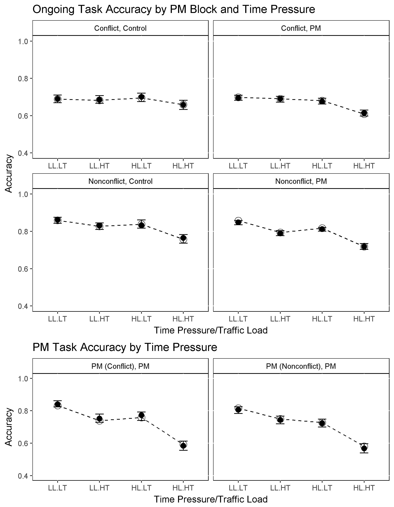
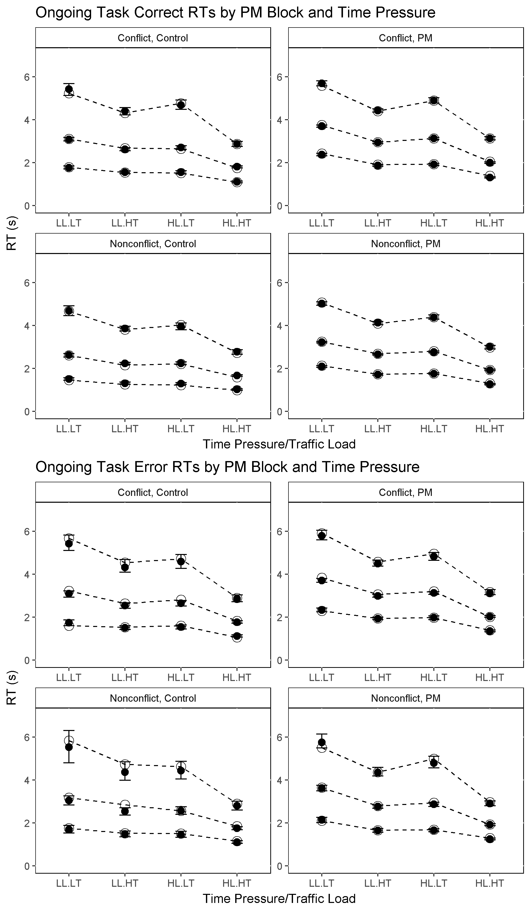

```{r setup, include=FALSE}

knitr::opts_chunk$set(echo = FALSE)
# setwd("C:/Users/Russell Boag/Documents/GitHub/DMCATC")
setwd("~/Software/DMCATC")
pkgs <- c("plyr", "dplyr", "tidyr", "broom", "pander", "xtable")
# install.packages(pkgs) #install
sapply(pkgs, require, character.only = T) #load

```

```{r echo=FALSE, eval=FALSE}
LUKE: Throughout, where I remembered, I edited the code to be within the 80pt 
margin for readability. You can get Rstudio to show you this with a line, tools>
  global options>code>display
```

# Results

- Conventional statistical analyses are reported first in order to check whether 
our experimental manipulations had the expected effects on manifest RT and accuracy. 

- Data from two particpants was excluded from the analyses; one who failed to complete
all experimental blocks and one who made no PM responses at all for the entire experiment. 

- We excluded trials with outlying RTs, defined as less than 0.2s or 3 times the 
interquartile range / 1.349 (a robust measure of standard deviation) above the mean 
(8.35% of responses overall). PM keypresses occurring during the control condition 
(which contained no PM stimuli) were also excluded. 

- The following analyses compare mean accuracy and RT by stimulus type (conflict, nonconflict, PM)
PM block (control, PM) and time pressure (Low, High) across 2 levels of trial 
load (2 vs 5 decision per trial). 

- In our omnibus significance testing for accuracy effects we used generalized
linear mixed models with a probit link function. In our omnibus significance testing 
for mean correct RTs we used general linear mixed models. 

- Significance was assessed with Wald's chi-square tests, and an alpha level of 
0.05 was used in all analyses. The results of our omnibus analyses are tabulated 
in the supplementary materials. All standard errors reported in text and 
displayed in graphs were calculated using the bias corrected method.


## Ongoing Task (Non-PM) Trials

- Accuracy was lower for conflicts (67.1%) compared to nonconflicts (80.8%), slightly 
lower under PM load compared to control (control M = 74.8%, SE = 3.2%; PM M = 73.1%, SE = 3.4%), 
and decreased across different levels of time pressure during both low traffic 
load (Low TP M = 77.2%, SE = 2.7%; High TP M = 74.4%, SE = 2.7%) and high traffic 
load conditions (Low TP M = 75.8%, SE = 2.5%; High TP M = 68.5%, SE = 2.5%). 

- Mean RT was slower for conflicts (3.00s) compared to nonconflicts (2.65s), 
slower during PM blocks than control blocks (control M = 2.62s, SE = 0.14s; PM M = 3.03s, SE = 0.15s),
and faster across different levels of time pressure for both low traffic load 
(Low TP M = 3.46s, SE = 0.11s; High TP M = 2.81s, SE = 0.08s) and high traffic 
load conditions (Low TP M = 2.95s, SE = 0.09s; High TP M = 2.07s, SE = 0.07s). 

- To summarise, the addition of PM load resulted in slower (0.4s) and slightly 
less accurate (1.7%) ongoing task performance, while increased time pressure led 
to faster but less accurate ongoing task performance. 

```{r echo=FALSE, eval=FALSE}
LUKE:A sentence about cond in the summary?
```

## PM Trials

- PM responses were scored correct if the participant pressed the PM-response key 
instead of an ongoing task (conflict/nonconflict) response key on the PM target 
trial. 

- PM accuracy decreased across different levels of time pressure during both low 
traffic load (Low TP M = 80.5%, SE = 1.8%; High TP M = 72.5%, SE = 2.0%) and high 
traffic load conditions (Low TP M = 72.4%, SE = 1.9%; High TP M = 57.2%, SE = 2.6%). 

```{r echo=FALSE, eval=FALSE}
LUKE:If you want to you can reference results directly in your text chunks.
The advantage would be if you drop a subject, or a reviewer says trim the data 
differently or something, you can reproduce more quickly. Maybe not worth it. 
```

- Mean RT for PM responses was significantly faster at higher levels of time pressure
during both low traffic load (Low TP M = 1.9s, SE = 0.05s; High TP M = 1.8s, SE = 0.05s)
and high traffic load conditions (Low TP M = 1.9s, SE = 0.05s; High TP M = 1.6s, SE = 0.05s). 

- There were no significant differences in accuracy or RT between conflict PM targets 
and nonconflict PM target. This is expected since the PM cue (i.e., particular 
letters in an aircraft callsign) was completely non-focal, meaning the evidence 
used to make PM decisions was independent of evidence used to make ongoing task decisions. 

- To summarise, as with the ongoing task, increased time pressure led to faster 
but less accurate PM performance. 

```{r echo=FALSE, eval=FALSE}
LUKE:This TP/load distinction is good bc it sounds applied psychish, and helps you condense the results. Still,
it is a bit misleading in that D was the highest time pressure of all, but in terms 
of this factor it is treated as equivalent to B (or C?). Make sure you address this
when you introduce the terms, and make sure you convince the reader that it conceptually
makes sense to look at it the way you are. 
```


## Ongoing Task Responses on PM Trials compared with Non-PM Trials

- It is possible that reactive control over ongoing task decisions could lead to 
slower ongoing task RTs on PM trials in PM blocks, as compared with non-PM trials i
n PM blocks. 

- To check whether reactive control was evident without the model-based analysis, 
we compared correct RTs on missed PM trials to correct ongoing task RTs. That is, 
RTs for 'conflict' responses to conflict PM targets and 'nonconflict' responses 
to nonconflict PM targets were compared with RTs for 'conflict' responses to non-PM 
conflicts and 'nonconflict' responses to non-PM nonconflicts (in the PM blocks).

- We ran a linear mixed effects model to examine the effects of stimulus type 
(Conflict, Nonconflict, PM (Conflict), PM (Nonconflict)) and time pressure on RTs 
for conflict and nonconflict responses. 

- Planned comparisons revealed that conflict RTs were significantly faster on PM 
trials (2.97s) than on non-PM trials (3.16s). Likewise, nonconflict RTs were significantly 
faster on PM trials (2.62s) than on non-PM trials (2.88s). 

- Stimulus type also interacted with time pressure, such that RT differences 
between PM and non-PM trials were larger during low time pressure and attenuated 
under high time pressure. 

- However it should be noted that reactive control on PM trials is confounded in 
raw RT by statistical facilitation from the PM response. As such, the critical 
test of reactive control is on accumulation rates, and is presented in the 
modeling section below.

```{r echo=FALSE, eval=FALSE}
LUKE:You may not need to do this section for your stuff. It doesn't show 
the reactive control anyway, and as you say it isn't the right test. 
```

# Model Analysis

- Brief description of PMDC model and general parameter descriptions

- Desciption of how model parameters and accumulators can vary over our 
experimental factors (PM block, time pressure, latent response, stimulus)

- Prior constraints on model parameters:

- 1 A parameter

- sv parameter allowed to vary by stimulus and latent response factors but not 
PM block or time pressure

- sv for PM false alarms (i.e., 'PM' responses to non-PM stimuli) was fixed at 
0.5 as a scaling paramter

- 1 nondecision time parameter

- Due to very low numbers of PM false alarms we pooled estimates of both 
accumulation rate and variance (v and sv) across all stimulus, response and 
experiment factors to give a single PM false alarm rate and corresponding sv
parameter. 

- This resulted in an 89 

```{r echo=FALSE, eval=FALSE}
LUKE:Seeing as this is so many parameters, it might be worth checking out the 
results with, say, the sv1 model (already sampled, I think I sent you it, if not
tell me),and making sure the parameter inference stuff largely holds up 
(it might not be a perfect match). I did so for my paper. Not necessarily to 
report it, just so if the 90 parameter thing catches a reviewer's eye, we know 
where we stand in advance. 
```


## Sampling

- Used Bayesian techniques to estimate entire probability distributions of parameters

- Hierarchical methods too computationally expensive (several months server time 
per fit) with our sample size and complexity of our models

- Thus opted for separate parameter estimation for each participant

- Bayesian analysis requires the reseacher specify prior beliefs about the 
probabilities of parameters and the form of their distrubutions

- Since these analysis techniques have not been used on a dynamic applied task 
this complex, we did not have strong reasons to prefer any particular set of 
priors over others. We therefore used the modelling results of Strickland's (2017)
PM task as a guide, but otherwise specified fairly uninformative priors (Table 1).
These prior values were the same over control/PM blocks and the different 
levels of time pressure.

- Posterior parameter distributions were estimated using the 
differential evolution Markov-chain Monte-Carlo (DE-MCMC) algorithm. DE-MCMC is
more adept at handling the high parameter correlations such as those common to 
evidence accumulation models.

- The number of chains was three times the number of parameters (e.g., for an 84 
parameter model there were 252 chains per parameter). Chains were thinned by 20,
meaning that one iteration in every 20 was kept. Sampling continued for each 
participant until a small Gelman's multivariate potential scale reduction factor 
(<1.1) indicated convergence, stationarity, and mixing. This factor is calculated
with the number of chains doubled, by considering the first and second halves of 
each chain as separate chains. Convergence, stationarity, and mixing were verified 
by visual inspection. We retained the same number of samples for each participant: 
each of the 252 chains was 120 iterations long, producing 30,240 samples of each 
parameter's posterior distribution for each participant.


```{r priors, echo=FALSE}

panderOptions('table.alignment.default', function(df) ifelse(sapply(df, is.numeric), 'right', 'center'))

table <- rbind(
c("A", "Truncated Normal", 3, 1, 0, 10),
c("B", "Truncated Normal", 2, 1, 0, "None"),
c("v (Correct Ongoing Task Response)", "Truncated Normal", 1, 2, 0, "None"),
c("v (Error Ongoing Task Response)", "Truncated Normal", 0, 2, 0, "None"),
c("v (Correct PM Response)","Truncated Normal", 1, 2, 0, "None"),
c("v (PM False Alarm)", "Truncated Normal", 0, 2, 0, "None"),
c("sv", "Truncated Normal", 0.5, 1, 0, "None"),
c("t0","Uniform", 0.3, 1, 0.1, 1)
)
table <- data.frame(table)
colnames(table) <- c("Model Parameter", "Distribution", "Mean", "SD", "Lower", "Upper")
# write.csv(table, file = "analysis/PRIORS.E1.csv")

pander(table)

```

## Model Results

### Model Fit

- To evaluate fit, we sampled 100 posterior predictions for each participant and 
then averaged over participants

- The model provided good fits to both ongoing task and PM accuracy, and gave a 
good account of the entire distribution of response times. The model provided a 
close fit to the differences in manifest RT and accuracy observed across PM and 
control conditions and across different levels of time pressure. The next section 
explains how the model fit the data in terms of model parameters.

- Figure below shows model fits to ongoing task and PM accuracy by time pressure and PM block

```{r echo=FALSE, eval=FALSE}
LUKE: Remember to compare fit graphs to say, n.post=500, to make sure
they are similar.
Also you may want to makee these dots a bit smaller. Go into 
ggplot.RP.dmc and ggplot.RP.dmc and change the size argument in the calls to
geom_point (the main call and the data call). Or maybe add a size argument to the 
function so you can tweak it as needed. 
```



- Figure below shows model fits to ongoing task correct and error RT by time pressure and PM block



- Figure below shows model fits to PM RT by time pressure and PM block


```{r echo=FALSE, eval=FALSE}
If we use this model in text we may want to include fits of block.B.cond.B.V (the PMDC model) in
the supplementaries. Check whether the fits look identical. Alternatively we could simplify
things by just using the block.B.cond.B.V model in text rather than the bigger model where we have to
address the arousal stuff, and just say we got something similar to Strickland et al. in the bigger 
model (perhaps with supplementary evidence).

What we do depends on what you think these rate effects are. If they're just overfitting,
lets use the PMDC model, DIC be damned. If they mean something, we will stick with the bigger model. 

```

### Model Selection

- Model selection to assess whether we could justify contstraining model
parameters over blocked experimental conditions (e.g., Control/PM Block, 
Time Pressure).

- We used the Deviance Information Criterion (DIC)

- DIC takes into account both goodness of fit and model complexity (number of parameters)

- Model with smallest DIC value to be prefered as most parsimonious model of the data

- Table below shows each model we compared and its corresponding DIC value

- Starting with a fully flexible 'top' model, we then built several simpler 
models by systematically constrained threshold and rate parameters over PM and 
time pressure factors. This allowed us to assess whether it was necessary to 
vary thresholds and/or rates to account for observed PM demand and time pressure 
effects.

- We compared the following four constrained models to the top model:

- A model in which rates could vary by time pressure but thresholds could not

- A model in which thresholds could vary by time pressure but rates could not

- A model in which rates could vary across PM and control blocks but thresholds 
could not, and

- A model in which thresholds could vary across PM and control blocks but rates 
could not

- In each case the simpler model was rejected in favour of the fully flexible top 
model, suggesting that it is necessary to allow both rate and threshold parameters
to vary over PM and time pressure (i.e., both parameters are influenced by PM and
time pressure manipulations and are important in explaining the observed data).

- Finally, we tested an additional model (the selected model) which allowed both
rates and thresholds to vary over both PM and time pressure, but included a slight 
simplification from the top model. The simplification involved constraining the PM 
rate parameter such that it was not allowed to vary over stimulus type (i.e., PM 
conflicts and PM nonconflicts had the same accumulation rate). This simplification 
makes theoretical sense, since the evidence used to make a PM decision (i.e.,
particular letters in an aircraft callsign) is independent of the evidence used 
to make either conflict or nonconflict ongoing task decisions (i.e., speed, 
relative distance, and motion). 

- This slightly simpler model produced the smallest DIC value and is thus
selected as our preferred model.

```{r DIC, echo=FALSE}

panderOptions('table.alignment.default', function(df) ifelse(sapply(df, is.numeric), 'right', 'left'))

DIC <- read.csv("analysis/DIC.TABLE.E1.csv", header = TRUE)
DIC <- DIC[,-1]
pander(DIC)

```

### Out-of-Sample Prediction: Nonresponse Proportions

- Misspecified model in that model was fit to truncated data (due to trial 
response deadline)

- Model fit without information about nonresponses

- We assessed ability of the model to predict nonresponses

- Simulated out of model and matched order of stimuli and responses to actual 
order they were presented to each participant. Whenever the cumulative sum of
RTs within a trial exceeded that trial's deadline, a nonresponse was predicted.

- We compared predicted nonresponses with observed nonresponse proportions 
accross the different levels of time pressure (i.e., different response deadlines)

- Figure below shows observed versus predicted nonresponse proportions

- As shown in the figure, the model's predicted nonresponse proportions closely 
matched the empirical nonresponse proportions

- This gives us confidence that the slight model misspecification due to fitting 
to truncated data is not of concern


```{r echo=FALSE, eval=FALSE}
LUKE:I would put this out of sample bit right after the regular fit bit. Also
mention that we checked the fits with truncation built into the sim and they weren't
noticeably worse than the fits presented. Might be worth appending graphs in supplementaries
showing that. NR_truncation_E1.R has a method for checking this. I am pretty damn sure
it's working, but I recommend you go through that and make double sure it's doing
what I think it is. 
```


## Model Summary

### Capacity Sharing (Non-PM Trial Accumulation)

- Capacity sharing theories of PM costs propose that holding PM intentions or 
monitoring for PM stimuli draws limited-capacity cognitive resources away from 
the ongoing task. As such, they predict that ongoing task evidence accumulation 
rates will be higher in control conditions (when more resources can be devoted 
to the ongoing task), and lower under PM load (when resources must be shared 
between the ongoing task and concurrent PM monitoring processes), which would 
lead to slower ongoing task RTs under PM load. Alternatively, another prediction 
consistent with capacity sharing is increased accumulation rates for error 
responses under PM load relative to rates for correct responses. This would 
lead to lower accuracy under PM load relative to control.

```{r echo=FALSE, eval=FALSE}
LUKE: Not alternatively, capacity could come out in both
```

- The figure below shows accumulation rates in control and PM blocks for 
non-PM ongoing task stimuli (i.e., conflicts and nonconflicts that were not 
also PM targets). Contrary to the predictions of capacity sharing theories, 
accumulation rates for correct responses were higher under PM load than in the
control condition for both conflict and nonconflict stimuli. It should be noted
however that accumulation rates for error responses were also greater under 
PM load, which is not inconsistent with a capacity sharing account. 

- Taken together, this pattern of large increases in correct and error
accumulation rates from control to PM conditions provides convincing evidence 
against a capacity sharing account of PM costs in this task. As will be discussed 
later, these results are more indicative of an overall increase in effort or 
arousal/task engagement during PM blocks, which may be because the ongoing task 
becomes subjectively more difficult and/or engaging with the addition of the 
concurrent PM task relative to control blocks.


### Proactive Control (Thresholds)

#### Proactive Control under PM Demand

- Proactive control over ongoing task decisions predicts higher conflict and 
nonconflict response thresholds under PM load compared to during control blocks.

- Z-score effect sizes and p-values for threshold comparisons are shown in the table below.

- The figure below shows conflict and nonconflict response thresholds in the 
control and PM blocks.

- Ongoing task thresholds where much higher in PM than control blocks

- This is consistent with strategic delay theories on PM costs where responses 
to the ongoing task are deliberately delayed in order to avoid preempting PM targets.

#### Proactive Control under Time Pressure

- Spiel about speed-accuracy trade-off and adjusting threshold to increase 
speed at expense of accuracy

- The lower panels of the figure below also show ongoing task and PM response 
thresholds under low and high time pressure for both low trial load 
(2 decisions per trial) and high trial load (5 decisions per trial)

- In both cases thresholds decreased under high time pressure relative to 
low time pressure

- Consistent with much choice-RT modelling of the speed-accuracy trade-off

- Consistent with proactive control of decision processes whereby thresholds are
strategically lowered in order to facilitate fast responding (at the expense of accuracy)


### Reactive Inhibition (PM vs. Non-PM Trial Accumulation)

- A prediction of PMDC theory is that ongoing task (conflict/nonconflict) 
evidence accumulation rates will be lower on PM trials due to 'reactive'
inhibitory control of the decision process by the PM stimulus detector. 

- The figure below shows accumulation rates for ongoing task responses to 
non-PM conflict/nonconflict stimuli compared to PM conflict/nonconflict stimuli
(i.e., ongoing task stimuli that also contained a PM target).

- Consistent with the predictions of PMDC's reactive inhibition mechanism, rates 
for ongoing task accumulators where much lower for stimuli containing a PM cue 
compared to when the same stimuli did not contain a PM cue.

- This supports the idea that when the PM detector detects a PM target, the 
accumulation process for the competing ongoing task response is supressed or inhibited.

- The reactive inhibition of ongoing task responses was slightly stronger for 
the incorrect ongoing response accumulators

- These findings are consistent with the idea that response accumulators compete 
with each other based on their inputs; in the presence of a PM stimulus, evidence
accumulation processes for conflict and nonconflict are inhibited relative to when 
a PM stimulus is absent.

- (Maybe include some stuff about the connection between this finding and research 
on PM lures (stimuli that share some but not all of the features of a PM target))

```{r echo=FALSE, eval=FALSE}
LUKE: Lures are more of a discussion or intro point
```


### Effort/Arousal (Accumulation Increases with PM Load and Time Pressure)

- As mentioned previously, in contrast with the predictions of capacity-sharing 
theories of PM costs, we found that evidence accumulation rates actually increased 
with the addition of PM load. 

- The figure below also shows correct and error accumulation rates across the 
different levels of time pressure for both low trial load (2 decisions per trial) 
and high trial load (5 decisions per trial) conditions.

- As with the increases seen from control to PM blocks, both correct and error 
accumulation rates were higher under higher time pressure relative to low time pressure.

- Since rates for both correct and error responses increase, this effect is also 
suggestive of an overall increase in arousal/task engagement or the overall effort 
being invested in completing the task.

- Possible that the task becomes more difficult or engaging under high time pressure
leading participants to deploy more resources

- Alternatively participants could be 'satisficing', that is, in the relatively 
easy control and low time pressure conditions participants may believe that they 
can disengage from the task somewhat, expending fewer cognitive resources while 
maintaining a satisfactory level of task performance.

```{r echo=FALSE, eval=FALSE}
Ok good points. There is a paper from Rummel on more on-task focus with PM as well.
Still I recall there was even more to this arousal thing across A1-A4?
```


## Model Exploration

- Given the complexity of our model, it is difficult to discern the overall 
contribution given parameters have on overall RT and/or accuracy. In this section 
we attempt to tease out the individual contribution to RT and accuracy provided 
by certain parameters and mechanisms in the model. It is our aim to give a 
clearer picture of the relative importance of key parameters in accounting for 
the observed effects.

- In order to evaluate a given parameter's contribution to the model, we first 
replace that parameter with the average either across control/PM blocks or across 
time pressure levels (e.g., replacing control and PM ongoing task thresholds with 
the average of the two). We can then examine the associated mis-fit of the model 
with the removed effect relative to the full model with the effect included.

- Compare fits to accuracy and RT for a model with thresholds averaged over 
control and PM blocks and a model with rates averaged over control and PM blocks.


```{r echo=FALSE, eval=FALSE}
LUKE:I recommend the below graphs go in the supplementaries with explanations in text 
that capture the key point of each graph. They are great but the casual reader probably
won't be able to process them. Percentage values can be good. 
```


- Compare fits to accuracy and RT for a model with thesholds averaged over time pressure and a model with accumulation rates averaged over time pressure.


- Compare fits to overall RT and accuracy for a model which only includes reactive control mechanisms, a model which only includes proactive control mechanisms, and a model with neither control mechanism.


