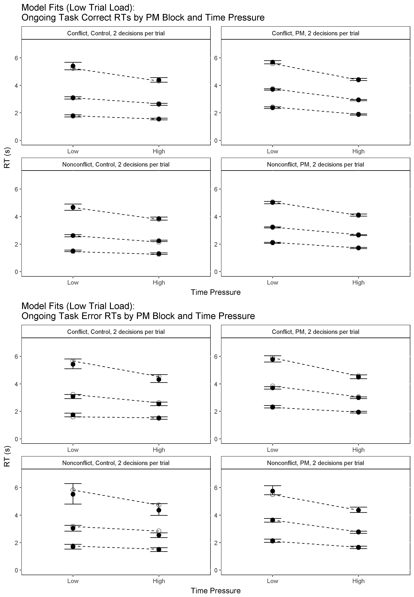
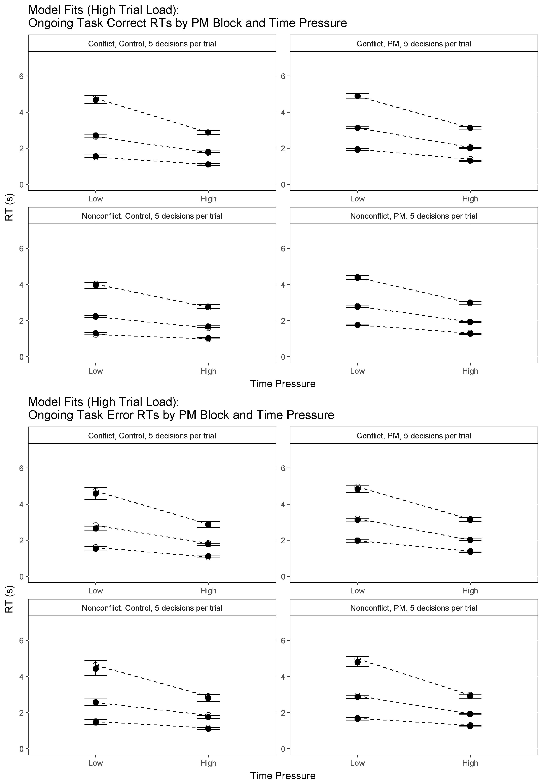
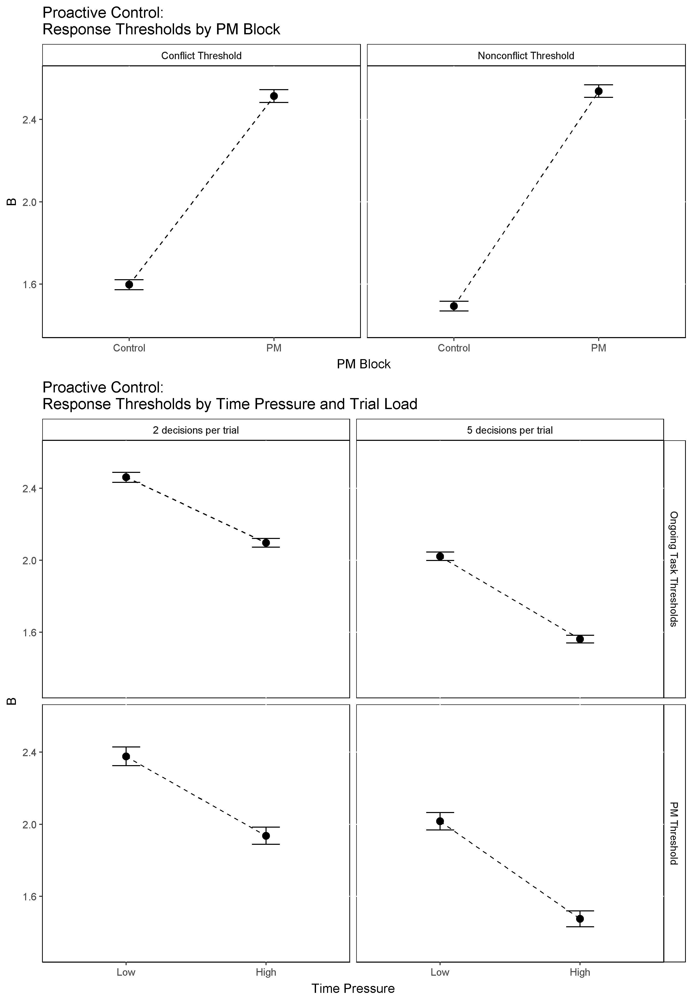

```{r setup, include=FALSE}

knitr::opts_chunk$set(echo = FALSE)
setwd("C:/Users/Russell Boag/Documents/GitHub/DMCATC")
# setwd("~/Software/DMCATC")
pkgs <- c("plyr", "dplyr", "tidyr", "broom", "pander", "xtable", "citr")
# install.packages(pkgs) #install
sapply(pkgs, require, character.only = T) #load

```


# Results

```{r nonresponses and excluded data, echo=FALSE, include=FALSE}

rm(list=ls())
setwd("C:/Users/Russell Boag/Documents/GitHub/DMCATC")
# setwd("~/Software/DMCATC")
pkgs <- c("plyr", "dplyr", "tidyr", "broom", "pander", "xtable")
# install.packages(pkgs) #install
sapply(pkgs, require, character.only = T) #load

# Load data
data <- read.csv("data/exp_data/ATC.E1.csv")
str(data)

## Exclude p17 due to no PM responses
data <- data[ data$s!="p17", ]
data$s <- factor(data$s)

## PARSE E1

dat <- data
dat$s <- factor(as.character(dat$s))
# dat$TP <- dat$TP/1000
dat$RT <- dat$RT/1000

str(dat)
dat$pool <- NULL
dat$load <- NULL
dat$TP <- NULL
dat$presOrder <- NULL
dat$pairNumber <- NULL
dat$DOMS <- NULL
dat$TTMS <- NULL
dat$OOP <- NULL
dat$C <- NULL
dat$angle <- NULL
dat$ac1_type <- NULL
dat$ac2_type <- NULL
dat$ac1_cs <- NULL
dat$ac2_cs <- NULL
dat$ac1_fl <- NULL
dat$ac2_fl <- NULL
dat$ac1_speed <- NULL
dat$ac2_speed <- NULL
dat$pm_status <- NULL
dat$conflict_status <- NULL
str(dat)

# Rename stimulus and response factor levels
levels(dat$S)
levels(dat$S) <- c("cc", "nn", "pc", "pn")

levels(dat$R)
levels(dat$R) <- c("C","N","P","M")

# Revalue Control and PM blocks by number of accumulators ("2", "3")
levels(dat$block)
levels(dat$block) <- c("2", "3")

# Label nonresponses with 'M' for 'miss'
dat[ which(is.na(dat$R)==TRUE), "R" ] <- "M"
plot(dat$R)

# Calculate % nonresponses
percent.NR <- length(dat$R[dat$R=="M"])/length(dat$R) * 100
percent.NR

# Calculate % PM responses in control blocks
# dat[dat$block=="2" & dat$R=="P",]
percent.PM.in.Control <- length(dat[dat$block=="2" & dat$R=="P", 1])/length(dat$R) * 100
percent.PM.in.Control

# Clean data, remove outliers and nonresponses
okdats <- dat
okdats <- okdats[okdats$R!="M", ]  # Remove misses
okdats$R <- factor(okdats$R)
okdats <- okdats[!is.na(okdats$RT),]  # Remove NA RT values
str(okdats)

# Remove PM false alarms
okdats<-okdats[!(okdats$block=="2" & okdats$R=="P"),]
str(okdats)

clean <- function(df) {
    dfc <- df
    n=tapply(df$RT,list(df$s),length)
    ns=tapply(df$RT,list(df$s),length)
    mn=tapply(df$RT,list(df$s),mean)
    sd=tapply(df$RT,list(df$s),IQR)
    upper <- mn+3*(sd/1.349)
    lower <- 0.2
    bad <- logical(dim(df)[1])
    levs <- paste(df$s,sep=".")
    for (i in levels(df$s)){
        lev <- i
        bad[levs==lev] <- df[levs==lev,"RT"] > upper[i] | df[levs==lev,"RT"] < lower
    }
    df=df[!bad,]
    nok=tapply(df$RT,list(df$s),length)
    pbad=100-100*nok/n
    nok=tapply(df$RT,list(df$s),length)
    pbad=100-100*nok/ns
    print(sort(round(pbad,5)))
    print(mean(pbad,na.rm=T))
    df
}


okdats <- clean(okdats)
str(okdats)

# Calculate % of responses cleaned / outliers removed
percent.cleaned <- (1 - length(okdats$RT)/length(dat$RT)) * 100
percent.cleaned

```

- Conventional statistical analyses are reported first in order to check whether 
our experimental manipulations had the expected effects on manifest RT and accuracy. 

- Data from two particpants was excluded from the analyses; one who failed to complete all experimental blocks and one who made no PM responses at all for the entire experiment. 

- We excluded trials with outlying RTs, defined as less than 0.2s or 3 times the 
interquartile range / 1.349 (a robust measure of standard deviation) above the mean (`r options(digits = 2); percent.cleaned`% of responses overall). PM keypresses occurring during the control condition (which contained no PM stimuli) were also excluded (`r options(digits = 2); percent.PM.in.Control`% of responses overall). 

- The following analyses compare mean accuracy and RT by stimulus type (conflict, nonconflict, PM) PM block (control, PM) and time pressure (Low, High) across 2 levels of trial load (2 vs 5 decision per trial). 

- It should be noted that our time pressure factor was not crossed orthogonally with the trial load factor. Specifically, under low trial load (2 decisions per trial), low time pressure corresponded to a response deadline of 12 seconds (i.e., 6 seconds per decision on average) while high time pressure corresponded to a response deadline of 8 seconds (i.e., 4 seconds per decision on average). In contrast, under high trial load (5 decisions per trial), low time pressure corresponded to a response deadline of 20 seconds (i.e., 4 seconds per decision on average) while high time pressure corresponded to a response deadline of 10 seconds (i.e., 2 seconds per decision on average). As such, the following analyses compare the low and high time pressure levels separately for the low and high trial load conditions.

- Likewise, we can only sensibly compare low versus high trial load between the two conditions where time pressure is equivalent (i.e., the two blocks with time pressure of 4 seconds per decision). As such, all comparisons of trial load are done between the low load/high time pressure condition (i.e., 2 decisions per trial/4 seconds per decision) and high load/low time pressure condition (i.e., 5 decisions per trial/4 seconds per decision).

- In our omnibus significance testing for accuracy effects we used generalized
linear mixed models with a probit link function. In our omnibus significance testing 
for mean correct RTs we used general linear mixed models. 

- Significance was assessed with Wald's chi-square tests, and an alpha level of 
0.05 was used in all analyses. The results of our omnibus analyses are tabulated 
in the supplementary materials. All standard errors reported in text and 
displayed in graphs were calculated using the bias corrected method.


## Ongoing Task (Non-PM) Trials

```{r ongoing task non-pm stats, echo=FALSE, eval=TRUE}

CDT.Acc.S <- read.csv("analysis/CDT.Acc.S.E1.csv")
CDT.Acc.Block <- read.csv("analysis/CDT.Acc.Block.E1.csv")
CDT.Acc.Cond <- read.csv("analysis/CDT.Acc.Cond.E1.csv")

CDT.RT.S <- read.csv("analysis/CDT.RT.S.E1.csv")
CDT.RT.Block <- read.csv("analysis/CDT.RT.Block.E1.csv")
CDT.RT.Cond <- read.csv("analysis/CDT.RT.Cond.E1.csv")

```

- Accuracy was lower for conflicts (`r options(digits = 2); CDT.Acc.S$Conflict[1]*100`%) compared to nonconflicts (`r options(digits = 2); CDT.Acc.S$Nonconflict[1]*100`%), slightly lower under PM load compared to control (Control: _M_ = `r options(digits = 2); CDT.Acc.Block$Control[1]*100`%, _SE_ = `r options(digits = 2); CDT.Acc.Block$Control[2]*100`%; PM: _M_ = `r options(digits = 2); CDT.Acc.Block$PM[1]*100`%, _SE_ = `r options(digits = 2); CDT.Acc.Block$PM[2]*100`%), and decreased with higher levels of time pressure during both low trial load (Low TP: _M_ = `r options(digits = 2); CDT.Acc.Cond$A[1]*100`%, _SE_ = `r options(digits = 2); CDT.Acc.Cond$A[2]*100`%; High TP: _M_ = `r options(digits = 2); CDT.Acc.Cond$B[1]*100`%, _SE_ = `r options(digits = 2); CDT.Acc.Cond$B[2]*100`%) and high trial load conditions (Low TP: _M_ = `r options(digits = 2); CDT.Acc.Cond$C[1]*100`%, _SE_ = `r options(digits = 2); CDT.Acc.Cond$C[2]*100`%; High TP: _M_ = `r options(digits = 2); CDT.Acc.Cond$D[1]*100`%, _SE_ = `r options(digits = 2); CDT.Acc.Cond$D[2]*100`%). 

```{r ongoing task accuracy glmer table, echo=FALSE, include=FALSE}

panderOptions('table.alignment.default', function(df) ifelse(sapply(df, is.numeric), 'center', 'left'))

table <- read.csv("analysis/CDT.Acc.TABLE.E1.csv")
table <- data.frame(table)
colnames(table) <- c("Factor", "Chi-square", "df", "p")

pander(table)

```

- Mean RT was slower for conflicts (`r options(digits = 2); CDT.RT.S$Conflict[1]`s) compared to nonconflicts (`r options(digits = 2); CDT.RT.S$Nonconflict[1]`s), slower during PM blocks than control blocks (Control: _M_ = `r options(digits = 2); CDT.RT.Block$Control[1]`s, _SE_ = `r options(digits = 2); CDT.RT.Block$Control[2]`s; PM: _M_ = `r options(digits = 2); CDT.RT.Block$PM[1]`s, _SE_ = `r options(digits = 2); CDT.RT.Block$PM[2]`s), and faster across different levels of time pressure for both low trial load (Low TP: _M_ = `r options(digits = 2); CDT.RT.Cond$A[1]`s, _SE_ = `r options(digits = 2); CDT.RT.Cond$A[2]`s; High TP: _M_ = `r options(digits = 2); CDT.RT.Cond$B[1]`s, _SE_ = `r options(digits = 2); CDT.RT.Cond$B[2]`s) and high trial load conditions (Low TP: _M_ = `r options(digits = 2); CDT.RT.Cond$C[1]`s, _SE_ = `r options(digits = 2); CDT.RT.Cond$C[2]`s; High TP: _M_ = `r options(digits = 2); CDT.RT.Cond$D[1]`s, _SE_ = `r options(digits = 2); CDT.RT.Cond$D[2]`s). 

```{r ongoing task RT lmer table, echo=FALSE, include=FALSE}

panderOptions('table.alignment.default', function(df) ifelse(sapply(df, is.numeric), 'center', 'left'))

table <- read.csv("analysis/CDT.RT.TABLE.E1.csv")
table <- data.frame(table)
colnames(table) <- c("Factor", "Chi-square", "df", "p")

pander(table)

```

- To summarise, the addition of PM load resulted in slower (_Mean Difference_ = `r options(digits = 2); CDT.RT.Block$PM[1] - CDT.RT.Block$Control[1]`s) and slightly 
less accurate (_Mean Difference_ = `r options(digits = 2); CDT.Acc.Block$Control[1]*100 - CDT.Acc.Block$PM[1]*100`%) ongoing task performance, while increased time pressure led to faster but less accurate ongoing task performance. 


## PM Trials

```{r pm trial stats, echo=FALSE, eval=TRUE}

PMT.Acc.S <- read.csv("analysis/PMT.Acc.S.E1.csv")
PMT.Acc.Cond <- read.csv("analysis/PMT.Acc.Cond.E1.csv")

PMT.RT.S <- read.csv("analysis/PMT.RT.S.E1.csv")
PMT.RT.Cond <- read.csv("analysis/PMT.RT.Cond.E1.csv")

```

- PM responses were scored correct if the participant pressed the PM-response key 
instead of an ongoing task (conflict/nonconflict) response key on the PM target 
trial. 

- PM accuracy decreased across different levels of time pressure during both low 
trial load (Low TP: _M_ = `r options(digits = 2); PMT.Acc.Cond$A[1]*100`%, _SE_ = `r options(digits = 2); PMT.Acc.Cond$A[2]*100`%; High TP: _M_ = `r options(digits = 2); PMT.Acc.Cond$B[1]*100`%, _SE_ = `r options(digits = 2); PMT.Acc.Cond$B[2]*100`%) and high trial load conditions (Low TP: _M_ = `r options(digits = 2); PMT.Acc.Cond$C[1]*100`%, _SE_ = `r options(digits = 2); PMT.Acc.Cond$C[2]*100`%; High TP: _M_ = `r options(digits = 2); PMT.Acc.Cond$D[1]*100`%, _SE_ = `r options(digits = 2); PMT.Acc.Cond$D[2]*100`%). 

```{r pm accuracy glmer table, echo=FALSE, include=FALSE}

panderOptions('table.alignment.default', function(df) ifelse(sapply(df, is.numeric), 'center', 'left'))

table <- read.csv("analysis/PMT.Acc.TABLE.E1.csv")
table <- data.frame(table)
colnames(table) <- c("Factor", "Chi-square", "df", "p")

pander(table)

```

- Mean RT for PM responses was significantly faster at higher levels of time pressure
during both low trial load (Low TP: _M_ = `r options(digits = 2); PMT.RT.Cond$A[1]`s, _SE_ = `r options(digits = 2); PMT.RT.Cond$A[2]`s; High TP: _M_ = `r options(digits = 2); PMT.RT.Cond$B[1]`s, _SE_ = `r options(digits = 2); PMT.RT.Cond$B[2]`s) and high trial load conditions (Low TP: _M_ = `r options(digits = 2); PMT.RT.Cond$C[1]`s, _SE_ = `r options(digits = 2); PMT.RT.Cond$C[2]`s; High TP: _M_ = `r options(digits = 2); PMT.RT.Cond$D[1]`s, _SE_ = `r options(digits = 2); PMT.RT.Cond$D[2]`s). 

- There were no significant differences in accuracy or RT between conflict PM targets
and nonconflict PM target. This is expected since the PM cue (i.e., particular letters in an aircraft callsign) was completely non-focal, meaning the evidence 
used to make PM decisions was independent of evidence used to make ongoing task decisions. 

- To summarise, as with the ongoing task, increased time pressure led to faster 
but less accurate PM performance. 

```{r pm RT lmer table, echo=FALSE, include=FALSE}

panderOptions('table.alignment.default', function(df) ifelse(sapply(df, is.numeric), 'center', 'left'))

table <- read.csv("analysis/PMT.RT.TABLE.E1.csv")
table <- data.frame(table)
colnames(table) <- c("Factor", "Chi-square", "df", "p")

pander(table)

```

## Ongoing Task Responses on PM Trials compared with Non-PM Trials

```{r ongoing task pm versus non-pm, echo=FALSE, include=FALSE}

CDT.Reactive.S <- read.csv("analysis/CDT.Reactive.S.E1.csv")

```

- It is possible that reactive control over ongoing task decisions could lead to 
slower ongoing task RTs on PM trials in PM blocks, as compared with non-PM trials in PM blocks. 

- To check whether reactive control was evident without the model-based analysis, 
we compared correct RTs on missed PM trials to correct ongoing task RTs. That is, 
RTs for 'conflict' responses to conflict PM targets and 'nonconflict' responses 
to nonconflict PM targets were compared with RTs for 'conflict' responses to non-PM 
conflicts and 'nonconflict' responses to non-PM nonconflicts (in the PM blocks).

- We ran a linear mixed effects model to examine the effects of stimulus type 
(Conflict, Nonconflict, PM (Conflict), PM (Nonconflict)) and time pressure on RTs 
for conflict and nonconflict responses. 

- Planned comparisons revealed that conflict RTs were significantly faster on PM 
trials (`r options(digits = 2); CDT.Reactive.S$PM_Conflict[1]`s) than on non-PM trials (`r options(digits = 2); CDT.Reactive.S$Conflict[1]`s). Likewise, nonconflict RTs were significantly faster on PM trials (`r options(digits = 2); CDT.Reactive.S$PM_Nonconflict[1]`s) than on non-PM trials (`r options(digits = 2); CDT.Reactive.S$Nonconflict[1]`s). 

- However, it should be noted that reactive control on PM trials is confounded in 
raw RT by statistical facilitation from the PM response. Specifically, on PM trials the accumulators for the ongoing task responses must compete with a much faster PM response accumulator. Overt ongoing task responses on PM trials are therefore more likely to be fast errors which outpace the PM accumulation process. As such, this comparison of mean RT is not sufficient to rule out reactive control. Rather, the critical test of reactive control is a comparison of accumulation rates, and is presented in the modelling section below.

```{r reactive check lmer table, echo=FALSE, include=FALSE}

panderOptions('table.alignment.default', function(df) ifelse(sapply(df, is.numeric), 'center', 'left'))

table <- read.csv("analysis/CDT.Reactive.TABLE.E1.csv")
table <- data.frame(table)
colnames(table) <- c("Factor", "Chi-square", "df", "p")

pander(table)

```


# Model Analysis

- Following Strickland (2017), we modelled the current task with a 3-accumulator LBA with two accumulators for the ongoing task (conflict/nonconflict) repsonses and one accumulator for the PM response. 

- Each accumulator is described by several model parameters. Each accumulator begins a decision with a starting amount of evidence drawn from a uniform distribution on the interval [0, A]. After a stimulus is presented, evidence accumulates linearly at a rate drawn from a normal distribution with mean _v_ and standard deviation _sv_. Evidence continues accumulating until it reaches a response threshold _b_; the first accumulator to reach threshold determines the overt response. Note that since _A_ is held constant across all conditions, we report threshold in terms of _B_ (_B_ = _b_ - _A_), where differences in _B_ between experimental conditions reflect pure threshold effects. Finally, the addtional components of RT which fall outside of the decision process such as stimulus encoding and motor response time are captured by the nondecision time paramter _t0_. 

- Our design includes several factors over which model parameters can vary, including latent response (i.e., conflict, nonconflict, and PM accumulators), and three manifest factors, stimulus type, time pressure/trial load, and PM demand. The latent response factor refers to the accumulators that can lead to each response (i.e., 'conflict', 'nonconflict', and 'PM'). It is important to be clear that the latent response factor corresponds to the accumulators, and not the response that was actually observed; the observed response is predicted by, not included in, the model. 
- The stimulus type factor had four levels: _non-PM conflict_, _non-PM nonconflict_, _PM conflict_, and _PM nonconflict_. Since the time pressure (low, high) and trial load (2 vs. 5 decisions per trial) factors were not crossed orthogonally, they were captured by a four-level composite factor with the following levels: _low TP/low load_, _high TP/low load_, _low TP/high load_, _high TP/high load_. Lastly the PM demand factors had two levels: _control (i.e., no PM demand)_ and _PM_. 

- In order to reduce model complexity, we applied several theoretically sensible _a priori_ constraints on which factors each paramter could vary over. First, we estimated only one _A_ parameter for each participant, as is common practice in LBA modelling. 

- Second, we allowed the _sv_ parameter to vary by stimulus and latent response factors but not over the different PM block or time pressure conditions. This is more flexible than most previous LBA modelling, which only allows _sv_ to vary as a function of whether the latent accumulator matches or does not match the stimulus. We used this more flexible approach because in our current model there are two types of 'correct' response for PM trials (i.e., correct PM and correct ongoing task decision). Also in line with Strickland (2017), we fixed the _sv_ parameter for PM false alarms (i.e., 'PM' responses to non-PM stimuli) at 0.5. This is standard practice in LBA (and other parametric modelling) where one parameter must be fixed as a scaling parameter.

- Third, as with _A_, we estimated only one nondecision time (_t0_) parameter for each participant. This was done because our design minimized any potential differences in the motor movement required to make each response (i.e., participants kept their fingers positioned above the response key which were all located on one keyboard row). In addition, previous research has shown nondecision time does not appear to play a role in PM cost and is mostly negligible in explaining speed-accuracy trade-off effects. We also follow previous research in assuming that nondecision time is constant across trials. 

- Finally, due to very low numbers of PM false alarms (i.e., PM responses to non-PM stimuli) we pooled estimates of both accumulation rate and variance (_v_ and _sv_) across all experiment factors to give one PM false alarm accumulation rate and one corresponding _sv_ parameter (which was used as a fixed scaling parameter as mentioned above). 

- These _a priori_ restrictions resulted in an 89 parameter most flexible 'top' model with one _A_, one _t0_, 20 _B_, 57 _v_, and 10 _sv_ parameters. We compared this flexible top model against several simpler, more constrained variants outlined in the Model Selection section below.

```{r echo=FALSE, eval=FALSE}
LUKE:Seeing as this is so many parameters, it might be worth checking out the 
results with, say, the sv1 model (already sampled, I think I sent you it, if not
tell me),and making sure the parameter inference stuff largely holds up 
(it might not be a perfect match). I did so for my paper. Not necessarily to 
report it, just so if the 90 parameter thing catches a reviewer's eye, we know 
where we stand in advance. 
```


## Sampling

- Most evidence accumulation modelling to-date has relied on maximum-likelihood techniques to obtain point estimates of model parameter values. Here we instead use Bayesian techniques to estimate entire probability distributions of parameters rather than single point estimates. 

- Although we could have fit a hierarchical model to estimate the common population distributions (hyperparameters) of each parameter, we opted to estimate parameters separately for each participant. This was due to several reasons. First, since this is the first time that such a model has been fit to this kind of task, we did not have adequate knowledge of the appropriate form of the population-level distributions. Because inappropriate population-level assumptions can introduce biases and shrinkage effects in hierarchical models, fitting to individual participants was the more conservative option. Second, because of the large number of participants in our sample and the complexity of our models, hierarchical methods proved too computationally expensive (estimated at several months of server time per fit) at the present time. 

- Bayesian analysis requires the reseacher specify prior beliefs about the 
probabilities of parameters and the form of their distrubutions. However, note that because of our large sample sizes and use of inference based on posterior probability distributions, the influence of our particular choice of priors on the final parameter estimates was negligible. Since these analysis techniques have not been used on a dynamic applied task this complex, we did not have strong reasons to prefer any particular set of priors over others. We therefore used the modelling results of Strickland's (2017) PM task as a guide, but otherwise specified fairly uninformative priors (Table). All prior values were the same over control/PM blocks and the different levels of time pressure.

- Posterior parameter distributions were estimated using the differential evolution Markov-chain Monte-Carlo (DE-MCMC) algorithm. DE-MCMC is more adept at handling the high parameter correlations such as those common to evidence accumulation models. The number of chains was three times the number of parameters (e.g., for an 84 parameter model there were 252 chains per parameter). Chains were thinned by 20, meaning that one iteration in every 20 was kept. Sampling continued for each participant until a small Gelman's multivariate potential scale reduction factor (<1.1) indicated convergence, stationarity, and mixing. This factor is calculated with the number of chains doubled, by considering the first and second halves of each chain as separate chains. Convergence, stationarity, and mixing were verified by visual inspection. We retained the same number of samples for each participant: each of the 252 chains was 120 iterations long, producing 30,240 samples of each parameter's posterior distribution for each participant. 

```{r priors table, echo=FALSE}

panderOptions('table.alignment.default', function(df) ifelse(sapply(df, is.numeric), 'right', 'center'))

table <- rbind(
c("A", "Truncated Normal", 3, 1, 0, 10),
c("B", "Truncated Normal", 2, 1, 0, "None"),
c("v (Correct Ongoing Task Response)", "Truncated Normal", 1, 2, 0, "None"),
c("v (Error Ongoing Task Response)", "Truncated Normal", 0, 2, 0, "None"),
c("v (Correct PM Response)","Truncated Normal", 1, 2, 0, "None"),
c("v (PM False Alarm)", "Truncated Normal", 0, 2, 0, "None"),
c("sv", "Truncated Normal", 0.5, 1, 0, "None"),
c("t0","Uniform", 0.3, 1, 0.1, 1)
)
table <- data.frame(table)
colnames(table) <- c("Model Parameter", "Distribution", "Mean", "SD", "Lower", "Upper")
# write.csv(table, file = "analysis/PRIORS.E1.csv")

pander(table)

```

## Model Results

### Model Fits: Accuracy and RT

- To evaluate fit, we sampled 100 posterior predictions for each participant and 
then averaged over participants. The model provided good fits to both ongoing task and PM accuracy (Figure), and gave a good account of the entire distribution of response times (Figure). The model provided a close fit to the differences in manifest RT and accuracy observed across PM and control conditions and across different levels of time pressure. The next section explains how the model fit the data in terms of model parameters.

```{r echo=FALSE, eval=FALSE}
LUKE: Remember to compare fit graphs to say, n.post=500, to make sure
they are similar.
Also you may want to makee these dots a bit smaller. Go into 
ggplot.RP.dmc and ggplot.RP.dmc and change the size argument in the calls to
geom_point (the main call and the data call). Or maybe add a size argument to the 
function so you can tweak it as needed. 
```

- Figure below shows model fits to ongoing task and PM accuracy by time pressure and PM block

```{r Fits: Accuracy Ongoing, echo=FALSE, out.width='80%'}

knitr::include_graphics("figures/E1/E1.Fits.Accuracy.Ongoing.png")

```

```{r Fits: Accuracy PM, echo=FALSE, out.width='80%'}


```

- Figure below shows model fits to ongoing task correct and error RT by time pressure and PM block

```{r Fits: RT Ongoing Low Load, echo=FALSE, out.width='80%'}



```

```{r Fits: RT Ongoing High Load, echo=FALSE, out.width='80%'}



```

- Figure below shows model fits to PM RT by time pressure and PM block

```{r Fits: RT PM, echo=FALSE, out.width='80%'}

knitr::include_graphics("figures/E1/E1.Fits.RT.PM.png")

```


```{r echo=FALSE, eval=FALSE}
If we use this model in text we may want to include fits of block.B.cond.B.V (the PMDC model) in the supplementaries. Check whether the fits look identical. Alternatively we could simplify things by just using the block.B.cond.B.V model in text rather than the bigger model where we have to address the arousal stuff, and just say we got something similar to Strickland et al. in the bigger 
model (perhaps with supplementary evidence).

What we do depends on what you think these rate effects are. If they're just overfitting, lets use the PMDC model, DIC be damned. If they mean something, we will stick with the bigger model. 

```

### Model Fits: Nonresponse Proportions

- It should be noted that because the current model was fit to truncated data (i.e., with nonresponses removed), it is slightly misspecified. Specifically, because of the response deadline feature in our experimental design, a small proportion of our data were nonresponses which do not have associated RTs. As such, they do not contribute information to RT distributions fit by the LBA model. 

- Since the model was fit without explicit information about nonresponses, we were interested in assessing the model's ability to predict nonresponses and how well those predictions fit empirical nonresponse proportion data. In order to do this, we simulated data out of the model and matched the order of the simulated stimuli and responses to the actual presentation order experienced by each participant. Whenever the cumulative sum of simulated RTs within a trial exceeded that trial's deadline, a nonresponse was predicted. Using this method, 100 posterior predictions for nonresponse proportions were sampled for each participant and predictions were then averaged over all participants. We then compared the predicted nonresponses with observed nonresponse proportions across the different levels of time pressure (i.e., different response deadlines) for both low and high trial load conditions. 

- Figure below shows observed versus predicted nonresponse proportions.

```{r fits NR, echo=FALSE, out.width='80%'}

knitr::include_graphics("figures/E1/E1.Fits.NR.png")

```

- As shown in the figure, the model's predicted nonresponse proportions closely 
match the empirical nonresponse proportions. This gives us confidence that the slight model misspecification due to fitting to truncated data is not of concern in terms of the models predictive validity. 

```{r echo=FALSE, eval=FALSE}

LUKE:Also
mention that we checked the fits with truncation built into the sim and they weren't
noticeably worse than the fits presented. Might be worth appending graphs in supplementaries
showing that. NR_truncation_E1.R has a method for checking this. I am pretty damn sure
it's working, but I recommend you go through that and make double sure it's doing
what I think it is. 

```


### Model Selection

- We applied model selection to assess whether we could justify contstraining model
parameters over blocked experimental conditions (e.g., Control/PM Block, Time Pressure) to obtain a simpler model with fewer parameters. To select between models, we used the Deviance Information Criterion (DIC), a measure which takes into account both goodness of fit and model complexity (number of parameters). In general, models with smaller DIC values are to be prefered as more parsimonious explanations of the data than models with larger DIC values. Table below shows each model we compared, its number of parameters, and its corresponding DIC value. 

- Starting with the fully flexible top model, we built several simpler variants by systematically constraining threshold and rate parameters over PM and time pressure factors. This allowed us to assess whether it was necessary to vary thresholds and/or rates to account for observed PM demand and time pressure effects. We compared the following four constrained models to the top model: 

- A model in which rates could vary by time pressure but thresholds could not
- A model in which thresholds could vary by time pressure but rates could not
- A model in which rates could vary across PM and control blocks but thresholds 
could not, and
- A model in which thresholds could vary across PM and control blocks but rates 
could not

- In each case the simpler model was rejected in favour of the fully flexible top 
model, suggesting that it is necessary to allow both rate and threshold parameters
to vary over PM and time pressure (i.e., both parameters are influenced by PM and
time pressure manipulations and are important in explaining the observed data).

- Finally, we tested an additional model (the selected model) which allowed both
rates and thresholds to vary over both PM and time pressure, but included a slight 
simplification from the top model. The simplification involved constraining the PM 
rate parameter such that it was not allowed to vary over stimulus type (i.e., PM 
conflicts and PM nonconflicts had the same accumulation rate). This simplification 
makes theoretical sense, since the evidence used to make a PM decision (i.e.,
particular letters in an aircraft callsign) is independent of the evidence used 
to make either conflict or nonconflict ongoing task decisions (i.e., speed, 
relative distance, and motion). This slightly simpler model produced the smallest DIC value and was thus selected as our preferred model.

- Although the results of model selection suggest that both rates and thresholds have some role in explaining PM cost and time pressure effects, we cannot say how important each parameter is or what proportion of a given effect is accounted for by each parameter. As such, in the next section we test the direction and magnitude of differences between conditions in the parameters of the selected model. Testing the direction of effects is important because it allows us to distinguish between competing theories of PM costs, whose predictions are also directional (e.g., capacity-sharing theories predict lower accumulation rates under PM load than control). Testing the magnitude of effects is similarly important, especially in applied settings, as it indicates which processes contribute the most to a given effect (such as PM costs) or are most affected by an experimental manipulation. 

```{r DIC, echo=FALSE}

panderOptions('table.alignment.default', function(df) ifelse(sapply(df, is.numeric), 'right', 'left'))

DIC <- read.csv("analysis/DIC.TABLE.E1.csv", header = TRUE)
DIC <- DIC[,-1]
pander(DIC)

```

## Model Summary

```{r t0 & A posterior mean table, echo=FALSE, include=FALSE}

panderOptions('table.alignment.default', function(df) ifelse(sapply(df, is.numeric), 'center', 'left'))

t0.table <- read.csv("analysis/t0.E1.csv")
t0.table <- data.frame(t0.table)
colnames(t0.table) <- c("Parameter", "Mean", "SD")

pander(t0.table)

A.table <- read.csv("analysis/A.E1.csv")
A.table <- data.frame(A.table)
colnames(A.table) <- c("Parameter", "Mean", "SD")

pander(A.table)

```

- To summarise the central tendency of model parameters over participants, we created a subject-average posterior distribution. This was obtained by computing the mean of each posterior sample over all participants for each parameter. In terms of answering theoretical questions, our primary interest is in mean threshold and accumulation rate parameters, which we explore in detail in the following sections. The other parameters all had reasonable mean values. The nondecision time mean of the subject-average posterior distribution was `r options(digits = 2); t0.table$Mean` (posterior _SD_ = `r options(digits = 2); t0.table$SD`). The _A_ posterior mean was `r options(digits = 2); A.table$Mean` (posterior _SD_ = `r options(digits = 2); A.table$SD`). The _sv_ posterior means and SDs are summarised in Table X. Consistent with other LBA modelling studies, _sv_ parameters for the ongoing task are lower for correct response accumulators compared to error response accumulators. 

```{r sv posterior mean table, echo=FALSE}

panderOptions('table.alignment.default', function(df) ifelse(sapply(df, is.numeric), 'center', 'left'))

sdv.table <- read.csv("analysis/sdvs.E1.csv")
sdv.table <- data.frame(sdv.table)
colnames(sdv.table) <- c("Parameter", "Mean", "SD")

pander(sdv.table)

```

- We next test the direction and magnitude of differences in threshold and accumulation rate parameters for the selected model across experimental conditions in order to assess how well they correspond to the theoretical predictions of capacity sharing, proactive control, reactive control, and effort/arousal. 

- To this end, we calculated posterior distributions of the differences between experimental conditions. For example, to test the difference between response thresholds in control and PM conditions (i.e., testing the proactive control account of PM costs), we subtracted the control condition threshold from the PM condition threshold for every posterior sample, thus obtaining the posterior probability distribution of the difference between control and PM thresholds. Difference distributions were calculated independently for each participant before being averaged across participants to create a subject-averaged posterior difference distribution. 

- For each subject-averaged difference distribution we report a Bayesan posterior-predictive _p_-value (Meng, 1994), which indicates the one-tailed probability that the difference between parameters is less than zero. 

- Due to the power of our design, almost all of our observed parameter differences have _p_ = 0, indicating a probability of 1 that an effect was present. However, some of our parameter differences were much larger in magnitude than others. As such, we illustrate the magnitude of the effect by reporting the standardised difference between parameters (i.e., _M_ / _SD_ of the posterior difference distribution). Because our posterior parameter distributions are approximately normal, this standardised statistic can be interpreted in a similar way to a _Z_-score. We therefore refer to this statistic as _Z_ from here on.


### Capacity Sharing (Non-PM Trial Accumulation)

```{r capacity Z table, echo=FALSE, include=TRUE}

panderOptions('table.alignment.default', function(df) ifelse(sapply(df, is.numeric), 'center', 'left'))

Z.cap.table <- read.csv("analysis/Z.Capacity.E1.csv")
Z.cap.table <- data.frame(Z.cap.table)
# colnames(Z.cap.table) <- c()

pander(Z.cap.table)

```

- Capacity sharing theories of PM costs propose that holding PM intentions or 
monitoring for PM stimuli draws limited-capacity cognitive resources away from 
the ongoing task. As such, they predict that ongoing task evidence accumulation 
rates will be higher in control conditions (when more resources can be devoted 
to the ongoing task), and lower under PM load (when resources must be shared 
between the ongoing task and concurrent PM monitoring processes), which would 
lead to slower ongoing task RTs under PM load. Another prediction consistent with capacity sharing is increased accumulation rates for error responses under PM load relative to rates for correct responses. This would lead to lower accuracy under PM load relative to control.

- Figure XX shows accumulation rates in control and PM blocks for 
non-PM ongoing task stimuli (i.e., conflicts and nonconflicts that were not 
also PM targets). Effect sizes (_Z_-scores) and _p_ values for comparisons between non-PM trial accumulation rates are shown in Table XX. 

- Contrary to the predictions of capacity sharing theories, accumulation rates for correct responses were higher under PM load than in the control condition for both conflict and nonconflict stimuli. It should be noted however that accumulation rates for error responses were also greater under PM load, which is not inconsistent with a capacity sharing account. 

- Taken together, this pattern of large increases in correct and error
accumulation rates from control to PM conditions provides convincing evidence 
against a capacity sharing account of PM costs in this task. As will be discussed 
later, these results are more indicative of an overall increase in effort or 
arousal/task engagement during PM blocks, which may be because the ongoing task 
becomes subjectively more difficult and/or engaging with the addition of the 
concurrent PM task relative to control blocks.


### Proactive Control (Thresholds)

#### Proactive Control under PM Demand

```{r proactive PM Z table, echo=FALSE, include=TRUE}

panderOptions('table.alignment.default', function(df) ifelse(sapply(df, is.numeric), 'center', 'left'))

Z.pro.pm.table <- read.csv("analysis/Z.Proactive.PM.E1.csv")
Z.pro.pm.table <- data.frame(Z.pro.pm.table)
# colnames(Z.pro.pm.table) <- c()

pander(Z.pro.pm.table)

```

- PM cost theories that involve proactive control over ongoing task decisions (e.g., strategic delay theory) predict higher conflict and nonconflict response thresholds under PM load compared to during control blocks.

- Figure XX shows conflict and nonconflict response thresholds in the control and PM blocks. _Z_-score effect sizes and p-values for threshold comparisons are shown in Table XX.

- As Figure XX shows, ongoing task thresholds where much higher in PM than control blocks for both conflict and nonconflict responses. This is consistent with strategic delay theories of PM costs whereby responses to the ongoing task are deliberately delayed in order to avoid preempting PM targets.


#### Proactive Control under Time Pressure

```{r proactive TP Z table, echo=FALSE, include=TRUE}

panderOptions('table.alignment.default', function(df) ifelse(sapply(df, is.numeric), 'center', 'left'))

Z.pro.tp.table <- read.csv("analysis/Z.Proactive.TP.E1.csv")
Z.pro.tp.table <- data.frame(Z.pro.tp.table)
# colnames(Z.pro.tp.table) <- c()

pander(Z.pro.tp.table)

```

- %%% Spiel about speed-accuracy trade-off and adjusting threshold to increase 
speed at expense of accuracy

- The lower panels of Figure XX show ongoing task and PM response thresholds under low and high time pressure for both low trial load (2 decisions per trial) and high trial load (5 decisions per trial). _Z_-score effect sizes and _p_ values are shown in Table XX. 

- As shown in Table XX, in both cases thresholds decreased under high time pressure relative to low time pressure for both conflict and nonconflict responses. There was no significant difference in thresholds by trial load for either response type. 

- This is consistent with much choice-RT modelling of the speed-accuracy trade-off and supports a proactive control account of decision processes in which thresholds are strategically lowered in order to facilitate fast responding (at the expense of accuracy)

- Taken together, and considering the very large magnitude of the effects, these threshold shifts in response to changes in both PM demand and time pressure provide convincing evidence that proactive control via strategic threshold adjustment is the most important driver of observed PM cost and speed-accuracy trade-off effects. 

```{r Plot: Proactive Control, echo=FALSE, out.width='80%'}



```


### Reactive Inhibition (PM vs. Non-PM Trial Accumulation)

```{r Reactive Inhibition Z Table, echo=FALSE, include=TRUE}

panderOptions('table.alignment.default', function(df) ifelse(sapply(df, is.numeric), 'center', 'left'))

Z.reactive.table <- read.csv("analysis/Z.Reactive.E1.csv")
Z.reactive.table <- data.frame(Z.reactive.table)
# colnames(Z.reactive.table) <- c()

pander(Z.reactive.table)

```

- A prediction of PMDC theory is that ongoing task (conflict/nonconflict) 
evidence accumulation rates will be lower on PM trials due to 'reactive' or stimulus-driven inhibitory control of the decision process by the PM stimulus detector. 

- Figure XX shows accumulation rates for ongoing task responses to non-PM conflict/nonconflict stimuli compared to PM conflict/nonconflict stimuli
(i.e., ongoing task stimuli that also contained a PM target). _Z_-score effect sizes and _p_ values are shown in Table XX. 

- Consistent with the predictions of PMDC's reactive inhibition mechanism, rates 
for ongoing task accumulators where much lower for stimuli containing a PM cue 
compared to when the same stimuli did not contain a PM cue.

- This supports the idea that when the PM detector detects a PM target, the 
accumulation process for the competing ongoing task response is supressed or inhibited.

- As shown in Table XX, the magnitude of reactive inhibition for ongoing task responses was generally stronger for the correct response accumulators compared to error response accumulators. This suggests that response inhibition processes are somewhat stimulus-specific or targeted toward the specific ongoing task response currently competing with the PM accumulator for selection.  

- These findings are consistent with the idea that response accumulators compete 
with each other based on their inputs; in the presence of a PM stimulus, evidence
accumulation processes for conflict and nonconflict are inhibited relative to when 
a PM stimulus is absent. Moreover, the stronger inhibition of congruent ongoing task accumulators suggests that reactive inhibition processes may selectively inhibit more salient competing responses.

```{r Plot: Reactive Inhibition, echo=FALSE, out.width='80%'}

knitr::include_graphics("figures/E1/E1.Reactive.Inhibition.png")

```


### Effort/Arousal (Accumulation Rate Increases with PM Load and Time Pressure)

```{r Effort Z Table, echo=FALSE, include=TRUE}

panderOptions('table.alignment.default', function(df) ifelse(sapply(df, is.numeric), 'center', 'left'))

Z.effort.table <- read.csv("analysis/Z.Effort.TP.E1.csv")
Z.effort.table <- data.frame(Z.effort.table)
# colnames(Z.effort.table) <- c()

pander(Z.effort.table)

```

- As mentioned previously, in contrast with the predictions of capacity-sharing 
theories of PM costs, we found that evidence accumulation rates actually increased 
with the addition of PM load. 

- The figure below also shows correct and error accumulation rates across the 
different levels of time pressure for both low trial load (2 decisions per trial) 
and high trial load (5 decisions per trial) conditions. _Z_-score effect sizes and _p_ values are shown in Table XX. 

- As with the increases seen from control to PM blocks, both correct and error 
accumulation rates were higher under higher time pressure relative to low time pressure.

- Since rates for both correct and error responses increase, this effect is also 
suggestive of an overall increase in arousal/task engagement or the overall effort 
being invested in completing the task.

- One possibly explanation is that the task becomes more difficult or engaging under high time pressure leading participants to deploy more cognitive resources toward completing the task. 

- Alternatively, rather than increasing effort in response to greater difficulty, participants could be 'satisficing', or decreasing effort when the task is perceived as easy. For example, in the relatively easy control and low time pressure conditions participants may believe that they can disengage from the task somewhat, expending fewer cognitive resources while still maintaining a satisfactory level of task performance. 

```{r echo=FALSE, eval=FALSE}

Ok good points. There is a paper from Rummel on more on-task focus with PM as well.
Still I recall there was even more to this arousal thing across A1-A4?

```

```{r Plot: Effort/Arousal, echo=FALSE, out.width='80%'}

knitr::include_graphics("figures/E1/E1.Effort.Arousal.png")

```


## Model Exploration

- Given the complexity of our model, it is difficult to discern the overall 
contribution given parameters have on overall RT and/or accuracy. In this section 
we attempt to tease out the individual contribution to RT and accuracy provided 
by certain parameters and mechanisms in the model. It is our aim to give a 
clearer picture of the relative importance of key parameters in accounting for 
the observed effects.

- In order to evaluate a given parameter's contribution to the model, we first 
replace that parameter with the average either across control/PM blocks or across 
time pressure levels (e.g., replacing control and PM ongoing task thresholds with 
the average of the two). We can then examine the associated mis-fit of the model 
with the removed effect relative to the full model with the effect included.

- Compare fits to accuracy and RT for a model with thresholds averaged over 
control and PM blocks and a model with rates averaged over control and PM blocks.

```{r Plot: Model Exploration PM Contrasts, echo=FALSE, out.width='80%'}


```


- Compare fits to accuracy and RT for a model with thesholds averaged over time pressure and a model with accumulation rates averaged over time pressure.

```{r Plot: Model Exploration TP Contrasts, echo=FALSE, out.width='80%'}

knitr::include_graphics("figures/E1/E1.ModelExpTPContrastsOngoing.png")

```


- Compare fits to overall RT and accuracy for a model which only includes reactive control mechanisms, a model which only includes proactive control mechanisms, and a model with neither control mechanism.

```{r Plot: Model Exploration TP Contrasts PM & Control Mechanisms, echo=FALSE, out.width='80%'}

knitr::include_graphics("figures/E1/E1.ModelExpTPContrastsPM_ControlMech.png")

```

