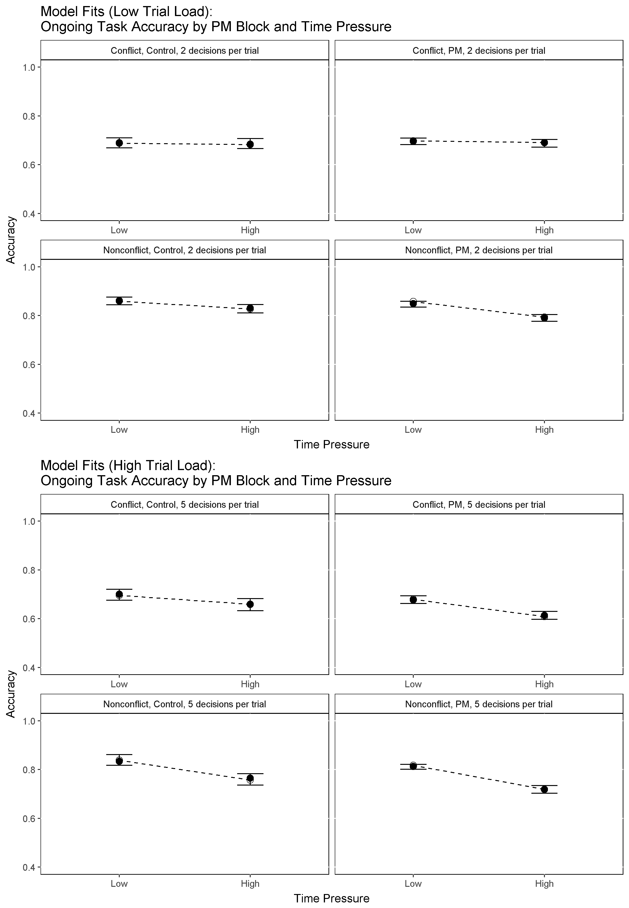
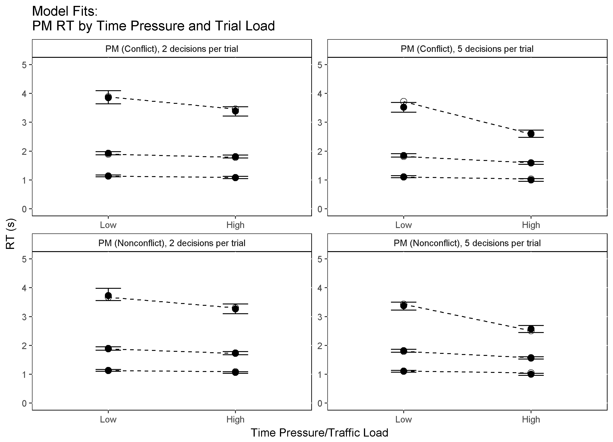
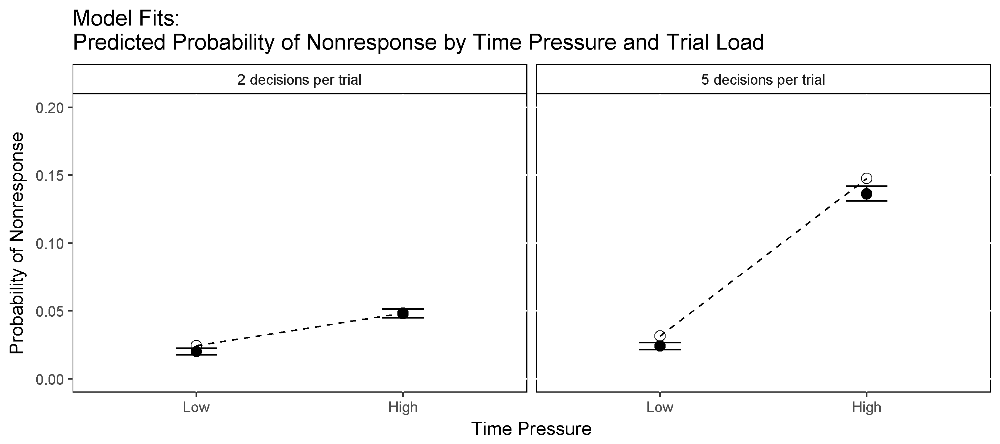
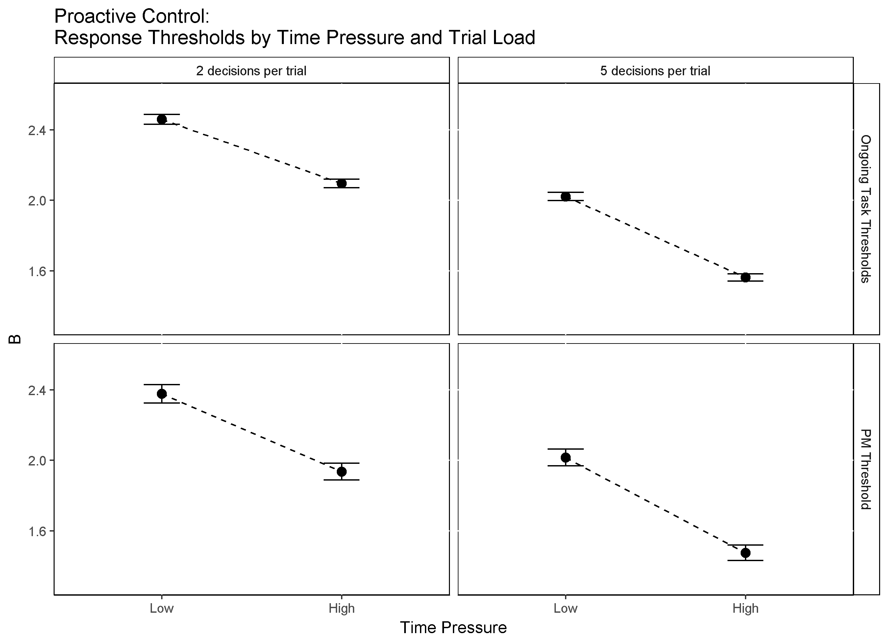
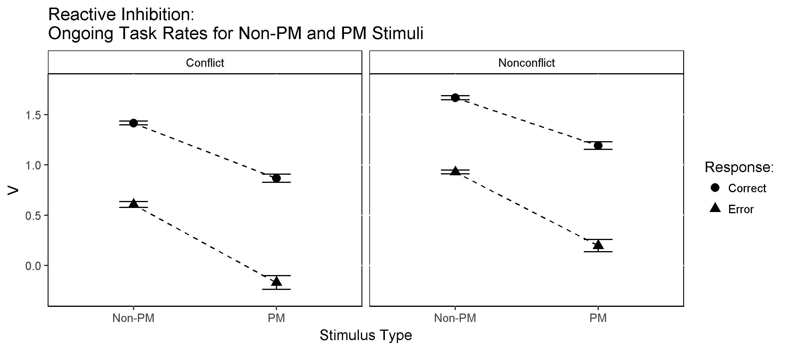
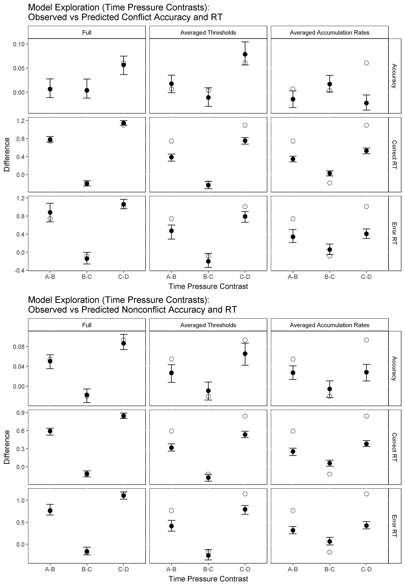

```{r setup, include=FALSE}
wd <- "C:/Users/Russell Boag/Documents/GitHub/DMCATC"
# wd <- "D:/Software/DMC_ATCPMDC"
knitr::opts_chunk$set(echo = FALSE)
setwd(wd)
source("dmc/dmc.R")
source("dmc/dmc_ATC.R")
source("LSAnova.R")

require("lsr")
require("lme4")
require("car")

pkgs <- c("plyr", "dplyr", "tidyr", "broom", "pander", "xtable", "citr", "bookdown")
# install.packages(pkgs) #install
sapply(pkgs, require, character.only = T) #load

```


# Results

```{r Nonresponses and Excluded Data, echo=FALSE, include=FALSE}

# rm(list=ls())
setwd(wd)
pkgs <- c("plyr", "dplyr", "tidyr", "broom", "pander", "xtable")
# install.packages(pkgs) #install
sapply(pkgs, require, character.only = T) #load

# Load data
data <- read.csv("data/exp_data/ATC.E1.csv")
str(data)

## Exclude p17 due to no PM responses
data <- data[ data$s!="p17", ]
data$s <- factor(data$s)

## PARSE E1

dat <- data
dat$s <- factor(as.character(dat$s))
# dat$TP <- dat$TP/1000
dat$RT <- dat$RT/1000

str(dat)
dat$pool <- NULL
dat$load <- NULL
dat$TP <- NULL
dat$presOrder <- NULL
dat$pairNumber <- NULL
dat$DOMS <- NULL
dat$TTMS <- NULL
dat$OOP <- NULL
dat$C <- NULL
dat$angle <- NULL
dat$ac1_type <- NULL
dat$ac2_type <- NULL
dat$ac1_cs <- NULL
dat$ac2_cs <- NULL
dat$ac1_fl <- NULL
dat$ac2_fl <- NULL
dat$ac1_speed <- NULL
dat$ac2_speed <- NULL
dat$pm_status <- NULL
dat$conflict_status <- NULL
str(dat)

# Rename stimulus and response factor levels
levels(dat$S)
levels(dat$S) <- c("cc", "nn", "pc", "pn")

levels(dat$R)
levels(dat$R) <- c("C","N","P","M")

# Revalue Control and PM blocks by number of accumulators ("2", "3")
levels(dat$block)
levels(dat$block) <- c("2", "3")

# Label nonresponses with 'M' for 'miss'
dat[ which(is.na(dat$R)==TRUE), "R" ] <- "M"
plot(dat$R)

# Calculate % nonresponses
percent.NR <- length(dat$R[dat$R=="M"])/length(dat$R) * 100
percent.NR

# Calculate % PM responses in control blocks
# dat[dat$block=="2" & dat$R=="P",]
percent.PM.in.Control <- length(dat[dat$block=="2" & dat$R=="P", 1])/length(dat$R) * 100
percent.PM.in.Control

# Clean data, remove outliers and nonresponses
okdats <- dat
okdats <- okdats[okdats$R!="M", ]  # Remove misses
okdats$R <- factor(okdats$R)
okdats <- okdats[!is.na(okdats$RT),]  # Remove NA RT values
str(okdats)

# Remove PM false alarms
okdats<-okdats[!(okdats$block=="2" & okdats$R=="P"),]
str(okdats)

clean <- function(df) {
    dfc <- df
    n=tapply(df$RT,list(df$s),length)
    ns=tapply(df$RT,list(df$s),length)
    mn=tapply(df$RT,list(df$s),mean)
    sd=tapply(df$RT,list(df$s),IQR)
    upper <- mn+3*(sd/1.349)
    lower <- 0.2
    bad <- logical(dim(df)[1])
    levs <- paste(df$s,sep=".")
    for (i in levels(df$s)){
        lev <- i
        bad[levs==lev] <- df[levs==lev,"RT"] > upper[i] | df[levs==lev,"RT"] < lower
    }
    df=df[!bad,]
    nok=tapply(df$RT,list(df$s),length)
    pbad=100-100*nok/n
    nok=tapply(df$RT,list(df$s),length)
    pbad=100-100*nok/ns
    print(sort(round(pbad,5)))
    print(mean(pbad,na.rm=T))
    df
}


okdats <- clean(okdats)
str(okdats)

# Calculate % of responses cleaned / outliers removed
percent.cleaned <- (1 - length(okdats$RT)/length(dat$RT)) * 100
percent.cleaned

```

Conventional statistical analyses are reported first in order to check whether 
our experimental manipulations had the expected effects on manifest RT and accuracy. Data from two participants was excluded from the analyses; one who failed to complete all experimental blocks and one who made no PM responses at all for the entire experiment. We excluded trials with outlying RTs, defined as less than 0.2s or 3 times the 
interquartile range / 1.349 (a robust measure of standard deviation) above the mean (`r options(digits = 2); percent.cleaned`% of responses overall). 

The following analyses compare mean accuracy and RT by stimulus type (Conflict, Nonconflict, PM) PM block (Control, PM) and time pressure (Low, High) across 2 levels of trial load (2 vs 5 decisions per trial). It should be noted that our time pressure factor was not crossed orthogonally with the trial load factor. Specifically, under low trial load (2 decisions per trial), low time pressure corresponded to a response deadline of 12 seconds (i.e., 6 seconds per decision on average) while high time pressure corresponded to a response deadline of 8 seconds (i.e., 4 seconds per decision on average). In contrast, under high trial load (5 decisions per trial), low time pressure corresponded to a response deadline of 20 seconds (i.e., 4 seconds per decision on average) while high time pressure corresponded to a response deadline of 10 seconds (i.e., 2 seconds per decision on average). As such, the following analyses compare the low and high time pressure levels separately for the low and high trial load conditions.

Likewise, we can only sensibly compare low versus high trial load between the two conditions where time pressure is equivalent (i.e., the two blocks with time pressure of 4 seconds per decision). As such, all comparisons of trial load are done between the low load/high time pressure condition (i.e., 2 decisions per trial/4 seconds per decision) and high load/low time pressure condition (i.e., 5 decisions per trial/4 seconds per decision).

In our omnibus significance testing for accuracy effects we used generalized
linear mixed models with a probit link function. In our omnibus significance testing 
for mean correct RTs we used general linear mixed models. Significance was assessed with Wald's chi-square tests, and an alpha level of 
0.05 was used in all analyses. The results of our omnibus analyses are tabulated 
in the supplementary materials. All standard errors reported in text and 
displayed in graphs were calculated using the bias-corrected method (Morey, 2008).


## Ongoing Task (Non-PM) Trials

```{r Statistics: Ongoing Task (Non-PM), echo=FALSE, eval=TRUE}

# Means Tables - Accuracy
LMER.CDT.Acc <- read.csv("analysis/LMER.CDT.Acc.E1.csv")
CDT.Acc.S <- read.csv("analysis/CDT.Acc.S.E1.csv")
CDT.Acc.Block <- read.csv("analysis/CDT.Acc.Block.E1.csv")
CDT.Acc.Cond <- read.csv("analysis/CDT.Acc.Cond.E1.csv")
T.Contrasts.CDT.Acc <- read.csv("analysis/T.Contrasts.CDT.Acc.E1.csv")

# Means Tables - RT
LMER.CDT.RT <- read.csv("analysis/LMER.CDT.RT.E1.csv")
CDT.RT.S <- read.csv("analysis/CDT.RT.S.E1.csv")
CDT.RT.Block <- read.csv("analysis/CDT.RT.Block.E1.csv")
CDT.RT.Cond <- read.csv("analysis/CDT.RT.Cond.E1.csv")
T.Contrasts.CDT.RT <- read.csv("analysis/T.Contrasts.CDT.RT.E1.csv")

# pander(T.Contrasts.CDT.Acc)
# pander(T.Contrasts.CDT.RT)

```

Accuracy was lower for conflicts (`r options(digits = 2); CDT.Acc.S$Conflict[1]*100`%) compared to nonconflicts (`r options(digits = 2); CDT.Acc.S$Nonconflict[1]*100`%) and slightly lower under PM load compared to control (Control: _M_ = `r options(digits = 2); CDT.Acc.Block$Control[1]*100`%, _SE_ = `r options(digits = 2); CDT.Acc.Block$Control[2]*100`%; PM: _M_ = `r options(digits = 2); CDT.Acc.Block$PM[1]*100`%, _SE_ = `r options(digits = 2); CDT.Acc.Block$PM[2]*100`%). Planned comparisons revealed that accuracy decreased with higher levels of time pressure during both low trial load (Low TP: _M_ = `r options(digits = 2); CDT.Acc.Cond$A[1]*100`%, _SE_ = `r options(digits = 2); CDT.Acc.Cond$A[2]*100`%; High TP: _M_ = `r options(digits = 2); CDT.Acc.Cond$B[1]*100`%, _SE_ = `r options(digits = 2); CDT.Acc.Cond$B[2]*100`%) _t_ = `r options(digits = 2); T.Contrasts.CDT.Acc$t[1]`, _df_ = `r options(digits = 2); T.Contrasts.CDT.Acc$df[1]`, _p_ = `r options(digits = 2); T.Contrasts.CDT.Acc$p[1]`, _Cohen's d_ = `r options(digits = 2); T.Contrasts.CDT.Acc$d[1]`, and high trial load conditions (Low TP: _M_ = `r options(digits = 2); CDT.Acc.Cond$C[1]*100`%, _SE_ = `r options(digits = 2); CDT.Acc.Cond$C[2]*100`%; High TP: _M_ = `r options(digits = 2); CDT.Acc.Cond$D[1]*100`%, _SE_ = `r options(digits = 2); CDT.Acc.Cond$D[2]*100`%) _t_ = `r options(digits = 2); T.Contrasts.CDT.Acc$t[3]`, _df_ = `r options(digits = 2); T.Contrasts.CDT.Acc$df[3]`, _p_ = `r options(digits = 2); T.Contrasts.CDT.Acc$p[3]`, _Cohen's d_ = `r options(digits = 2); T.Contrasts.CDT.Acc$d[3]`. Accuracy did not differ by trial load. 

Mean RT was slower for conflicts (`r options(digits = 2); CDT.RT.S$Conflict[1]`s) compared to nonconflicts (`r options(digits = 2); CDT.RT.S$Nonconflict[1]`s), slower for errors (2.95s) compared to correct responses (2.87s), and slower during PM blocks than control blocks (Control: _M_ = `r options(digits = 2); CDT.RT.Block$Control[1]`s, _SE_ = `r options(digits = 2); CDT.RT.Block$Control[2]`s; PM: _M_ = `r options(digits = 2); CDT.RT.Block$PM[1]`s, _SE_ = `r options(digits = 2); CDT.RT.Block$PM[2]`s). Planned comparisons indicated RT was significantly faster under high time pressure for both low trial load (Low TP: _M_ = `r options(digits = 2); CDT.RT.Cond$A[1]`s, _SE_ = `r options(digits = 2); CDT.RT.Cond$A[2]`s; High TP: _M_ = `r options(digits = 2); CDT.RT.Cond$B[1]`s, _SE_ = `r options(digits = 2); CDT.RT.Cond$B[2]`s) _t_ = `r options(digits = 2); T.Contrasts.CDT.RT$t[1]`, _df_ = `r options(digits = 2); T.Contrasts.CDT.RT$df[1]`, _p_ = `r options(digits = 2); T.Contrasts.CDT.RT$p[1]`, _Cohen's d_ = `r options(digits = 2); T.Contrasts.CDT.RT$d[1]`, and high trial load conditions (Low TP: _M_ = `r options(digits = 2); CDT.RT.Cond$C[1]`s, _SE_ = `r options(digits = 2); CDT.RT.Cond$C[2]`s; High TP: _M_ = `r options(digits = 2); CDT.RT.Cond$D[1]`s, _SE_ = `r options(digits = 2); CDT.RT.Cond$D[2]`s) _t_ = `r options(digits = 2); T.Contrasts.CDT.RT$t[3]`, _df_ = `r options(digits = 2); T.Contrasts.CDT.RT$df[3]`, _p_ = `r options(digits = 2); T.Contrasts.CDT.RT$p[3]`, _Cohen's d_ = `r options(digits = 2); T.Contrasts.CDT.RT$d[3]`. RTs were marginally longer under high trial load compared to low trial load, _t_ = `r options(digits = 2); T.Contrasts.CDT.RT$t[2]`, _df_ = `r options(digits = 2); T.Contrasts.CDT.RT$df[2]`, _p_ = `r options(digits = 2); T.Contrasts.CDT.RT$p[2]`, _Cohen's d_ = `r options(digits = 2); T.Contrasts.CDT.RT$d[2]`, although this effect was small. To summarise, the addition of PM load resulted in slower (_Mean Difference_ = `r options(digits = 2); CDT.RT.Block$PM[1] - CDT.RT.Block$Control[1]`s) and slightly less accurate (_Mean Difference_ = `r options(digits = 2); CDT.Acc.Block$Control[1]*100 - CDT.Acc.Block$PM[1]*100`%) ongoing task performance, while increased time pressure led to faster but less accurate ongoing task performance. 


## PM Trials

```{r Statistics: PM Trials, echo=FALSE, include=FALSE}

# Means Tables - Accuracy
LMER.PMT.Acc <- read.csv("analysis/LMER.PMT.Acc.E1.csv")
PMT.Acc.S <- read.csv("analysis/PMT.Acc.S.E1.csv")
PMT.Acc.Cond <- read.csv("analysis/PMT.Acc.Cond.E1.csv")
T.Contrasts.PMT.Acc <- read.csv("analysis/T.Contrasts.PMT.Acc.E1.csv")

# Means Tables - RT
LMER.PMT.RT <- read.csv("analysis/LMER.PMT.RT.E1.csv")
PMT.RT.S <- read.csv("analysis/PMT.RT.S.E1.csv")
PMT.RT.Cond <- read.csv("analysis/PMT.RT.Cond.E1.csv")
T.Contrasts.PMT.RT <- read.csv("analysis/T.Contrasts.PMT.RT.E1.csv")

# pander(T.Contrasts.PMT.Acc)
# pander(T.Contrasts.PMT.RT)
# pander(PMT.Acc.S)

```

PM responses were scored correct if the participant pressed the PM response key 
instead of an ongoing task (Conflict/Nonconflict) response key on PM target 
trials. PM accuracy decreased across different levels of time pressure during both low 
trial load (Low TP: _M_ = `r options(digits = 2); PMT.Acc.Cond$A[1]*100`%, _SE_ = `r options(digits = 2); PMT.Acc.Cond$A[2]*100`%; High TP: _M_ = `r options(digits = 2); PMT.Acc.Cond$B[1]*100`%, _SE_ = `r options(digits = 2); PMT.Acc.Cond$B[2]*100`%) _t_ = `r options(digits = 2); T.Contrasts.PMT.Acc$t[1]`, _df_ = `r options(digits = 2); T.Contrasts.PMT.Acc$df[1]`, _p_ = `r options(digits = 2); T.Contrasts.PMT.Acc$p[1]`, _Cohen's d_ = `r options(digits = 2); T.Contrasts.PMT.Acc$d[1]`, and high trial load conditions (Low TP: _M_ = `r options(digits = 2); PMT.Acc.Cond$C[1]*100`%, _SE_ = `r options(digits = 2); PMT.Acc.Cond$C[2]*100`%; High TP: _M_ = `r options(digits = 2); PMT.Acc.Cond$D[1]*100`%, _SE_ = `r options(digits = 2); PMT.Acc.Cond$D[2]*100`%) _t_ = `r options(digits = 2); T.Contrasts.PMT.Acc$t[3]`, _df_ = `r options(digits = 2); T.Contrasts.PMT.Acc$df[3]`, _p_ = `r options(digits = 2); T.Contrasts.PMT.Acc$p[3]`, _Cohen's d_ = `r options(digits = 2); T.Contrasts.PMT.Acc$d[3]`. PM accuracy did not differ by trial load.

Mean RT was slower for PM errors (2.71s) compared to correct PM responses (1.77s). Mean RT for PM responses was significantly faster at higher levels of time pressure
during both low trial load (Low TP: _M_ = `r options(digits = 2); PMT.RT.Cond$A[1]`s, _SE_ = `r options(digits = 2); PMT.RT.Cond$A[2]`s; High TP: _M_ = `r options(digits = 2); PMT.RT.Cond$B[1]`s, _SE_ = `r options(digits = 2); PMT.RT.Cond$B[2]`s) _t_ = `r options(digits = 2); T.Contrasts.PMT.RT$t[1]`, _df_ = `r options(digits = 2); T.Contrasts.PMT.RT$df[1]`, _p_ = `r options(digits = 2); T.Contrasts.PMT.RT$p[1]`, _Cohen's d_ = `r options(digits = 2); T.Contrasts.PMT.RT$d[1]`, and high trial load conditions (Low TP: _M_ = `r options(digits = 2); PMT.RT.Cond$C[1]`s, _SE_ = `r options(digits = 2); PMT.RT.Cond$C[2]`s; High TP: _M_ = `r options(digits = 2); PMT.RT.Cond$D[1]`s, _SE_ = `r options(digits = 2); PMT.RT.Cond$D[2]`s) _t_ = `r options(digits = 2); T.Contrasts.PMT.RT$t[3]`, _df_ = `r options(digits = 2); T.Contrasts.PMT.RT$df[3]`, _p_ = `r options(digits = 2); T.Contrasts.PMT.RT$p[3]`, _Cohen's d_ = `r options(digits = 2); T.Contrasts.PMT.RT$d[3]`. PM RTs were marginally slower under high trial load compared to low trial load,  _t_ = `r options(digits = 2); T.Contrasts.PMT.RT$t[2]`, _df_ = `r options(digits = 2); T.Contrasts.PMT.RT$df[2]`, _p_ = `r options(digits = 2); T.Contrasts.PMT.RT$p[2]`, _Cohen's d_ = `r options(digits = 2); T.Contrasts.PMT.RT$d[2]`, although again this was a relatively small effect.

There were no significant differences in accuracy or RT between conflict PM targets
and nonconflict PM target. This is expected since the PM cue (i.e., particular letters in an aircraft callsign) was completely non-focal, meaning the evidence 
used to make PM decisions was independent of evidence used to make ongoing task decisions. To summarise, as with the ongoing task, increased time pressure led to faster 
but less accurate PM performance. 


## Ongoing Task Responses on PM Trials compared with Non-PM Trials

```{r Reactive Control Manifest Check: Non-PM vs PM Trials, echo=FALSE, include=FALSE}

# Means Tables - Reactive
LMER.CDT.Reactive <- read.csv("analysis/LMER.CDT.Reactive.E1.csv")
CDT.Reactive.S <- read.csv("analysis/CDT.Reactive.S.E1.csv")
T.Contrasts.Reactive <- read.csv("analysis/T.Contrasts.Reactive.E1.csv")

pander(T.Contrasts.Reactive)

```

It is possible that reactive control over ongoing task decisions could lead to 
slower ongoing task RTs on PM trials in PM blocks, as compared with non-PM trials in PM blocks. To check whether reactive control was evident without the model-based analysis, 
we compared correct RTs on missed PM trials to correct ongoing task RTs. That is, 
RTs for 'conflict' responses to conflict PM targets and 'nonconflict' responses 
to nonconflict PM targets were compared with RTs for 'conflict' responses to non-PM 
conflicts and 'nonconflict' responses to non-PM nonconflicts (in the PM blocks).

We ran a linear mixed effects model (Table XX in the supplementary materials) to examine the effects of stimulus type 
(Conflict, Nonconflict, PM (Conflict), PM (Nonconflict)) and time pressure on RTs 
for conflict and nonconflict responses (Figures \ref{fig:Fits.RT.Ongoing.2} & \ref{fig:Fits.RT.Ongoing.5} in the supplementary materials). Planned comparisons revealed that conflict RTs were significantly faster on PM 
trials (`r options(digits = 2); CDT.Reactive.S$PM_Conflict[1]`s) than on non-PM trials (`r options(digits = 2); CDT.Reactive.S$Conflict[1]`s) _t_ = `r options(digits = 2); T.Contrasts.Reactive$t[1]`, _df_ = `r options(digits = 2); T.Contrasts.Reactive$df[1]`, _p_ = `r options(digits = 2); T.Contrasts.Reactive$p[1]`, _Cohen's d_ = `r options(digits = 2); T.Contrasts.Reactive$d[1]`. Likewise, nonconflict RTs were significantly faster on PM trials (`r options(digits = 2); CDT.Reactive.S$PM_Nonconflict[1]`s) than on non-PM trials (`r options(digits = 2); CDT.Reactive.S$Nonconflict[1]`s) _t_ = `r options(digits = 2); T.Contrasts.Reactive$t[2]`, _df_ = `r options(digits = 2); T.Contrasts.Reactive$df[2]`, _p_ = `r options(digits = 2); T.Contrasts.Reactive$p[2]`, _Cohen's d_ = `r options(digits = 2); T.Contrasts.Reactive$d[2]`. 

However, it should be noted that reactive control on PM trials is confounded in 
raw RT by statistical facilitation from the PM response. Specifically, on PM trials the accumulators for the ongoing task responses must compete with a much faster PM response accumulator. Overt ongoing task responses on PM trials are therefore more likely to be fast errors which outpace the PM accumulation process. As such, this comparison of mean RT is not sufficient to rule out reactive control. Rather, the critical test of reactive control is a comparison of accumulation rates, and is presented in the modelling section below.

```{r echo=FALSE, eval=FALSE}
LUKE:I still think we could consider dumping this. It's not the right test and 
the results are already long. Maybe leave it in and see what S & AH think though?
```


# Model Analysis

Following Strickland (2017), we modelled the current task with a 3-accumulator LBA with two accumulators for the ongoing task (conflict/nonconflict) repsonses and one accumulator for the PM response. Each accumulator is described by several model parameters. Each accumulator begins a decision with a starting amount of evidence drawn from a uniform distribution on the interval [0, A]. After a stimulus is presented, evidence accumulates linearly at a rate drawn from a normal distribution with mean _v_ and standard deviation _sv_. Evidence continues accumulating until it reaches a response threshold _b_; the first accumulator to reach threshold determines the overt response. Note that since _A_ is held constant across all conditions, we report threshold in terms of _B_ (_B_ = _b_ - _A_), where differences in _B_ between experimental conditions reflect pure threshold effects. Finally, the addtional components of RT which fall outside of the decision process such as stimulus encoding and motor response time are captured by the nondecision time paramter _t0_. 

Our design includes several factors over which model parameters can vary, including latent response (i.e., conflict, nonconflict, and PM accumulators), and three manifest factors, stimulus type, time pressure/trial load, and PM demand. The latent response factor refers to the accumulators that can lead to each response (i.e., 'conflict', 'nonconflict', and 'PM'). It is important to be clear that the latent response factor corresponds to the accumulators, and not the response that was actually observed; the observed response is predicted by, not included in, the model. The stimulus type factor had four levels: _non-PM conflict_, _non-PM nonconflict_, _PM conflict_, and _PM nonconflict_. Since the time pressure (low, high) and trial load (2 vs. 5 decisions per trial) factors were not crossed orthogonally, they were captured by a four-level composite factor with the following levels: _low TP/low load_, _high TP/low load_, _low TP/high load_, _high TP/high load_. Lastly the PM demand factors had two levels: _Control_ (i.e., no PM demand) and _PM_. 

In order to reduce model complexity, we applied several theoretically sensible _a priori_ constraints on which factors each paramter could vary over. First, we estimated only one _A_ parameter for each participant, as is common practice in LBA modelling. Second, we allowed the _sv_ parameter to vary by stimulus and latent response factors but not over the different PM block or time pressure conditions. This is more flexible than most previous LBA modelling, which only allows _sv_ to vary as a function of whether the latent accumulator matches or does not match the stimulus. We used this more flexible approach because in our current model there are two types of 'correct' response for PM trials (i.e., correct PM and correct ongoing task decision). Also in line with Strickland (2017), we fixed the _sv_ parameter for PM false alarms (i.e., 'PM' responses to non-PM stimuli) at 0.5. This is standard practice in LBA (and other parametric modelling) where one parameter must be fixed as a scaling parameter.

Third, as with _A_, we estimated only one nondecision time (_t0_) parameter for each participant. This was done because our design minimized any potential differences in the motor movement required to make each response (i.e., participants kept their fingers positioned above the response key which were all located on one keyboard row). In addition, previous research has shown nondecision time does not appear to play a role in PM cost and is mostly negligible in explaining speed-accuracy trade-off effects. We also follow previous research in assuming that nondecision time is constant across trials. Finally, due to very low numbers of PM false alarms (i.e., PM responses to non-PM stimuli) we pooled estimates of both accumulation rate and variance (_v_ and _sv_) across all experiment factors to give one PM false alarm accumulation rate and one corresponding _sv_ parameter (which was used as a fixed scaling parameter as mentioned above). These _a priori_ restrictions resulted in an 89 parameter most flexible 'top' model with one _A_, one _t0_, 20 _B_, 57 _v_, and 10 _sv_ parameters. We compared this flexible top model against several simpler, more constrained variants outlined in the Model Selection section below.

```{r echo=FALSE, eval=FALSE}
LUKE:Seeing as this is so many parameters, it might be worth checking out the 
results with, say, the sv1 model (already sampled, I think I sent you it, if not
tell me),and making sure the parameter inference stuff largely holds up 
(it might not be a perfect match). I did so for my paper. Not necessarily to 
report it, just so if the 90 parameter thing catches a reviewer's eye, we know 
where we stand in advance. 
```


## Sampling

Most evidence accumulation modelling to-date has relied on maximum-likelihood techniques to obtain point estimates of model parameter values. Here we instead use Bayesian techniques to estimate entire probability distributions of parameters rather than single point estimates. 

Although we could have fit a hierarchical model to estimate the common population distributions (hyperparameters) of each parameter, we opted to estimate parameters separately for each participant. This was due to several reasons. First, since this is the first time that such a model has been fit to this kind of task, we did not have adequate knowledge of the appropriate form of the population-level distributions. Because inappropriate population-level assumptions can introduce biases and shrinkage effects in hierarchical models, fitting to individual participants was the more conservative option. Second, because of the large number of participants in our sample and the complexity of our models, hierarchical methods proved too computationally expensive (estimated at several months of server time per fit) at the present time. 

Bayesian analysis requires that the reseacher specify prior beliefs about the 
probabilities of parameters and the form of their distrubutions. However, note that because of our large sample sizes and use of inference based on posterior probability distributions, the influence of our particular choice of priors on the final parameter estimates was negligible. Since these analysis techniques have not been used on a dynamic applied task this complex, we did not have strong reasons to prefer any particular set of priors over others. We therefore used the modelling results of Strickland's (2017) PM task as a guide, but otherwise specified fairly uninformative priors (Table). All prior values were the same over control/PM blocks and the different levels of time pressure.

Posterior parameter distributions were estimated using the differential evolution Markov-chain Monte-Carlo (DE-MCMC) algorithm. DE-MCMC is more adept at handling the high parameter correlations such as those common to evidence accumulation models. The number of chains was three times the number of parameters (e.g., for an 84 parameter model there were 252 chains per parameter). Chains were thinned by 20, meaning that one iteration in every 20 was kept. Sampling continued for each participant until a small Gelman's multivariate potential scale reduction factor (<1.1) indicated convergence, stationarity, and mixing. This factor is calculated with the number of chains doubled, by considering the first and second halves of each chain as separate chains. Convergence, stationarity, and mixing were verified by visual inspection. We retained the same number of samples for each participant: each of the 252 chains was 120 iterations long, producing 30,240 samples of each parameter's posterior distribution for each participant. 

```{r Priors Table, echo=FALSE}

Priors.Table <- rbind(
    c("A", "Truncated Normal", 3, 1, 0, 10),
    c("B", "Truncated Normal", 2, 1, 0, "None"),
    c("v (Correct Ongoing Task Response)", "Truncated Normal", 1, 2, 0, "None"),
    c("v (Error Ongoing Task Response)", "Truncated Normal", 0, 2, 0, "None"),
    c("v (Correct PM Response)","Truncated Normal", 1, 2, 0, "None"),
    c("v (PM False Alarm)", "Truncated Normal", 0, 2, 0, "None"),
    c("sv", "Truncated Normal", 0.5, 1, 0, "None"),
    c("t0","Uniform", 0.3, 1, 0.1, 1)
)
Priors.Table <- data.frame(Priors.Table)
colnames(Priors.Table) <- c("Model Parameter", "Distribution", "Mean", "SD", "Lower", "Upper")
# write.csv(Priors.Table, file = "analysis/PRIORS.E1.csv")

set.caption("Choice of Priors")
pander(Priors.Table, justify = c('left','left','center','center','center','center'))

```

## Model Results

### Model Fits: Accuracy and RT

To evaluate fit, we sampled 100 posterior predictions for each participant and 
then averaged over participants. The model provided good fits to both ongoing task and PM accuracy (Figures \ref{fig:Fits.Accuracy.Ongoing} & \ref{fig:Fits.Accuracy.PM}), and gave a good account of the entire distribution of response times (Figures \ref{fig:Fits.RT.Ongoing.2}, \ref{fig:Fits.RT.Ongoing.5} & \ref{fig:Fits.RT.PM}). The model provided a close fit to the differences in manifest RT and accuracy observed across PM and control conditions and across different levels of time pressure. The next section explains how the model fit the data in terms of model parameters.


```{r Fit Plot: Accuracy Ongoing, echo=FALSE, out.width='80%', fig.cap="\\label{fig:Fits.Accuracy.Ongoing}Model Fits to Ongoing Task Accuracy. Data effects are represented by white dots. Model predictions are represented by black dots with 95% credible intervals."}



# Figure shows model fits to ongoing task accuracy by time pressure and PM block

```

```{r Fit Plot: Accuracy PM, echo=FALSE, out.width='80%', fig.cap="\\label{fig:Fits.Accuracy.PM}Model Fits to PM Accuracy. Data effects are represented by white dots. Model predictions are represented by black dots with 95% credible intervals."}

knitr::include_graphics("figures/E1/E1.Fits.Accuracy.PM.png")

# Figure shows model fits to PM accuracy by time pressure and PM block

```

```{r Fit Plot: RT Ongoing Low Load, echo=FALSE, out.width='80%', fig.cap="\\label{fig:Fits.RT.Ongoing.2}Model Fits to Ongoing Task RT (Low Trial Load). Data effects are represented by white dots. Model predictions are represented by black dots with 95% credible intervals. RT distributions are summarised with three order statistics: the 0.1 quantile which captures the leading edge of the distribution, the 0.5 quantile (i.e., the median), and the 0.9 quantile which captures the tail of the distribution."}

knitr::include_graphics("figures/E1/E1.Fits.RT.Ongoing.2.png")

# Figure shows model fits to ongoing task correct and error RT by time pressure and PM block under low trial load

```

```{r Fit Plot: RT Ongoing High Load, echo=FALSE, out.width='80%', fig.cap="\\label{fig:Fits.RT.Ongoing.5}Model Fits to Ongoing Task RT (High Trial Load). Data effects are represented by white dots. Model predictions are represented by black dots with 95% credible intervals. RT distributions are summarised with three order statistics: the 0.1 quantile which captures the leading edge of the distribution, the 0.5 quantile (i.e., the median), and the 0.9 quantile which captures the tail of the distribution."}

knitr::include_graphics("figures/E1/E1.Fits.RT.Ongoing.5.png")

# Figure shows model fits to ongoing task correct and error RT by time pressure and PM block under high trial load

```

```{r Fit Plot: RT PM, echo=FALSE, out.width='80%', fig.cap="\\label{fig:Fits.RT.PM}Model Fits to PM RT. Data effects are represented by white dots. Model predictions are represented by black dots with 95% credible intervals. RT distributions are summarised with three order statistics: the 0.1 quantile which captures the leading edge of the distribution, the 0.5 quantile (i.e., the median), and the 0.9 quantile which captures the tail of the distribution."}



# Figure shows model fits to PM RT by time pressure and PM block

```


### Model Fits: Nonresponse Proportions

It should be noted that because the current model was fit to truncated data (i.e., with nonresponses removed), it is slightly misspecified. Specifically, because of the response deadline feature in our experimental design, a small proportion of our data were nonresponses which do not have associated RTs. As such, they do not contribute information to RT distributions fit by the LBA model. 

Since the model was fit without explicit information about nonresponses, we were interested in assessing the model's ability to predict nonresponses and how well those predictions fit empirical nonresponse proportion data. In order to do this, we simulated data out of the model and matched the order of the simulated stimuli and responses to the actual presentation order experienced by each participant. Whenever the cumulative sum of simulated RTs within a trial exceeded that trial's deadline, a nonresponse was predicted. Using this method, 100 posterior predictions for nonresponse proportions were sampled for each participant and predictions were then averaged over all participants. We then compared the predicted nonresponses with observed nonresponse proportions across the different levels of time pressure (i.e., different response deadlines) for both low and high trial load conditions. 

Figure \ref{fig:Fits.NR} shows observed versus predicted nonresponse proportions. As shown, the model's predicted nonresponse proportions closely match the empirical nonresponse proportions. This gives us confidence that the slight model misspecification due to fitting to truncated data is not of concern in terms of the models predictive validity. To verify this result, we also predicted nonresponses via a second method in which RT truncation was built-in to the simulation rather than RTs being censored after simulation. The fits produced by this method were not noticeably different than the fits presented.

```{r Fit Plot: Nonresponses, echo=FALSE, out.width='80%', fig.cap="\\label{fig:Fits.NR}Model Fits to Nonresponse Proportions. Data effects are represented by white dots. Model predictions are represented by black dots with 95% credible intervals."}



# Figure shows observed versus predicted nonresponse proportions.

```


```{r echo=FALSE, eval=FALSE}

LUKE:
    Might be worth appending graphs of second trunc method in supplementaries. NR_truncation_E1.R has a method for checking this. I am pretty damn sure
it's working, but I recommend you go through that and make double sure it's doing
what I think it is. 

```


### Model Selection

We applied model selection to assess whether we could justify contstraining model
parameters over blocked experimental conditions (e.g., Control/PM Block, Time Pressure) to obtain a simpler model with fewer parameters. To select between models, we used the Deviance Information Criterion (DIC), a measure which takes into account both goodness of fit and model complexity (number of parameters). In general, models with smaller DIC values are to be prefered as more parsimonious explanations of the data than models with larger DIC values. Table XX shows each model we compared, its number of parameters, and its corresponding DIC value. 

```{r DIC Table, echo=FALSE}

DIC <- read.csv("analysis/DIC.TABLE.E1.csv", header = TRUE)
DIC <- DIC[,-1]
colnames(DIC) <- c("Model", "N Parameters", "DIC")

set.caption("DIC Model Selection. Lower DIC indicates more preference for the model.")
pander(DIC, justify = c('left','center','center'))

```

Starting with the fully flexible top model, we built several simpler variants by systematically constraining threshold and rate parameters over PM and time pressure factors. This allowed us to assess whether it was necessary to vary thresholds and/or rates to account for observed PM demand and time pressure effects. We compared the following four constrained models to the top model: a model in which rates could vary across PM and control blocks but thresholds could not; a model in which thresholds could vary across PM and control blocks but rates could not; a model in which rates could vary by time pressure but thresholds could not; and a model in which thresholds could vary by time pressure but rates could not.

As Table XX shows, in each case the simpler model was rejected in favour of the fully flexible top 
model, suggesting that it is necessary to allow both rate and threshold parameters
to vary over PM and time pressure (i.e., both parameters are influenced by PM and
time pressure manipulations and are important in explaining the observed data).

Finally, we tested an additional model (the selected model) which allowed both
rates and thresholds to vary over both PM and time pressure, but included a slight 
simplification from the top model. The simplification involved constraining the PM 
rate parameter such that it was not allowed to vary over stimulus type (i.e., PM 
conflicts and PM nonconflicts had the same accumulation rate). This simplification 
makes theoretical sense, since the evidence used to make a PM decision (i.e.,
particular letters in an aircraft callsign) is independent of the evidence used 
to make either conflict or nonconflict ongoing task decisions (i.e., speed, 
relative distance, and motion). This slightly simpler model produced the smallest DIC value and was thus selected as our preferred model.

Although the results of model selection suggest that both rates and thresholds have some role in explaining PM cost and time pressure effects, we cannot say how important each parameter is or what proportion of a given effect is accounted for by each parameter. As such, in the next section we test the direction and magnitude of differences between conditions in the parameters of the selected model. Testing the direction of effects is important because it allows us to distinguish between competing theories of PM costs, whose predictions are also directional (e.g., capacity-sharing theories predict lower accumulation rates under PM load than control). Testing the magnitude of effects is similarly important, especially in applied settings, as it indicates which processes contribute the most to a given effect (such as PM costs) or are most affected by an experimental manipulation. 


## Model Summary

```{r Posterior Means Table: t0 & A, echo=FALSE, include=FALSE}

panderOptions('table.alignment.default', function(df) ifelse(sapply(df, is.numeric), 'center', 'left'))

Mean.T0.Table <- read.csv("analysis/mean.t0.E1.csv")
Mean.T0.Table <- data.frame(Mean.T0.Table)
colnames(Mean.T0.Table) <- c("Parameter", "Mean", "SD")

pander(Mean.T0.Table, caption = "Mean (SD) of the average posterior nondecision time parameter samples.")

Mean.A.Table <- read.csv("analysis/mean.A.E1.csv")
Mean.A.Table <- data.frame(Mean.A.Table)
colnames(Mean.A.Table) <- c("Parameter", "Mean", "SD")

pander(Mean.A.Table, caption = "Mean (SD) of the average posterior _A_ parameter samples.")

```

To summarise the central tendency of model parameters over participants, we created a subject-average posterior distribution. This was obtained by computing the mean of each posterior sample over all participants for each parameter. In terms of answering theoretical questions, our primary interest is in mean threshold and accumulation rate parameters, which we explore in detail in the following sections. The other parameters all had reasonable mean values. The nondecision time mean of the subject-average posterior distribution was `r options(digits = 2); Mean.T0.Table$Mean` (posterior _SD_ = `r options(digits = 2); Mean.T0.Table$SD`). The _A_ posterior mean was `r options(digits = 2); Mean.A.Table$Mean` (posterior _SD_ = `r options(digits = 2); Mean.A.Table$SD`). The _sv_ posterior means and SDs are summarised in Table XX. Consistent with other LBA modelling studies, _sv_ parameters for the ongoing task are lower for correct response accumulators compared to error response accumulators. 

```{r Posterior Means Table: sv, echo=FALSE}

Mean.SDV.Table <- read.csv("analysis/mean.sdvs.E1.csv")
Mean.SDV.Table <- data.frame(Mean.SDV.Table)
colnames(Mean.SDV.Table) <- c("Accumulator","Conflict","Nonconflict","PM (Conflict)","PM (Nonconflict)")

set.caption("Mean (SD) of the average posterior _sv_ parameter samples.")
pander(Mean.SDV.Table, justify = c('left','right','right','right','right'))

```

We next test the direction and magnitude of differences in threshold and accumulation rate parameters for the selected model across experimental conditions in order to assess how well they correspond to the theoretical predictions of capacity sharing, proactive control, reactive control, and effort/arousal. 

To this end, we calculated posterior distributions of the differences between experimental conditions. For example, to test the difference between response thresholds in control and PM conditions (i.e., testing the proactive control account of PM costs), we subtracted the control condition threshold from the PM condition threshold for every posterior sample, thus obtaining the posterior probability distribution of the difference between control and PM thresholds. Difference distributions were calculated independently for each participant before being averaged across participants to create a subject-averaged posterior difference distribution. 

For each subject-averaged difference distribution we report a Bayesan posterior-predictive _p_-value (Meng, 1994), which indicates the one-tailed probability that the difference between parameters is less than zero. 

Due to the power of our design, almost all of our observed parameter differences have _p_ = 0, indicating a probability of 1 that an effect was present. However, some of our parameter differences were much larger in magnitude than others. As such, we illustrate the magnitude of the effect by reporting the standardised difference between parameters (i.e., _M_ / _SD_ of the posterior difference distribution). Because our posterior parameter distributions are approximately normal, this standardised statistic can be interpreted in a similar way to a _Z_-score. We therefore refer to this statistic as _Z_ from here on.


### Capacity Sharing (Non-PM Trial Accumulation)

```{r Z Table: Capacity (in-text), echo=FALSE, include=FALSE}

Z.Capacity.Table.Collapsed <- read.csv("analysis/Z.Capacity.Collapsed.E1.csv")
Z.Capacity.Table.Collapsed <- data.frame(Z.Capacity.Table.Collapsed)

pander(Z.Capacity.Table.Collapsed)

# Z.Capacity.Table <- read.csv("analysis/Z.Capacity.E1.csv")
# Z.Capacity.Table <- data.frame(Z.Capacity.Table)
# colnames(Z.Capacity.Table) <- c("Contrast","Conflict","Nonconflict","Conflict (Error)","Nonconflict (Error)")
# levels(Z.Capacity.Table$Contrast) <- c("A: PM-Control","B: PM-Control","C: PM-Control","D: PM-Control")
# 
# set.caption("_Z_-values (with associated posterior predictive _p_-values in brackets) for accumulation rate contrasts relevant to capacity sharing. The difference distribution was calculated by subtracting control block rates from PM block rates for non-PM trials. Thus a positive difference indicates higher accumulation rates under PM load.")
# pander(Z.Capacity.Table, justify = c('left','right','right','right','right'))

```

Capacity sharing theories of PM costs propose that holding PM intentions or 
monitoring for PM stimuli draws limited-capacity cognitive resources away from 
the ongoing task. As such, they predict that ongoing task evidence accumulation 
rates will be higher in control conditions (when more resources can be devoted 
to the ongoing task), and lower under PM load (when resources must be shared 
between the ongoing task and concurrent PM monitoring processes), which would 
lead to slower ongoing task RTs under PM load. Another prediction consistent with capacity sharing is increased accumulation rates for error responses under PM load relative to rates for correct responses. This would lead to lower accuracy under PM load relative to control.

Figure \ref{fig:Effort.Arousal.PM} shows accumulation rates in control and PM blocks for 
non-PM ongoing task stimuli (i.e., conflicts and nonconflicts that were not 
also PM targets). Effect sizes (_Z_-scores) and _p_ values for comparisons between non-PM trial accumulation rates are shown in Table XX in the supplementary materials. 

Contrary to the predictions of capacity sharing theories, accumulation rates for correct responses were higher under PM load than in the control condition for both conflict (_Z_ = 11.86, _p_ = 0) and nonconflict (_Z_ = 9.85, _p_ = 0) stimuli. It should be noted however that accumulation rates for error responses were also greater under PM load (Conflict Error: _Z_ = 15.44, _p_ = 0; Nonconflict Error: _Z_ = 10.71, _p_ = 0), which is not inconsistent with a capacity sharing account. 

Taken together, this pattern of large increases in correct and error
accumulation rates from control to PM conditions provides convincing evidence 
against a capacity sharing account of PM costs in this task. As will be discussed 
later, these results are more indicative of an overall increase in effort or 
arousal/task engagement during PM blocks, which may be because the ongoing task 
becomes subjectively more difficult and/or engaging with the addition of the 
concurrent PM task relative to control blocks.

```{r Plot: Capacity PM, echo=FALSE, out.width='100%', fig.cap="\\label{fig:Effort.Arousal.PM}Ongoing Task Accumulation Rates by PM Block. Central symbols represent posterior means. Error bars represent +/- 1 posterior standard deviation."}


```

### Proactive Control (Thresholds)

#### Proactive Control under PM Demand

```{r Z Table: Proactive PM (in-text), echo=FALSE, include=FALSE}

Z.Proactive.PM.Table.Collapsed <- read.csv("analysis/Z.Proactive.PM.Collapsed.E1.csv")
Z.Proactive.PM.Table.Collapsed <- data.frame(Z.Proactive.PM.Table.Collapsed)

pander(Z.Proactive.PM.Table.Collapsed)

# Z.Proactive.PM.Table <- read.csv("analysis/Z.Proactive.PM.E1.csv")
# Z.Proactive.PM.Table <- data.frame(Z.Proactive.PM.Table)
# colnames(Z.Proactive.PM.Table) <- c("Contrast","Conflict","Nonconflict")
# levels(Z.Proactive.PM.Table$Contrast) <- c("A: PM-Control","B: PM-Control","C: PM-Control","D: PM-Control")
# 
# set.caption("_Z_-values (with associated posterior predictive _p_-values in brackets) for response threshold contrasts relevant to proactive control. The difference distribution was calculated by subtracting control block ongoing task thresholds from PM block ongoing task thresholds. Thus a positive difference indicates higher ongoing task thresholds under PM load.")
# pander(Z.Proactive.PM.Table, justify = c('left','right','right'))

```

PM cost theories that involve proactive control over ongoing task decisions (e.g., strategic delay theory) predict higher conflict and nonconflict response thresholds under PM load compared to during control blocks. Figure \ref{fig:Proactive.Control.PM} shows conflict and nonconflict response thresholds in the control and PM blocks. _Z_-score effect sizes and p-values for threshold comparisons are shown in Table XX in the supplementary materials.

As Figure \ref{fig:Proactive.Control.PM} shows, ongoing task thresholds were much higher in PM than control blocks for both conflict (_Z_ = 35.17, _p_ = 0) and nonconflict (_Z_ = 44.12, _p_ = 0) responses. This is consistent with strategic delay theories of PM costs whereby responses to the ongoing task are deliberately delayed in order to avoid preempting PM targets.

```{r Plot: Proactive Control PM, echo=FALSE, out.width='100%', fig.cap="\\label{fig:Proactive.Control.PM}Ongoing Task Thresholds by PM Block. Central symbols represent posterior means. Error bars represent +/- 1 posterior standard deviation."}


```

#### Proactive Control under Time Pressure

```{r Z Table: Threshold Shifts with Time Pressure (in-text), echo=FALSE, include=FALSE}

Z.Thresholds.TP.Table <- read.csv("analysis/Z.Thresholds.TP.E1.csv")
Z.Thresholds.TP.Table <- data.frame(Z.Thresholds.TP.Table)

pander(Z.Thresholds.TP.Table)

# Z.Thresholds.TP.Table.Collapsed <- read.csv("analysis/Z.Thresholds.TP.Collapsed.E1.csv")
# Z.Thresholds.TP.Table.Collapsed <- data.frame(Z.Thresholds.TP.Table.Collapsed)
# colnames(Z.Thresholds.TP.Table.Collapsed) <- c("Contrast","Control","PM")
# levels(Z.Thresholds.TP.Table.Collapsed$Contrast) <- c("Threshold: A-B","Threshold: B-C","Threshold: C-D")
# 
# set.caption("_Z_-values (with associated posterior predictive _p_-values in brackets) for response threshold contrasts relevant to proactive threshold shifts under time pressure. The difference distribution was calculated by subtracting high time pressure ongoing task thresholds from low time pressure ongoing task thresholds. Thus a positive difference indicates lower ongoing task thresholds under high time pressure.")
# pander(Z.Thresholds.TP.Table.Collapsed, justify = c('left','right','right'))

```

```{r Z Table: Proactive TP (in-text), echo=FALSE, include=FALSE}

# Z.Proactive.TP.Table <- read.csv("analysis/Z.Proactive.TP.E1.csv")
# Z.Proactive.TP.Table <- data.frame(Z.Proactive.TP.Table)
# colnames(Z.Proactive.TP.Table) <- c("Contrast","Conflict","Nonconflict")
# levels(Z.Proactive.TP.Table$Contrast) <- c("PM Cost: A-B","PM Cost: B-C","PM Cost: C-D")
# 
# set.caption("_Z_-values (with associated posterior predictive _p_-values in brackets) for response threshold contrasts relevant to the interaction of proactive control with time pressure. The difference distribution was calculated by subtracting the PM-Control threshold difference during high time pressure from the PM-Control threshold difference during low time pressure. Thus a positive difference indicates greater proactive control under low time pressure.")
# pander(Z.Proactive.TP.Table, justify = c('left','right','right'))

Z.Proactive.TP.Table.Collapsed <- read.csv("analysis/Z.Proactive.TP.Collapsed.E1.csv")
Z.Proactive.TP.Table.Collapsed <- data.frame(Z.Proactive.TP.Table.Collapsed)
colnames(Z.Proactive.TP.Table.Collapsed) <- c("Contrast","Z")
levels(Z.Proactive.TP.Table.Collapsed$Contrast) <- c("PM Cost: A-B","PM Cost: B-C","PM Cost: C-D")

pander(Z.Proactive.TP.Table.Collapsed)

# pander(Z.Proactive.TP.Table.Collapsed, caption = "_Z_-values (with associated posterior predictive _p_-values in brackets) for response threshold contrasts relevant to the interaction of proactive control with time pressure (i.e., magnitude of PM-Control threshold difference during low TP minus magnitude of PM-Control threshold difference during high TP).", justify = c('left','right'))

```

A common finding in decision-making literature is that of the speed-accuracy trade-off, in which individuals can deliberately increase the speed of their responses (at the expense of accuracy) or increase the accuracy of their responses (at the expense of speed). Several choice-RT modelling studies have shown these effects are well acounted for by strategic threshold adjustments (i.e., proactive control) in response to different levels of time pressure or speed/accuray emphasis. Figure \ref{fig:Proactive.Control.TP} shows ongoing task and PM response thresholds under low and high time pressure for both low trial load (2 decisions per trial) and high trial load (5 decisions per trial). _Z_-score effect sizes and _p_ values are shown in Table XX in the supplementary materials. 

As shown in Figure \ref{fig:Proactive.Control.TP}, control block ongoing task thresholds decreased under high time pressure relative to low time pressure during both low trial load (_Z_ = 7.14, _p_ = 0) and high trial load (_Z_ = 7.79, _p_ = 0) conditions. Similarly, PM block ongoing task thresholds decreased under high time pressure relative to low time pressure during both low trial load (_Z_ = 14.39, _p_ = 0) and high trial load (_Z_ = 23.73, _p_ = 0) conditions. Ongoing task thresholds also decreased between low and high trial load with time pressure held constant (Control: _Z_ = 2.24, _p_ = .013; PM: _Z_ = 2.65, _p_ = .004). PM response thresholds also decreased under high time pressure relative to low time pressure during both low trial load (_Z_ = 7.97, _p_ = 0) and high trial load (_Z_ = 9.86, _p_ = 0), but did not differ by trial load. This is consistent with much choice-RT modelling of the speed-accuracy trade-off and supports a proactive control account in which thresholds are strategically lowered to facilitate fast responding (at the expense of accuracy).

In addition to strategic threshold shifts in response to increased time pressure, time pressure also interacted with proactive control PM cost effects. Specifically, the magnitude of strategic threshold adjustments between control and PM blocks was attenuated under high time pressure conditions compared to low time pressure conditions. As shown in Table XX, the magnitude of PM-Control threshold differences decreased under high time pressure relative to low time pressure during both low trial load (_Z_ = 4.83, _p_ = 0) and high trial load (_Z_ = 11.58, _p_ = 0). The magnitude of PM-Control threshold differences was unaffected by trial load for both conflict and nonconflict responses. Taken together, and considering the very large magnitude of the effects, these threshold shifts in response to changes in both PM demand and time pressure provide convincing evidence that proactive control via strategic threshold adjustment is an important driver of observed PM cost and speed-accuracy trade-off effects. 


```{r Plot: Proactive Control TP, echo=FALSE, out.width='100%', fig.cap="\\label{fig:Proactive.Control.TP}Ongoing Task and PM Thresholds by Time Pressure. Central symbols represent posterior means. Error bars represent +/- 1 posterior standard deviation."}



```


#### Proactive Control of Response Bias under Time Pressure

```{r Z Table: Bias Shifts with Time Pressure (in-text), echo=FALSE, include=FALSE}

Z.Bias.TP.Table <- read.csv("analysis/Z.Proactive.Bias.E1.csv")
Z.Bias.TP.Table <- data.frame(Z.Bias.TP.Table)

pander(Z.Bias.TP.Table)

# set.caption("_Z_-values (with associated posterior predictive _p_-values in brackets) for response threshold contrasts relevant to proactive shifts in threshold bias under time pressure. The difference distribution was calculated by subtracting the difference between conflict and nonconflict thresholds in low time pressure blocks from the difference between conflict and nonconflict thresholds in high time pressure ongoing task thresholds. A positive difference indicates a shift from nonconflict bias to conflict bias under high time pressure.")
# pander(Z.Bias.TP.Table.Collapsed, justify = c('left','right','right'))

```

Figure \ref{fig:Proactive.Bias.TP} plots response threshold bias (i.e., the difference between conflict and nonconflict thresholds) by time pressure. The dotted horizontal line represents the zero-bias point; the point where conflict and nonconflict thresholds are equal. Values above the zero-line indicate that nonconflict thresholds were lower than conflict thresholds (i.e., a bias toward responding 'nonconflict'). Likewise, values below the zero-line indicate that conflict thresholds were lower than nonconflict thresholds (i.e., a bias toward responding 'conflict'). As shown, response bias flips from favoring nonconflict responses under low time pressure to favoring conflict responses under high time pressure during PM blocks. This occurs under both low trial load (_Z_ = 2.85, _p_ = 0.002) and high trial load conditions (_Z_ = 2.92, _p_ = 0.002). The same trend occurs (i.e., increased bias towards responding 'conflict') during control blocks but only reaches significance under high trial load (_Z_ = 2.17, _p_ = 0.016) and does not completely reverse direction (i.e., does not completely flip from a nonconflict to a conflict bias). This indicates that under high time pressure, participants lower their conflict thresholds relative to their nonconflict thresholds. This facilitates faster conflict responses but increases the frequency of conflict false alarms. This finding gels with the findings of Loft, Bolland, Humphreys, and Neal (2009) which suggest that air-traffic controllers apply larger safety margins by deliberately shifting bias towards conflict responses when placed under time pressure. Loft et al. (2009) argued that although this strategy increases the false alarm rate, the bias has the effect of ensuring safety over strict accuracy.


```{r Plot: Threshold Bias TP, echo=FALSE, out.width='100%', fig.cap="\\label{fig:Proactive.Bias.TP}Response Threshold Bias by Time Pressure.  Central symbols represent posterior mean difference between Conflict and Nonconflict thresholds. Error bars represent +/- 1 posterior standard deviation. Dotted horizontal line represents the zero-bias point (i.e., equal thresholds). Above the zero-line indicates lower Nonconflict than Conflict thresholds. Below indicates lower Conflict than Nonconflict thresholds."}


```

### Reactive Inhibition (PM vs. Non-PM Trial Accumulation)

```{r Z Table: Reactive Inhibition (in-text), echo=FALSE, include=FALSE}

panderOptions('table.alignment.default', function(df) ifelse(sapply(df, is.numeric), 'center', 'left'))

Z.Reactive.Table.Cor.Err <- read.csv("analysis/Z.Reactive.Cor.Err.E1.csv")
Z.Reactive.Table.Cor.Err <- data.frame(Z.Reactive.Table.Cor.Err)

# pander(Z.Reactive.Table.Cor.Err, caption = "_Z_-values (with associated posterior predictive _p_-values in brackets) for accumulation rate contrasts relevant to reactive inhibition (i.e., difference between ongoing task rates on PM versus non-PM trials during PM blocks).")

Z.Reactive.Table.Collapsed <- read.csv("analysis/Z.Reactive.Collapsed.E1.csv")
Z.Reactive.Table.Collapsed <- data.frame(Z.Reactive.Table.Collapsed)

# pander(Z.Reactive.Table.Collapsed, caption = "_Z_-values (with associated posterior predictive _p_-values in brackets) for accumulation rate contrasts relevant to reactive inhibition (i.e., difference between ongoing task rates on PM versus non-PM trials during PM blocks).")

# Z.Reactive.Table <- read.csv("analysis/Z.Reactive.E1.csv")
# Z.Reactive.Table <- data.frame(Z.Reactive.Table)
# colnames(Z.Reactive.Table) <- c("Contrast","Conflict","Nonconflict","Conflict (Error)","Nonconflict (Error)")
# levels(Z.Reactive.Table$Contrast) <- c("A: NonPM-PM","B: NonPM-PM","C: NonPM-PM","D: NonPM-PM")
# 
# set.caption("_Z_-values (with associated posterior predictive _p_-values in brackets) for accumulation rate contrasts relevant to reactive inhibition (i.e., difference between ongoing task rates on PM versus non-PM trials during PM blocks). The difference distribution was calculated by subtracting ongoing task rates on PM target trials from ongoing task rates on non-PM trials (in PM blocks). Thus a positive difference indicates lower ongoing task rates on PM target trials.")
# pander(Z.Reactive.Table, justify = c('left','right','right','right','right'))

```

A prediction of PMDC theory is that ongoing task (conflict/nonconflict) 
evidence accumulation rates will be lower on PM trials due to 'reactive' or stimulus-driven inhibitory control of the decision process by the PM stimulus detector. Figure \ref{fig:Reactive.Inhibition} shows accumulation rates for ongoing task responses to non-PM conflict/nonconflict stimuli compared to PM conflict/nonconflict stimuli (i.e., ongoing task stimuli that also contained a PM target). _Z_-score effect sizes and _p_ values are shown in Table XX in the supplementary materials. 

Consistent with the predictions of PMDC's reactive inhibition mechanism, rates 
for ongoing task accumulators where much lower for stimuli containing a PM cue 
compared to when the same stimuli did not contain a PM cue (Conflicts: _Z_ = 13.26, _p_ = 0; Nonconflicts: _Z_ = 12.63, _p_ = 0). This supports the idea that when the PM detector detects a PM target, the accumulation process for the competing ongoing task response is supressed or inhibited.

Moreover, the magnitude of reactive inhibition for ongoing task responses was generally stronger for the correct response accumulators (_Z_ = 18.09, _p_ = 0) compared to error response accumulators (_Z_ = 15.3, _p_ = 0). This suggests that response inhibition processes are somewhat stimulus-specific or targeted toward the specific ongoing task response currently competing with the PM accumulator for selection.  

These findings are consistent with the idea that response accumulators compete 
with each other based on their inputs; in the presence of a PM stimulus, evidence
accumulation processes for conflicts and nonconflicts are inhibited relative to when 
a PM stimulus is absent. Moreover, the stronger inhibition of congruent ongoing task accumulators suggests that reactive inhibition processes may selectively inhibit more salient competing responses.

```{r Plot: Reactive Inhibition, echo=FALSE, out.width='100%', fig.cap="\\label{fig:Reactive.Inhibition}Ongoing Task Accumulation Rates for PM and Non-PM Stimuli. Central symbols represent posterior means. Error bars represent +/- 1 posterior standard deviation."}



```


### Effort/Arousal (Accumulation Rate Increases with PM Load and Time Pressure)

```{r Statistics: TLX Effort Ratings, echo=FALSE, include=FALSE}

tlx <- read.csv("data/E1_TLX.csv", header = TRUE)
tlx$s <- factor(tlx$s)

tAB <- t.test (tlx[ tlx$cond=="A", "effort" ], tlx[ tlx$cond=="B", "effort" ], paired = TRUE)
dAB <- cohensD(tlx[ tlx$cond=="A", "effort" ], tlx[ tlx$cond=="B", "effort" ], method = "paired")
AB <- data.frame(cbind(t=tAB$statistic, df=tAB$parameter, p=tAB$p.value, Difference=tAB$estimate, d=dAB))

tBC <- t.test (tlx[ tlx$cond=="B", "effort" ], tlx[ tlx$cond=="C", "effort" ], paired = TRUE)
dBC <- cohensD(tlx[ tlx$cond=="B", "effort" ], tlx[ tlx$cond=="C", "effort" ], method = "paired")
BC <- data.frame(cbind(t=tBC$statistic, df=tBC$parameter, p=tBC$p.value, Difference=tBC$estimate, d=dBC))

tCD <- t.test (tlx[ tlx$cond=="C", "effort" ], tlx[ tlx$cond=="D", "effort" ], paired = TRUE)
dCD <- cohensD(tlx[ tlx$cond=="C", "effort" ], tlx[ tlx$cond=="D", "effort" ], method = "paired")
CD <- data.frame(cbind(t=tCD$statistic, df=tCD$parameter, p=tCD$p.value, Difference=tCD$estimate, d=dCD))

T.Contrasts.TLX.Effort.TP <- data.frame(rbind(AB, BC, CD))
T.Contrasts.TLX.Effort.TP$t <- round(T.Contrasts.TLX.Effort.TP$t, digits=2)
T.Contrasts.TLX.Effort.TP$Difference <- round(T.Contrasts.TLX.Effort.TP$Difference, digits=2)
T.Contrasts.TLX.Effort.TP$d <- round(T.Contrasts.TLX.Effort.TP$d, digits=2)
T.Contrasts.TLX.Effort.TP$p <- round(T.Contrasts.TLX.Effort.TP$p, digits=3)
T.Contrasts.TLX.Effort.TP$p <- format.pval(T.Contrasts.TLX.Effort.TP$p, digits=2, eps= 0.001)
row.names(T.Contrasts.TLX.Effort.TP) <- c("A-B","B-C","C-D")
# T.Contrasts.TLX.Effort.TP
pander(T.Contrasts.TLX.Effort.TP)

```

```{r Z Table: Effort/Arousal (in-text), echo=FALSE, include=FALSE}

Z.Effort.Table.Collapsed <- read.csv("analysis/Z.Effort.TP.Collapsed.E1.csv")
Z.Effort.Table.Collapsed <- data.frame(Z.Effort.Table.Collapsed)
colnames(Z.Effort.Table.Collapsed) <- c("Contrast","Correct","Error")
levels(Z.Effort.Table.Collapsed$Contrast) <- c("A-B","B-C","C-D")

pander(Z.Effort.Table.Collapsed)

# set.caption("_Z_-values (with associated posterior predictive _p_-values in brackets) for accumulation rate contrasts relevant to effort/arousal effects (i.e., low TP rates minus high TP rates). The difference distribution was calculated by subtracting ongoing task rates during high time pressure from ongoing task rates low time pressure. Thus a negative difference indicates higher accumulation rates under high time pressure.")
# pander(Z.Effort.Table.Collapsed, justify = c('left','right','right'))

# Z.Effort.Table <- read.csv("analysis/Z.Effort.TP.E1.csv")
# Z.Effort.Table <- data.frame(Z.Effort.Table)
# colnames(Z.Effort.Table) <- c("Contrast","A-B","B-C","C-D")
# levels(Z.Effort.Table$Contrast) <- c("Control: Correct","PM: Correct","Control: Error","PM: Error")
# 
# set.caption("_Z_-values (with associated posterior predictive _p_-values in brackets) for accumulation rate contrasts relevant to effort/arousal effects (i.e., low TP rates minus high TP rates). The difference distribution was calculated by subtracting ongoing task rates during high time pressure from ongoing task rates low time pressure. Thus a negative difference indicates higher accumulation rates under high time pressure.")
# pander(Z.Effort.Table, justify = c('left','right','right','right'))

```

As mentioned previously, in contrast with the predictions of capacity-sharing 
theories of PM costs, we found that evidence accumulation rates actually increased 
with the addition of PM load. Figure \ref{fig:Effort.Arousal.TP} shows correct and error accumulation rates across the different levels of time pressure for both low trial load (2 decisions per trial) 
and high trial load (5 decisions per trial) conditions. _Z_-score effect sizes and _p_ values are shown in Table XX in the supplementary materials. 

As with the increases seen from control to PM blocks, accumulation rates for correct ongoing task repsonses were higher in high time pressure blocks during both low trial load (_Z_ = -11.33, _p_ = 0) and high trial load (_Z_ = -24.11, _p_ = 0). Similarly, accumulation rates for ongoing task errors were also higher in high time pressure blocks during both low trial load (_Z_ = -11.93, _p_ = 0) and high trial load (_Z_ = -24.0, _p_ = 0). 

Since rates for both correct and error responses increase with time pressure, this effect is 
suggestive of an overall increase in arousal/task engagement or the overall effort 
being invested in completing the task. One possible explanation is that the task becomes more difficult or engaging under high time pressure leading participants to deploy more cognitive resources toward completing the task. 

Alternatively, rather than increasing effort in response to greater difficulty, participants could be 'satisficing', or decreasing effort when the task is perceived as easy. For example, in the relatively easy control and low time pressure conditions participants may believe that they can disengage from the task somewhat, expending fewer cognitive resources while still maintaining a satisfactory level of task performance.

Several additional lines of evidence support this effort/task engagement hypothesis. First, both PM block and time pressure were highly significant predictors of self-reported effort ratings on the NASA-TLX (see Table XX in the supplementary materials); participants reported expending more effort under PM load compared to control as well as expending more effort during higher time pressure blocks. Planned comparisons revealed that effort increased significantly with time pressure during both low trial load (_t_ = `r options(digits = 2); T.Contrasts.TLX.Effort.TP$t[1]`, _df_ = `r options(digits = 2); T.Contrasts.TLX.Effort.TP$df[1]`, _p_ = `r options(digits = 2); T.Contrasts.TLX.Effort.TP$p[1]`, _Cohen's d_ = `r options(digits = 2); T.Contrasts.TLX.Effort.TP$d[1]`, and high trial load conditions (_t_ = `r options(digits = 2); T.Contrasts.TLX.Effort.TP$t[3]`, _df_ = `r options(digits = 2); T.Contrasts.TLX.Effort.TP$df[3]`, _p_ = `r options(digits = 2); T.Contrasts.TLX.Effort.TP$p[3]`, _Cohen's d_ = `r options(digits = 2); T.Contrasts.TLX.Effort.TP$d[3]`. Second, ongoing task accumulation rates were significant predictors of self-reported effort ratings (see Table XX in the supplementary materials). Specifically, rates for both conflict and nonconflict error accumulators were positive predictors of effort, whereas correct accumulation rates were not. 

As such, it seems as though subjects can choose to deploy more cognitive resources into the task when changes in environmental conditions such as PM load and time pressure suggest it may be advantageous to do so. Crucially, such resources need not be diverted from the ongoing task, contrary to the claims of capacity-sharing explanations. However, it is interesting to note that error accumulation rates for the ongoing task were more related to effort ratings than were correct accumulation rates. This suggests that although subjects can increase their arousal or exert more effort, that extra effort or arousal may not necessarily translate into higher quality information processing. 

```{r TLX Effort Ratings by Block and Time Pressure, echo=FALSE, include=FALSE}

tlx <- read.csv("data/E1_TLX.csv", header = TRUE)
tlx$s <- factor(tlx$s)

TLX.lmer.E1 <- lmer(effort ~ block*cond+(1|s), data=tlx)
TLX.lm.E1 <- Anova(TLX.lmer.E1,type="II")
TLX.lm.TABLE.E1 <- data.frame(TLX.lm.E1$Chisq, TLX.lm.E1$Df, TLX.lm.E1$Pr)

TLX.lm.TABLE.E1$TLX.lm.E1.Chisq <- round(TLX.lm.TABLE.E1$TLX.lm.E1.Chisq, 2)
TLX.lm.TABLE.E1$TLX.lm.E1.Pr <- format.pval(TLX.lm.TABLE.E1$TLX.lm.E1.Pr, digits=2, eps= 0.001)
TLX.lm.TABLE.E1$TLX.lm.E1.Pr <- gsub("0\\.", ".", TLX.lm.TABLE.E1$TLX.lm.E1.Pr)
rownames(TLX.lm.TABLE.E1) <- c("PM Block","Time Pressure",
                                "PM Block by Time Pressure")
colnames(TLX.lm.TABLE.E1) <- c("Chi-square","df","p")

set.caption("Significance testing linear predictors of self-reported effort. NASA-TLX effort ratings were analysed with a general linear model which predicted mean self-reported effort for each participant. Tests for significance use Wald's chi-square test with an alpha level of .05.")
pander(TLX.lm.TABLE.E1)

```


```{r TLX Effort Ratings by Rates, echo=FALSE, include=FALSE}

tlx <- read.csv("data/E1_TLX.csv", header = TRUE)
tlx$s <- factor(tlx$s)

TLX.lmer.E1 <- lmer(effort ~ mean_v.C+mean_v.N+mean_v.Cerr+mean_v.Nerr+(1|s), data=tlx)
TLX.lm.E1 <- Anova(TLX.lmer.E1,type="II")
TLX.lm.TABLE.E1 <- data.frame(TLX.lm.E1$Chisq, TLX.lm.E1$Df, TLX.lm.E1$Pr)

TLX.lm.TABLE.E1$TLX.lm.E1.Chisq <- round(TLX.lm.TABLE.E1$TLX.lm.E1.Chisq, 2)
TLX.lm.TABLE.E1$TLX.lm.E1.Pr <- format.pval(TLX.lm.TABLE.E1$TLX.lm.E1.Pr, digits=2, eps= 0.001)
TLX.lm.TABLE.E1$TLX.lm.E1.Pr <- gsub("0\\.", ".", TLX.lm.TABLE.E1$TLX.lm.E1.Pr)
rownames(TLX.lm.TABLE.E1) <- c("Conflict","Nonconflict",
                                "Conflict (Error)", "Nonconflict (Error)")
colnames(TLX.lm.TABLE.E1) <- c("Chi-square","df","p")

set.caption("Significance testing accumulation rates as predictors of self-reported effort. NASA-TLX effort ratings were analysed with a general linear model which predicted mean self-reported effort for each participant. Tests for significance use Wald's chi-square test with an alpha level of .05.")
pander(TLX.lm.TABLE.E1)

```


```{r Plot: Effort/Arousal, echo=FALSE, out.width='100%', fig.cap="\\label{fig:Effort.Arousal.TP}Ongoing Task Accumulation Rates by Time Pressure. Central symbols represent posterior means. Error bars represent +/- 1 posterior standard deviation."}


```

## Model Exploration

Given the complexity of our model, it is difficult to discern the overall 
contribution given parameters have on overall RT and/or accuracy. In this section 
we attempt to tease out the individual contribution to RT and accuracy provided 
by certain parameters and mechanisms in the model. It is our aim to give a 
clearer picture of the relative importance of key parameters in accounting for 
the observed effects.

In order to evaluate a given parameter's contribution to the model, we first 
replace that parameter with the average either across control/PM blocks or across 
time pressure levels (e.g., replacing control and PM ongoing task thresholds with 
the average of the two). We can then examine the associated mis-fit of the model 
with the removed effect relative to the full model with the effect included.

We generated posterior predictions for all of the PM and time pressure effects for the selected model, and then separately for models with two different sets of parameters averaged over either PM or time pressure blocks: ongoing accumulation rates, and ongoing thresholds. 

In the supplementary materials, we include fit graphs comparing the full model to the two versions with proactive (threshold) and reactive (rate) mechanisms systematically turned off. 

Here we focus our discussion on PM cost and time pressure effects and the contribution of each cognitive mechanism toward explaining the effects. First, we assess how much of the PM accuracy and RT effects were accounted for by the different models, and whether each model adequately fit these effects. Second, we assess how much of the time pressure accuracy and RT effects were accounted for by the different models, and whether each model adequately fit these effects. Finally, we examine the penalty associated with selectively turning off proactive control mechanisms, reactive inhibition mechanisms, or both in terms of fit to overall accuracy and RT.


### PM Cost Effects

```{r Percent Explained: PM Cost Effects, echo=FALSE, include=FALSE}

panderOptions('table.alignment.default', function(df) ifelse(sapply(df, is.numeric), 'center', 'left'))

PM.Control.Contrast.Percent.Table <- read.csv("analysis/PM.Control.Contrast.Percent.E1.csv")
PM.Control.Contrast.Percent.Table <- data.frame(PM.Control.Contrast.Percent.Table)
# colnames(PM.Control.Contrast.Percent.Table) <- c()

pander(PM.Control.Contrast.Percent.Table)

```

As shown in Figure \ref{fig:PM.Control.Contrast.Plots}, the full (selected) model accounted for the accuracy and RT costs associated with PM demand fairly well, providing close fits to the difference between control and PM accuracy for both conflict and nonconflict stimuli, and closely fit the cost to both correct and error RT for both ongoing task responses. 

Averaging the ongoing task thresholds between control and PM blocks made the model overpredict the cost to ongoing task accuracy, more so for conflicts than nonconflicts, and dramatically underpredict the cost to both correct and error ongoing task RT (so much so that the model in fact predicted a PM advantage to ongoing task RT rather than a cost). That is, adopting higher ongoing task thresholds under PM load facilitated accurate ongoing task performance under PM load, but was also the primary driver of the PM costs in terms of ongoing task RT. This further indicates that proactive control of thresholds is an important mechanism in explaining PM costs effects, in particular costs to ongoing task RT. 

In contrast, averaging the ongoing task accumulation rates between control and PM blocks caused the model to underpredict costs to ongoing task accuracy (predicting an accuracy advantage for conflicts) and overpredict costs to both correct and error ongoing task RT. That is, rate increases between control and PM blocks improved the speed but reduced the accuracy of ongoing task performance under PM load. This supports the idea that modulation of accumulation rates is also an important mechanism in explaining the differences in ongoing task accuracy and RT that occur under PM demand.


### Time Pressure Effects

```{r Percent Explained: Time Pressure Effects, echo=FALSE, include=FALSE}

panderOptions('table.alignment.default', function(df) ifelse(sapply(df, is.numeric), 'center', 'left'))

TP.Contrast.C.Percent.Table <- read.csv("analysis/TP.Contrast.C.Percent.E1.csv")
TP.Contrast.C.Percent.Table <- data.frame(TP.Contrast.C.Percent.Table)

TP.Contrast.N.Percent.Table <- read.csv("analysis/TP.Contrast.N.Percent.E1.csv")
TP.Contrast.N.Percent.Table <- data.frame(TP.Contrast.N.Percent.Table)

TP.Contrast.P.Percent.Table <- read.csv("analysis/TP.Contrast.P.Percent.E1.csv")
TP.Contrast.P.Percent.Table <- data.frame(TP.Contrast.P.Percent.Table)

pander(TP.Contrast.C.Percent.Table)
pander(TP.Contrast.N.Percent.Table)
pander(TP.Contrast.P.Percent.Table)

```

In terms of time pressure effects, the full model provided a very close account of accuracy differences between low and high time pressure blocks under both low and high trial load conditions (Figure \ref{fig:ModelExpTPContrastsOngoing}). The full model also closely fit RT differences between time pressure blocks for both correct and error ongoing task responses as well as PM responses.

Averaging the ongoing task thresholds made the model overpredict the cost to ongoing task accuracy under increased time pressure for conflcits, that is, it predicted lower conflict accuracy in the high time pressure blocks than was observed. Conversely, the model underpredicted the cost to ongoing task accuracy under increased time pressure for nonconflcits, that is, it predicted higher nonconflict accuracy in the high time pressure blocks than was observed. 

Similarly, the averaged-threshold model underpredicted RT differences between high and low time pressure blocks for both correct and error conflict and nonconflict responses (i.e., it predicted less of a speed-up from low to high time pressure than was observed). That is, the primary consequence of lowering thresholds under high time pressure was an overall increase in the speed of responding. This provides further evidence that proactive control mechanisms are critical for explaining empirical speed-accuracy trade-off effects under different levels of time pressure. 

Averaging the ongoing task accumulation rates resulted in a model that underpredicts the cost to ongoing task accuracy under increased time pressure (actually predicting an accuracy advantage for conflicts under high time pressure instead of the observed cost). Likewise, the averaged-rates model underpredicts RT differences between high and low time pressure blocks for both correct and error conflict and nonconflict responses, predicteding less of a speed-up from low to high time pressure than was observed. That is, rate increases between low and high time pressure conditions improved the speed but reduced the accuracy of ongoing task responses under high time pressure. 

In terms of PM responses, the averaged-threshold model maintained close fits to PM accuracy, but severely underpredicted RT differences between high and low time pressure blocks. In contrast, the averaged-rates model maintained close fits with PM RT, but underpredicted accuracy differences between high and low time pressure blocks (i.e., predicted higher PM accuracy under high time pressure than was observed). That is, PM RT was more related to thresholds than accumulation rates, whereas PM accuracy was more related to accumulation rates than thresholds. Taken together, both proactive and reactive control mechanisms appear necessary to account for the full range of RT and accuracy differences under different levels of time pressure. 


### Importance of Cognitive Control Mechanisms

```{r Percent Explained: Cognitive Control Mechanisms, echo=FALSE, include=FALSE}

panderOptions('table.alignment.default', function(df) ifelse(sapply(df, is.numeric), 'center', 'left'))

Cog.Control.Percent.Table <- read.csv("analysis/Cog.Control.Percent.E1.csv")
Cog.Control.Percent.Table <- data.frame(Cog.Control.Percent.Table)

pander(Cog.Control.Percent.Table)

```

Finally, we examine the overall importance of proactive and reactive inhibition mechanisms in terms of how well the model fits observed accuracy and RT on PM trials. As shown in Figure \ref{fig:ModelExpTPContrastsPM_ControlMech}, the full model (which includes both proactive and reactive control mechanisms) provided an almost exact fit to PM accuracy (`r options(digits = 2); Cog.Control.Percent.Table$Cog.Control.Percent[1]`% of the effect), while slightly overpredicting overall PM RT (RT overpredicted by `r options(digits = 2); Cog.Control.Percent.Table$Diff.from.100[2]`%).

In contrast, when proactive control is removed and the model only allows for reactive control, we get severe misfit to both overall PM accuracy and RT, the model underpredicting both by a large margin (PM accuracy underpredicted by `r options(digits = 2); abs(Cog.Control.Percent.Table$Diff.from.100[3])`%, PM RT underpredicted by `r options(digits = 2); abs(Cog.Control.Percent.Table$Diff.from.100[4])`%). Similarly, when reactive control is removed from the model and only proactive control included, we get less severe but still substantial underprediction of both PM accuracy and RT (PM accuracy underpredicted by `r options(digits = 2); abs(Cog.Control.Percent.Table$Diff.from.100[5])`%, PM RT underpredicted by `r options(digits = 2); abs(Cog.Control.Percent.Table$Diff.from.100[6])`%).

Lastly, when both proactive and reactive control mechanisms are turned off (i.e., the model includes neither mechanism), the model produces the worst overall fit to PM accuracy and RT, underpredicting both by a larger margin than either the proactive-only or reactive-only models (PM accuracy underpredicted by `r options(digits = 2); abs(Cog.Control.Percent.Table$Diff.from.100[7])`%, PM RT underpredicted by `r options(digits = 2); abs(Cog.Control.Percent.Table$Diff.from.100[8])`%). This provides convincing evidence that both proactive and reactive control mechanisms play critical and complimentary roles in accounting for the speed and accuracy of PM performance. 


# Supplementary Materials

```{r LMER: Ongoing Task Accuracy, echo=FALSE, include=TRUE}

panderOptions('table.alignment.default', function(df) ifelse(sapply(df, is.numeric), 'center', 'left'))

LMER.CDT.Acc <- read.csv("analysis/LMER.CDT.Acc.E1.csv")
colnames(LMER.CDT.Acc) <- c("Factor", "Chi-square", "df", "p")

set.caption("Significance testing linear predictors of ongoing task accuracy. Accuracies were analysed with a generalised linear model with a binomial probit link function which predicts the outcome of every trial. Tests for significance use Wald's chi-square test with an alpha level of .05.")
pander(LMER.CDT.Acc, justify = c('left','right','right','right'))

```

```{r LMER: Ongoing Task RT, echo=FALSE, include=TRUE}

LMER.CDT.RT <- read.csv("analysis/LMER.CDT.RT.E1.csv")
colnames(LMER.CDT.RT) <- c("Factor", "Chi-square", "df", "p")

set.caption("Significance testing linear predictors of ongoing task RT. RT was analysed with a general linear model which predicted mean correct RT for each participant. Tests for significance use Wald's chi-square test with an alpha level of .05.")
pander(LMER.CDT.RT, justify = c('left','right','right','right'))

```

```{r LMER: PM Accuracy, echo=FALSE, include=TRUE}

LMER.PMT.Acc <- read.csv("analysis/LMER.PMT.Acc.E1.csv")
colnames(LMER.PMT.Acc) <- c("Factor", "Chi-square", "df", "p")

set.caption("Significance testing linear predictors of PM accuracy. Accuracies were analysed with a generalised linear model with a binomial probit link function which predicts the outcome of every trial. Tests for significance use Wald's chi-square test with an alpha level of .05.")
pander(LMER.PMT.Acc, justify = c('left','right','right','right'))

```

```{r LMER: PM RT, echo=FALSE, include=TRUE}

LMER.PMT.RT <- read.csv("analysis/LMER.PMT.RT.E1.csv")
colnames(LMER.PMT.RT) <- c("Factor", "Chi-square", "df", "p")

set.caption("Significance testing linear predictors of PM RT. PM RT was analysed with a general linear model which predicted mean PM RT for each participant. Tests for significance use Wald's chi-square test with an alpha level of .05.")
pander(LMER.PMT.RT, justify = c('left','right','right','right'))

```

```{r LMER: Reactive Control Manifest Check, echo=FALSE, include=TRUE}

LMER.CDT.Reactive <- read.csv("analysis/LMER.CDT.Reactive.E1.csv")
colnames(LMER.CDT.Reactive) <- c("Factor", "Chi-square", "df", "p")

set.caption("Significance testing for differences in ongoing task RTs between PM and non-PM trials. RT was analysed with a general linear model which predicted mean correct RT for each participant. Tests for significance use Wald's chi-square test with an alpha level of .05.")
pander(LMER.CDT.Reactive, justify = c('left','right','right','right'))

```

```{r Z Table: Capacity (supplementary), echo=FALSE, include=TRUE}

# Z.Capacity.Table.Collapsed <- read.csv("analysis/Z.Capacity.Collapsed.E1.csv")
# Z.Capacity.Table.Collapsed <- data.frame(Z.Capacity.Table.Collapsed)

Z.Capacity.Table <- read.csv("analysis/Z.Capacity.E1.csv")
Z.Capacity.Table <- data.frame(Z.Capacity.Table)
colnames(Z.Capacity.Table) <- c("Contrast","Conflict","Nonconflict","Conflict (Error)","Nonconflict (Error)")
levels(Z.Capacity.Table$Contrast) <- c("A: PM-Control","B: PM-Control","C: PM-Control","D: PM-Control")

set.caption("_Z_-values (with associated posterior predictive _p_-values in brackets) for accumulation rate contrasts relevant to capacity sharing. The difference distribution was calculated by subtracting control block rates from PM block rates for non-PM trials. Thus a positive difference indicates higher accumulation rates under PM load.")
pander(Z.Capacity.Table, justify = c('left','right','right','right','right'))

```

```{r Z Table: Proactive PM (supplementary), echo=FALSE, include=TRUE}

# Z.Proactive.PM.Table.Collapsed <- read.csv("analysis/Z.Proactive.PM.Collapsed.E1.csv")
# Z.Proactive.PM.Table.Collapsed <- data.frame(Z.Proactive.PM.Table.Collapsed)

Z.Proactive.PM.Table <- read.csv("analysis/Z.Proactive.PM.E1.csv")
Z.Proactive.PM.Table <- data.frame(Z.Proactive.PM.Table)
colnames(Z.Proactive.PM.Table) <- c("Contrast","Conflict","Nonconflict")
levels(Z.Proactive.PM.Table$Contrast) <- c("A: PM-Control","B: PM-Control","C: PM-Control","D: PM-Control")

set.caption("_Z_-values (with associated posterior predictive _p_-values in brackets) for response threshold contrasts relevant to proactive control. The difference distribution was calculated by subtracting control block ongoing task thresholds from PM block ongoing task thresholds. Thus a positive difference indicates higher ongoing task thresholds under PM load.")
pander(Z.Proactive.PM.Table, justify = c('left','right','right'))

```

```{r Z Table: Threshold Shifts with Time Pressure (supplementary), echo=FALSE, include=TRUE}

# Z.Thresholds.TP.Table <- read.csv("analysis/Z.Thresholds.TP.E1.csv")
# Z.Thresholds.TP.Table <- data.frame(Z.Thresholds.TP.Table)
# pander(Z.Thresholds.TP.Table)

Z.Thresholds.TP.Table.Collapsed <- read.csv("analysis/Z.Thresholds.TP.Collapsed.E1.csv")
Z.Thresholds.TP.Table.Collapsed <- data.frame(Z.Thresholds.TP.Table.Collapsed)
colnames(Z.Thresholds.TP.Table.Collapsed) <- c("Contrast","Control","PM")
levels(Z.Thresholds.TP.Table.Collapsed$Contrast) <- c("Threshold: A-B","Threshold: B-C","Threshold: C-D")

set.caption("_Z_-values (with associated posterior predictive _p_-values in brackets) for response threshold contrasts relevant to proactive threshold shifts under time pressure. The difference distribution was calculated by subtracting high time pressure ongoing task thresholds from low time pressure ongoing task thresholds. Thus a positive difference indicates lower ongoing task thresholds under high time pressure.")
pander(Z.Thresholds.TP.Table.Collapsed, justify = c('left','right','right'))

```

```{r Z Table: Proactive TP (supplementary), echo=FALSE, include=TRUE}

Z.Proactive.TP.Table <- read.csv("analysis/Z.Proactive.TP.E1.csv")
Z.Proactive.TP.Table <- data.frame(Z.Proactive.TP.Table)
colnames(Z.Proactive.TP.Table) <- c("Contrast","Conflict","Nonconflict")
levels(Z.Proactive.TP.Table$Contrast) <- c("PM Cost: A-B","PM Cost: B-C","PM Cost: C-D")

set.caption("_Z_-values (with associated posterior predictive _p_-values in brackets) for response threshold contrasts relevant to the interaction of proactive control with time pressure. The difference distribution was calculated by subtracting the PM-Control threshold difference during high time pressure from the PM-Control threshold difference during low time pressure. Thus a positive difference indicates greater proactive control under low time pressure.")
pander(Z.Proactive.TP.Table, justify = c('left','right','right'))

# Z.Proactive.TP.Table.Collapsed <- read.csv("analysis/Z.Proactive.TP.Collapsed.E1.csv")
# Z.Proactive.TP.Table.Collapsed <- data.frame(Z.Proactive.TP.Table.Collapsed)
# colnames(Z.Proactive.TP.Table.Collapsed) <- c("Contrast","Z")
# levels(Z.Proactive.TP.Table.Collapsed$Contrast) <- c("PM Cost: A-B","PM Cost: B-C","PM Cost: C-D")

# pander(Z.Proactive.TP.Table.Collapsed, caption = "_Z_-values (with associated posterior predictive _p_-values in brackets) for response threshold contrasts relevant to the interaction of proactive control with time pressure (i.e., magnitude of PM-Control threshold difference during low TP minus magnitude of PM-Control threshold difference during high TP).", justify = c('left','right'))

```


```{r Z Table: Bias Shifts with Time Pressure (supplementary), echo=FALSE, include=TRUE}

Z.Bias.TP.Table <- read.csv("analysis/Z.Proactive.Bias.E1.csv")
Z.Bias.TP.Table <- data.frame(Z.Bias.TP.Table)
colnames(Z.Bias.TP.Table) <- c("Contrast","Control","PM")
levels(Z.Bias.TP.Table$Contrast) <- c("Shift in Bias: A-B","Shift in Bias: B-C","Shift in Bias: C-D")
pander(Z.Bias.TP.Table)

set.caption("_Z_-values (with associated posterior predictive _p_-values in brackets) for response threshold difference contrasts relevant to proactive shifts in threshold bias under time pressure. The difference distribution was calculated by subtracting the difference between conflict and nonconflict thresholds in low time pressure blocks from the difference between conflict and nonconflict thresholds in high time pressure ongoing task thresholds. A positive difference indicates a shift from nonconflict bias to conflict bias under high time pressure.")
pander(Z.Bias.TP.Table, justify = c('left','right','right'))

```


```{r Z Table: Reactive Inhibition (supplementary), echo=FALSE, include=TRUE}

panderOptions('table.alignment.default', function(df) ifelse(sapply(df, is.numeric), 'center', 'left'))

# Z.Reactive.Table.Cor.Err <- read.csv("analysis/Z.Reactive.Cor.Err.E1.csv")
# Z.Reactive.Table.Cor.Err <- data.frame(Z.Reactive.Table.Cor.Err)

# pander(Z.Reactive.Table.Cor.Err, caption = "_Z_-values (with associated posterior predictive _p_-values in brackets) for accumulation rate contrasts relevant to reactive inhibition (i.e., difference between ongoing task rates on PM versus non-PM trials during PM blocks).")

# Z.Reactive.Table.Collapsed <- read.csv("analysis/Z.Reactive.Collapsed.E1.csv")
# Z.Reactive.Table.Collapsed <- data.frame(Z.Reactive.Table.Collapsed)

# pander(Z.Reactive.Table.Collapsed, caption = "_Z_-values (with associated posterior predictive _p_-values in brackets) for accumulation rate contrasts relevant to reactive inhibition (i.e., difference between ongoing task rates on PM versus non-PM trials during PM blocks).")

Z.Reactive.Table <- read.csv("analysis/Z.Reactive.E1.csv")
Z.Reactive.Table <- data.frame(Z.Reactive.Table)
colnames(Z.Reactive.Table) <- c("Contrast","Conflict","Nonconflict","Conflict (Error)","Nonconflict (Error)")
levels(Z.Reactive.Table$Contrast) <- c("A: NonPM-PM","B: NonPM-PM","C: NonPM-PM","D: NonPM-PM")

set.caption("_Z_-values (with associated posterior predictive _p_-values in brackets) for accumulation rate contrasts relevant to reactive inhibition (i.e., difference between ongoing task rates on PM versus non-PM trials during PM blocks). The difference distribution was calculated by subtracting ongoing task rates on PM target trials from ongoing task rates on non-PM trials (in PM blocks). Thus a positive difference indicates lower ongoing task rates on PM target trials.")
pander(Z.Reactive.Table, justify = c('left','right','right','right','right'))

```

```{r Z Table: Effort/Arousal (supplementary), echo=FALSE, include=TRUE}

# Z.Effort.Table.Collapsed <- read.csv("analysis/Z.Effort.TP.Collapsed.E1.csv")
# Z.Effort.Table.Collapsed <- data.frame(Z.Effort.Table.Collapsed)
# colnames(Z.Effort.Table.Collapsed) <- c("Contrast","Correct","Error")
# levels(Z.Effort.Table.Collapsed$Contrast) <- c("A-B","B-C","C-D")

# set.caption("_Z_-values (with associated posterior predictive _p_-values in brackets) for accumulation rate contrasts relevant to effort/arousal effects (i.e., low TP rates minus high TP rates). The difference distribution was calculated by subtracting ongoing task rates during high time pressure from ongoing task rates low time pressure. Thus a negative difference indicates higher accumulation rates under high time pressure.")
# pander(Z.Effort.Table.Collapsed, justify = c('left','right','right'))

Z.Effort.Table <- read.csv("analysis/Z.Effort.TP.E1.csv")
Z.Effort.Table <- data.frame(Z.Effort.Table)
colnames(Z.Effort.Table) <- c("Contrast","A-B","B-C","C-D")
levels(Z.Effort.Table$Contrast) <- c("Control: Correct","PM: Correct","Control: Error","PM: Error")

set.caption("_Z_-values (with associated posterior predictive _p_-values in brackets) for accumulation rate contrasts relevant to effort/arousal effects (i.e., low TP rates minus high TP rates). The difference distribution was calculated by subtracting ongoing task rates during high time pressure from ongoing task rates low time pressure. Thus a negative difference indicates higher accumulation rates under high time pressure.")
pander(Z.Effort.Table, justify = c('left','right','right','right'))

```


```{r Plot: Model Exploration PM Contrasts, echo=FALSE, out.width='80%', fig.cap="\\label{fig:PM.Control.Contrast.Plots}Model Exploration: Comparison of Accuracy and RT Fits for Models with Thresholds or Rates Averaged over PM-Control Blocks. Data effects are represented by white dots. Model predictions are represented by black dots with 95% credible intervals."}


```

```{r Plot: Model Exploration TP Contrasts, echo=FALSE, out.width='80%', fig.cap="\\label{fig:ModelExpTPContrastsOngoing}Model Exploration: Comparison of Ongoing Task Accuracy and RT Fits for Models with Thresholds or Rates Averaged over Time Pressure Conditions. Data effects are represented by white dots. Model predictions are represented by black dots with 95% credible intervals."}



```

```{r Plot: Model Exploration TP Contrasts PM & Control Mechanisms, echo=FALSE, out.width='80%', fig.cap="\\label{fig:ModelExpTPContrastsPM_ControlMech}Top Panel: Model Exploration: Comparison of PM Accuracy and RT Fits for Models with Thresholds or Rates Averaged over Time Pressure Conditions. Bottom Panel: Model Exploration: Comparison of Accuracy and RT Fits for Models with Cognitive Control Mechanisms Selectively Removed. Data effects are represented by white dots. Model predictions are represented by black dots with 95% credible intervals."}

knitr::include_graphics("figures/E1/E1.ModelExpTPContrastsPM_ControlMech.png")

```

